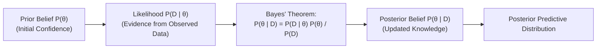

# Module 10: Reasoning Under Uncertainty

> **ML Math** · 41 lessons
> **Status:** 🔴 Scaffold — structure is in place, lesson content is not written.

---

## 🗺️ Recommended Step-by-Step Learning Path

Follow this exact sequence to achieve complete mastery of this module:

| Step | File to Open | What You Will Do |
| :---: | :--- | :--- |
| **1** | **[README.md](README.md)** | Read conceptual overview, architectural foundations, and mental models. |
| **2** | **[02_FOUNDATIONS_PLAYGROUND.md](02_FOUNDATIONS_PLAYGROUND.md)** | Practice beginner spoonfed micro-drills and line-by-line syntax breakdowns. |
| **3** | **[03_try_it_yourself.py](03_try_it_yourself.py)** | Run in terminal (`python 03_try_it_yourself.py`) for an interactive zero-dependency sandbox. |
| **4** | **[01_Why_Probability_Not_Just_Statistics.md](lessons/01_Why_Probability_Not_Just_Statistics.md)** | Complete deep-dive curriculum lesson on 01 Why Probability Not Just Statistics. |
| **5** | **[02_Sample_Spaces_and_Events.md](lessons/02_Sample_Spaces_and_Events.md)** | Complete deep-dive curriculum lesson on 02 Sample Spaces And Events. |
| **6** | **[03_The_Axioms_of_Probability.md](lessons/03_The_Axioms_of_Probability.md)** | Complete deep-dive curriculum lesson on 03 The Axioms Of Probability. |
| **7** | **[04_Counting_Permutations_and_Combinations.md](lessons/04_Counting_Permutations_and_Combinations.md)** | Complete deep-dive curriculum lesson on 04 Counting Permutations And Combinations. |
| **8** | **[TROUBLESHOOTING_AND_EDGE_CASES.md](TROUBLESHOOTING_AND_EDGE_CASES.md)** | Study forensic runbooks, edge cases, and real-world failure post-mortems. |
| **9** | **[SELF_ASSESSMENT_AND_CHALLENGES.md](SELF_ASSESSMENT_AND_CHALLENGES.md)** | Test your knowledge with self-assessment quizzes, challenges, and diagnostic scenarios. |
| **10** | **[PROJECT_GUIDE.md](PROJECT_GUIDE.md)** | Follow guided project implementation for `starter/` and `project_solution/`. |
| **11** | **[problems/](problems/)** | Solve hands-on problem bank challenges and verify with `pytest problems/tests`. |
| **12** | **[debug_lab/](debug_lab/)** | Diagnose and fix silent production bugs in the Bug Hunter Drill. |

---


---


## Bayesian Reasoning & Belief Update Engine



## Why this module exists

<!-- The one question this module answers that no other module does. Two or
     three sentences, written before any lesson is drafted, because a module
     that cannot state its purpose in three sentences has the wrong scope. -->

TODO

## What you will be able to do

<!-- Module-level capabilities. These become the mastery checklist below. -->

- [ ] TODO
- [ ] TODO
- [ ] TODO

---

## Lessons

| # | Lesson | Status |
| :--- | :--- | :---: |
| 01 | [Why Probability, Not Just Statistics](lessons/01_Why_Probability_Not_Just_Statistics.md) | 🔴 |
| 02 | [Sample Spaces and Events](lessons/02_Sample_Spaces_and_Events.md) | 🔴 |
| 03 | [The Axioms of Probability](lessons/03_The_Axioms_of_Probability.md) | 🔴 |
| 04 | [Counting: Permutations and Combinations](lessons/04_Counting_Permutations_and_Combinations.md) | 🔴 |
| 05 | [Conditional Probability](lessons/05_Conditional_Probability.md) | 🔴 |
| 06 | [Independence versus Conditional Independence](lessons/06_Independence_versus_Conditional_Independence.md) | 🔴 |
| 07 | [The Law of Total Probability](lessons/07_The_Law_of_Total_Probability.md) | 🔴 |
| 08 | [Bayes' Theorem](lessons/08_Bayes_Theorem.md) | 🔴 |
| 09 | [Base Rates and the Prosecutor's Fallacy](lessons/09_Base_Rates_and_the_Prosecutors_Fallacy.md) | 🔴 |
| 10 | [Bayesian versus Frequentist Interpretations](lessons/10_Bayesian_versus_Frequentist_Interpretations.md) | 🔴 |
| 11 | [Random Variables](lessons/11_Random_Variables.md) | 🔴 |
| 12 | [Discrete Distributions and the PMF](lessons/12_Discrete_Distributions_and_the_PMF.md) | 🔴 |
| 13 | [Continuous Distributions and the PDF](lessons/13_Continuous_Distributions_and_the_PDF.md) | 🔴 |
| 14 | [The Cumulative Distribution Function](lessons/14_The_Cumulative_Distribution_Function.md) | 🔴 |
| 15 | [Expected Value](lessons/15_Expected_Value.md) | 🔴 |
| 16 | [Linearity of Expectation](lessons/16_Linearity_of_Expectation.md) | 🔴 |
| 17 | [Variance and Standard Deviation](lessons/17_Variance_and_Standard_Deviation.md) | 🔴 |
| 18 | [Moments and Moment Generating Functions](lessons/18_Moments_and_Moment_Generating_Functions.md) | 🔴 |
| 19 | [The Bernoulli and Binomial Distributions](lessons/19_The_Bernoulli_and_Binomial_Distributions.md) | 🔴 |
| 20 | [The Geometric and Negative Binomial Distributions](lessons/20_The_Geometric_and_Negative_Binomial_Distributions.md) | 🔴 |
| 21 | [The Poisson Distribution](lessons/21_The_Poisson_Distribution.md) | 🔴 |
| 22 | [The Uniform Distribution](lessons/22_The_Uniform_Distribution.md) | 🔴 |
| 23 | [The Exponential Distribution and Memorylessness](lessons/23_The_Exponential_Distribution_and_Memorylessness.md) | 🔴 |
| 24 | [The Normal Distribution](lessons/24_The_Normal_Distribution.md) | 🔴 |
| 25 | [Why the Normal Appears Everywhere](lessons/25_Why_the_Normal_Appears_Everywhere.md) | 🔴 |
| 26 | [The Standard Normal and Z-Scores](lessons/26_The_Standard_Normal_and_ZScores.md) | 🔴 |
| 27 | [The Log-Normal Distribution](lessons/27_The_LogNormal_Distribution.md) | 🔴 |
| 28 | [The Beta Distribution](lessons/28_The_Beta_Distribution.md) | 🔴 |
| 29 | [The Gamma Distribution](lessons/29_The_Gamma_Distribution.md) | 🔴 |
| 30 | [The Categorical and Multinomial Distributions](lessons/30_The_Categorical_and_Multinomial_Distributions.md) | 🔴 |
| 31 | [The Dirichlet Distribution](lessons/31_The_Dirichlet_Distribution.md) | 🔴 |
| 32 | [Transformations of Random Variables](lessons/32_Transformations_of_Random_Variables.md) | 🔴 |
| 33 | [The Change-of-Variables Formula](lessons/33_The_ChangeofVariables_Formula.md) | 🔴 |
| 34 | [Markov's and Chebyshev's Inequalities](lessons/34_Markovs_and_Chebyshevs_Inequalities.md) | 🔴 |
| 35 | [Concentration and Hoeffding's Inequality](lessons/35_Concentration_and_Hoeffdings_Inequality.md) | 🔴 |
| 36 | [The Law of Large Numbers](lessons/36_The_Law_of_Large_Numbers.md) | 🔴 |
| 37 | [The Central Limit Theorem](lessons/37_The_Central_Limit_Theorem.md) | 🔴 |
| 38 | [Entropy](lessons/38_Entropy.md) | 🔴 |
| 39 | [Cross-Entropy and KL Divergence](lessons/39_CrossEntropy_and_KL_Divergence.md) | 🔴 |
| 40 | [Why Cross-Entropy Is the Classification Loss](lessons/40_Why_CrossEntropy_Is_the_Classification_Loss.md) | 🔴 |
| 41 | [Module Project: Naive Bayes With Calibrated Probabilities](lessons/41_Module_Project_Naive_Bayes_With_Calibrated_Probabilities.md) | 🔴 |

---

## Module project

See [PROJECT_GUIDE.md](PROJECT_GUIDE.md) for the 3-tier build path.

- **Tier 1 — Foundational:** TODO
- **Tier 2 — Practitioner:** TODO
- **Tier 3 — Architect:** TODO

## Assessment

- [SELF_ASSESSMENT_AND_CHALLENGES.md](SELF_ASSESSMENT_AND_CHALLENGES.md) — quiz, challenges and diagnostics
- [TROUBLESHOOTING_AND_EDGE_CASES.md](TROUBLESHOOTING_AND_EDGE_CASES.md) — documented failure modes
- `debug_lab/` — planted defects that produce plausible wrong answers

## You have mastered this module when you can…

<!-- Ten items, each one a thing the learner DOES, not a thing they know. -->

1. TODO

---

## Directory tour

```
Module_10_Reasoning_Under_Uncertainty/
├── README.md                            ← this file
├── PROJECT_GUIDE.md
├── SELF_ASSESSMENT_AND_CHALLENGES.md
├── TROUBLESHOOTING_AND_EDGE_CASES.md
├── lessons/                             ← 41 lessons
├── starter/                             ← stubs; the tests are the spec
├── project_solution/                    ← reference implementation + tests
└── debug_lab/                           ← defects to diagnose
```

## Navigation

- [Module 09 — Multivariable Calculus for Learning](../Module_09_Multivariable_Calculus_for_Learning/README.md)
- [Module 11 — Joint Distributions and Covariance](../Module_11_Joint_Distributions_and_Covariance/README.md)
- [Course README](../README.md) · [Master Syllabus](../MASTER_SYLLABUS.md) · [Roadmap](../ROADMAP_ML_MATH.md)