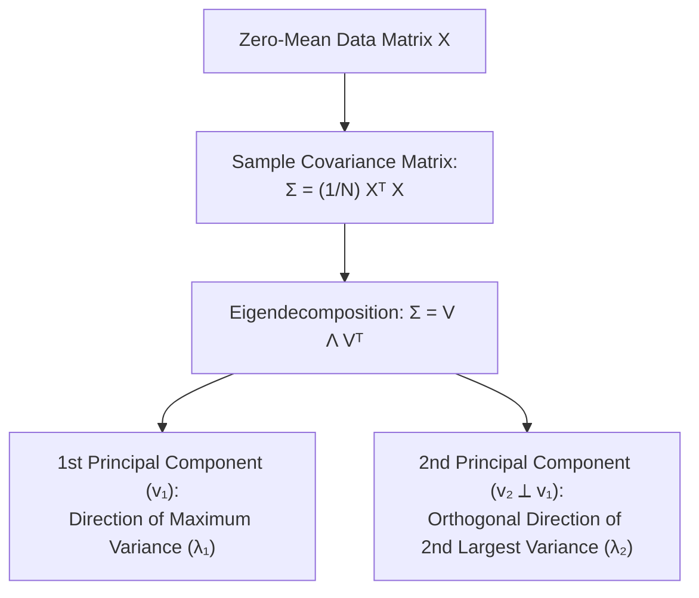

# Module 11: Joint Distributions and Covariance

> **ML Math** · 29 lessons
> **Status:** 🔴 Scaffold — structure is in place, lesson content is not written.

---


## Covariance Matrix & Principal Components Ellipsoid



## Why this module exists

<!-- The one question this module answers that no other module does. Two or
     three sentences, written before any lesson is drafted, because a module
     that cannot state its purpose in three sentences has the wrong scope. -->

TODO

## What you will be able to do

<!-- Module-level capabilities. These become the mastery checklist below. -->

- [ ] TODO
- [ ] TODO
- [ ] TODO

---

## Lessons

| # | Lesson | Status |
| :--- | :--- | :---: |
| 01 | [Joint Distributions of Two Variables](lessons/01_Joint_Distributions_of_Two_Variables.md) | 🔴 |
| 02 | [Marginal Distributions](lessons/02_Marginal_Distributions.md) | 🔴 |
| 03 | [Conditional Distributions](lessons/03_Conditional_Distributions.md) | 🔴 |
| 04 | [Independence in Terms of Joints](lessons/04_Independence_in_Terms_of_Joints.md) | 🔴 |
| 05 | [Joint, Marginal and Conditional Densities](lessons/05_Joint_Marginal_and_Conditional_Densities.md) | 🔴 |
| 06 | [Covariance](lessons/06_Covariance.md) | 🔴 |
| 07 | [Correlation and Its Limits](lessons/07_Correlation_and_Its_Limits.md) | 🔴 |
| 08 | [Correlation Is Not Causation, Concretely](lessons/08_Correlation_Is_Not_Causation_Concretely.md) | 🔴 |
| 09 | [The Covariance Matrix](lessons/09_The_Covariance_Matrix.md) | 🔴 |
| 10 | [Properties of the Covariance Matrix](lessons/10_Properties_of_the_Covariance_Matrix.md) | 🔴 |
| 11 | [Why Covariance Matrices Are Positive Semidefinite](lessons/11_Why_Covariance_Matrices_Are_Positive_Semidefinite.md) | 🔴 |
| 12 | [Linear Combinations and Their Variance](lessons/12_Linear_Combinations_and_Their_Variance.md) | 🔴 |
| 13 | [Conditional Expectation](lessons/13_Conditional_Expectation.md) | 🔴 |
| 14 | [The Tower Property](lessons/14_The_Tower_Property.md) | 🔴 |
| 15 | [Conditional Variance and Its Decomposition](lessons/15_Conditional_Variance_and_Its_Decomposition.md) | 🔴 |
| 16 | [The Bias-Variance Decomposition](lessons/16_The_BiasVariance_Decomposition.md) | 🔴 |
| 17 | [The Multivariate Normal Distribution](lessons/17_The_Multivariate_Normal_Distribution.md) | 🔴 |
| 18 | [Geometry of the Multivariate Normal](lessons/18_Geometry_of_the_Multivariate_Normal.md) | 🔴 |
| 19 | [Conditionals of a Multivariate Normal](lessons/19_Conditionals_of_a_Multivariate_Normal.md) | 🔴 |
| 20 | [Marginals of a Multivariate Normal](lessons/20_Marginals_of_a_Multivariate_Normal.md) | 🔴 |
| 21 | [The Precision Matrix and Partial Correlation](lessons/21_The_Precision_Matrix_and_Partial_Correlation.md) | 🔴 |
| 22 | [Whitening and Mahalanobis Distance](lessons/22_Whitening_and_Mahalanobis_Distance.md) | 🔴 |
| 23 | [Copulas: Separating Marginals From Dependence](lessons/23_Copulas_Separating_Marginals_From_Dependence.md) | 🔴 |
| 24 | [Mutual Information](lessons/24_Mutual_Information.md) | 🔴 |
| 25 | [Simpson's Paradox](lessons/25_Simpsons_Paradox.md) | 🔴 |
| 26 | [Confounders, Colliders and Selection Bias](lessons/26_Confounders_Colliders_and_Selection_Bias.md) | 🔴 |
| 27 | [Markov Chains and the Transition Matrix](lessons/27_Markov_Chains_and_the_Transition_Matrix.md) | 🔴 |
| 28 | [Stationary Distributions](lessons/28_Stationary_Distributions.md) | 🔴 |
| 29 | [Module Project: A Gaussian Mixture Model by EM](lessons/29_Module_Project_A_Gaussian_Mixture_Model_by_EM.md) | 🔴 |

---

## Module project

See [PROJECT_GUIDE.md](PROJECT_GUIDE.md) for the 3-tier build path.

- **Tier 1 — Foundational:** TODO
- **Tier 2 — Practitioner:** TODO
- **Tier 3 — Architect:** TODO

## Assessment

- [SELF_ASSESSMENT_AND_CHALLENGES.md](SELF_ASSESSMENT_AND_CHALLENGES.md) — quiz, challenges and diagnostics
- [TROUBLESHOOTING_AND_EDGE_CASES.md](TROUBLESHOOTING_AND_EDGE_CASES.md) — documented failure modes
- `debug_lab/` — planted defects that produce plausible wrong answers

## You have mastered this module when you can…

<!-- Ten items, each one a thing the learner DOES, not a thing they know. -->

1. TODO

---

## Directory tour

```
Module_11_Joint_Distributions_and_Covariance/
├── README.md                            ← this file
├── PROJECT_GUIDE.md
├── SELF_ASSESSMENT_AND_CHALLENGES.md
├── TROUBLESHOOTING_AND_EDGE_CASES.md
├── lessons/                             ← 29 lessons
├── starter/                             ← stubs; the tests are the spec
├── project_solution/                    ← reference implementation + tests
└── debug_lab/                           ← defects to diagnose
```

## Navigation

- [Module 10 — Reasoning Under Uncertainty](../Module_10_Reasoning_Under_Uncertainty/README.md)
- [Module 12 — Statistical Estimation from Samples](../Module_12_Statistical_Estimation_from_Samples/README.md)
- [Course README](../README.md) · [Master Syllabus](../MASTER_SYLLABUS.md) · [Roadmap](../ROADMAP_ML_MATH.md)