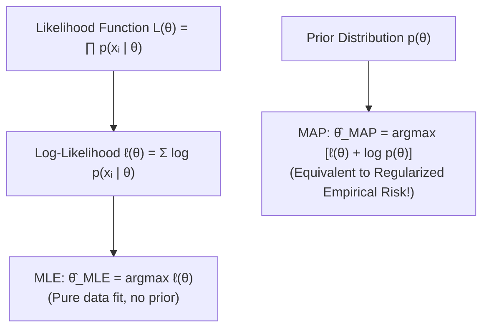

# Module 12: Statistical Estimation from Samples

> **ML Math** · 22 lessons
> **Status:** 🔴 Scaffold — structure is in place, lesson content is not written.

---

## 🗺️ Recommended Step-by-Step Learning Path

Follow this exact sequence to achieve complete mastery of this module:

| Step | File to Open | What You Will Do |
| :---: | :--- | :--- |
| **1** | **[README.md](README.md)** | Read conceptual overview, architectural foundations, and mental models. |
| **2** | **[02_FOUNDATIONS_PLAYGROUND.md](02_FOUNDATIONS_PLAYGROUND.md)** | Practice beginner spoonfed micro-drills and line-by-line syntax breakdowns. |
| **3** | **[03_try_it_yourself.py](03_try_it_yourself.py)** | Run in terminal (`python 03_try_it_yourself.py`) for an interactive zero-dependency sandbox. |
| **4** | **[01_Populations_Samples_and_Estimators.md](lessons/01_Populations_Samples_and_Estimators.md)** | Complete deep-dive curriculum lesson on 01 Populations Samples And Estimators. |
| **5** | **[02_Bias_Variance_and_Mean_Squared_Error.md](lessons/02_Bias_Variance_and_Mean_Squared_Error.md)** | Complete deep-dive curriculum lesson on 02 Bias Variance And Mean Squared Error. |
| **6** | **[03_Consistency_and_Efficiency.md](lessons/03_Consistency_and_Efficiency.md)** | Complete deep-dive curriculum lesson on 03 Consistency And Efficiency. |
| **7** | **[04_The_Sampling_Distribution.md](lessons/04_The_Sampling_Distribution.md)** | Complete deep-dive curriculum lesson on 04 The Sampling Distribution. |
| **8** | **[TROUBLESHOOTING_AND_EDGE_CASES.md](TROUBLESHOOTING_AND_EDGE_CASES.md)** | Study forensic runbooks, edge cases, and real-world failure post-mortems. |
| **9** | **[SELF_ASSESSMENT_AND_CHALLENGES.md](SELF_ASSESSMENT_AND_CHALLENGES.md)** | Test your knowledge with self-assessment quizzes, challenges, and diagnostic scenarios. |
| **10** | **[PROJECT_GUIDE.md](PROJECT_GUIDE.md)** | Follow guided project implementation for `starter/` and `project_solution/`. |
| **11** | **[problems/](problems/)** | Solve hands-on problem bank challenges and verify with `pytest problems/tests`. |
| **12** | **[debug_lab/](debug_lab/)** | Diagnose and fix silent production bugs in the Bug Hunter Drill. |

---


---


## Statistical Estimation: MLE vs MAP



## Why this module exists

<!-- The one question this module answers that no other module does. Two or
     three sentences, written before any lesson is drafted, because a module
     that cannot state its purpose in three sentences has the wrong scope. -->

TODO

## What you will be able to do

<!-- Module-level capabilities. These become the mastery checklist below. -->

- [ ] TODO
- [ ] TODO
- [ ] TODO

---

## Lessons

| # | Lesson | Status |
| :--- | :--- | :---: |
| 01 | [Populations, Samples and Estimators](lessons/01_Populations_Samples_and_Estimators.md) | 🔴 |
| 02 | [Bias, Variance and Mean Squared Error](lessons/02_Bias_Variance_and_Mean_Squared_Error.md) | 🔴 |
| 03 | [Consistency and Efficiency](lessons/03_Consistency_and_Efficiency.md) | 🔴 |
| 04 | [The Sampling Distribution](lessons/04_The_Sampling_Distribution.md) | 🔴 |
| 05 | [The Standard Error](lessons/05_The_Standard_Error.md) | 🔴 |
| 06 | [The Method of Moments](lessons/06_The_Method_of_Moments.md) | 🔴 |
| 07 | [Maximum Likelihood Estimation](lessons/07_Maximum_Likelihood_Estimation.md) | 🔴 |
| 08 | [The Log-Likelihood and Why We Take Logs](lessons/08_The_LogLikelihood_and_Why_We_Take_Logs.md) | 🔴 |
| 09 | [MLE for the Normal and Bernoulli](lessons/09_MLE_for_the_Normal_and_Bernoulli.md) | 🔴 |
| 10 | [Fisher Information and the Cramer-Rao Bound](lessons/10_Fisher_Information_and_the_CramerRao_Bound.md) | 🔴 |
| 11 | [Maximum A Posteriori Estimation](lessons/11_Maximum_A_Posteriori_Estimation.md) | 🔴 |
| 12 | [MAP as Regularized MLE](lessons/12_MAP_as_Regularized_MLE.md) | 🔴 |
| 13 | [Conjugate Priors](lessons/13_Conjugate_Priors.md) | 🔴 |
| 14 | [Confidence Intervals](lessons/14_Confidence_Intervals.md) | 🔴 |
| 15 | [What a Confidence Interval Does Not Mean](lessons/15_What_a_Confidence_Interval_Does_Not_Mean.md) | 🔴 |
| 16 | [Credible Intervals and the Bayesian Alternative](lessons/16_Credible_Intervals_and_the_Bayesian_Alternative.md) | 🔴 |
| 17 | [Hypothesis Testing and the p-Value](lessons/17_Hypothesis_Testing_and_the_pValue.md) | 🔴 |
| 18 | [What a p-Value Does Not Mean](lessons/18_What_a_pValue_Does_Not_Mean.md) | 🔴 |
| 19 | [Type I and Type II Errors, and Power](lessons/19_Type_I_and_Type_II_Errors_and_Power.md) | 🔴 |
| 20 | [Multiple Comparisons and the Bonferroni Correction](lessons/20_Multiple_Comparisons_and_the_Bonferroni_Correction.md) | 🔴 |
| 21 | [The Bootstrap](lessons/21_The_Bootstrap.md) | 🔴 |
| 22 | [Module Project: Estimate, Interval and Test, All From Scratch](lessons/22_Module_Project_Estimate_Interval_and_Test_All_From_Scratch.md) | 🔴 |

---

## Module project

See [PROJECT_GUIDE.md](PROJECT_GUIDE.md) for the 3-tier build path.

- **Tier 1 — Foundational:** TODO
- **Tier 2 — Practitioner:** TODO
- **Tier 3 — Architect:** TODO

## Assessment

- [SELF_ASSESSMENT_AND_CHALLENGES.md](SELF_ASSESSMENT_AND_CHALLENGES.md) — quiz, challenges and diagnostics
- [TROUBLESHOOTING_AND_EDGE_CASES.md](TROUBLESHOOTING_AND_EDGE_CASES.md) — documented failure modes
- `debug_lab/` — planted defects that produce plausible wrong answers

## You have mastered this module when you can…

<!-- Ten items, each one a thing the learner DOES, not a thing they know. -->

1. TODO

---

## Directory tour

```
Module_12_Statistical_Estimation_from_Samples/
├── README.md                            ← this file
├── PROJECT_GUIDE.md
├── SELF_ASSESSMENT_AND_CHALLENGES.md
├── TROUBLESHOOTING_AND_EDGE_CASES.md
├── lessons/                             ← 22 lessons
├── starter/                             ← stubs; the tests are the spec
├── project_solution/                    ← reference implementation + tests
└── debug_lab/                           ← defects to diagnose
```

## Navigation

- [Module 11 — Joint Distributions and Covariance](../Module_11_Joint_Distributions_and_Covariance/README.md)
- [Course README](../README.md) · [Master Syllabus](../MASTER_SYLLABUS.md) · [Roadmap](../ROADMAP_ML_MATH.md)