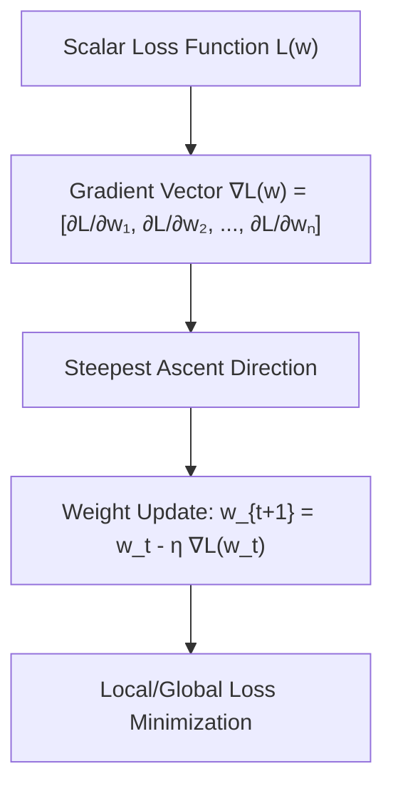

# Module 01: Math Fundamentals

> **AI Research Archive** · 15 lessons
> **Status:** 🔴 Scaffold — structure is in place, lesson content is not written.

---


## Vector Subspace Orthogonality & Gradient Direction



## Why this module exists

<!-- The one question this module answers that no other module does. Two or
     three sentences, written before any lesson is drafted, because a module
     that cannot state its purpose in three sentences has the wrong scope. -->

TODO

## What you will be able to do

<!-- Module-level capabilities. These become the mastery checklist below. -->

- [ ] TODO
- [ ] TODO
- [ ] TODO

---

## Lessons

| # | Lesson | Status |
| :--- | :--- | :---: |
| 01 | [What Math You Actually Need, and What You Do Not](lessons/01_What_Math_You_Actually_Need_and_What_You_Do_Not.md) | 🔴 |
| 02 | [Vectors, Matrices and Shapes](lessons/02_Vectors_Matrices_and_Shapes.md) | 🔴 |
| 03 | [Matrix Multiplication and Broadcasting](lessons/03_Matrix_Multiplication_and_Broadcasting.md) | 🔴 |
| 04 | [Dot Products, Norms and Similarity](lessons/04_Dot_Products_Norms_and_Similarity.md) | 🔴 |
| 05 | [Eigenvalues and the SVD in One Sitting](lessons/05_Eigenvalues_and_the_SVD_in_One_Sitting.md) | 🔴 |
| 06 | [Derivatives and the Chain Rule](lessons/06_Derivatives_and_the_Chain_Rule.md) | 🔴 |
| 07 | [Partial Derivatives and Gradients](lessons/07_Partial_Derivatives_and_Gradients.md) | 🔴 |
| 08 | [The Jacobian and the Hessian](lessons/08_The_Jacobian_and_the_Hessian.md) | 🔴 |
| 09 | [Gradient Descent by Hand](lessons/09_Gradient_Descent_by_Hand.md) | 🔴 |
| 10 | [Probability, Expectation and Variance](lessons/10_Probability_Expectation_and_Variance.md) | 🔴 |
| 11 | [Bayes' Rule for Practitioners](lessons/11_Bayes_Rule_for_Practitioners.md) | 🔴 |
| 12 | [The Distributions You Will Actually Meet](lessons/12_The_Distributions_You_Will_Actually_Meet.md) | 🔴 |
| 13 | [Entropy, Cross-Entropy and KL Divergence](lessons/13_Entropy_CrossEntropy_and_KL_Divergence.md) | 🔴 |
| 14 | [Numerical Stability: Overflow, Underflow and Log-Sum-Exp](lessons/14_Numerical_Stability_Overflow_Underflow_and_LogSumExp.md) | 🔴 |
| 15 | [Checkpoint: Derive Backpropagation for a Two-Layer Network](lessons/15_Checkpoint_Derive_Backpropagation_for_a_TwoLayer_Network.md) | 🔴 |

---

## Module project

See [PROJECT_GUIDE.md](PROJECT_GUIDE.md) for the 3-tier build path.

- **Tier 1 — Foundational:** TODO
- **Tier 2 — Practitioner:** TODO
- **Tier 3 — Architect:** TODO

## Assessment

- [SELF_ASSESSMENT_AND_CHALLENGES.md](SELF_ASSESSMENT_AND_CHALLENGES.md) — quiz, challenges and diagnostics
- [TROUBLESHOOTING_AND_EDGE_CASES.md](TROUBLESHOOTING_AND_EDGE_CASES.md) — documented failure modes
- `debug_lab/` — planted defects that produce plausible wrong answers

## You have mastered this module when you can…

<!-- Ten items, each one a thing the learner DOES, not a thing they know. -->

1. TODO

---

## Directory tour

```
Module_01_Math_Fundamentals/
├── README.md                            ← this file
├── PROJECT_GUIDE.md
├── SELF_ASSESSMENT_AND_CHALLENGES.md
├── TROUBLESHOOTING_AND_EDGE_CASES.md
├── lessons/                             ← 15 lessons
├── starter/                             ← stubs; the tests are the spec
├── project_solution/                    ← reference implementation + tests
└── debug_lab/                           ← defects to diagnose
```

## Navigation

- [Module 02 — Core AI Intuitions](../Module_02_Core_AI_Intuitions/README.md)
- [Course README](../README.md) · [Master Syllabus](../MASTER_SYLLABUS.md) · [Roadmap](../ROADMAP_AI_RESEARCH.md)