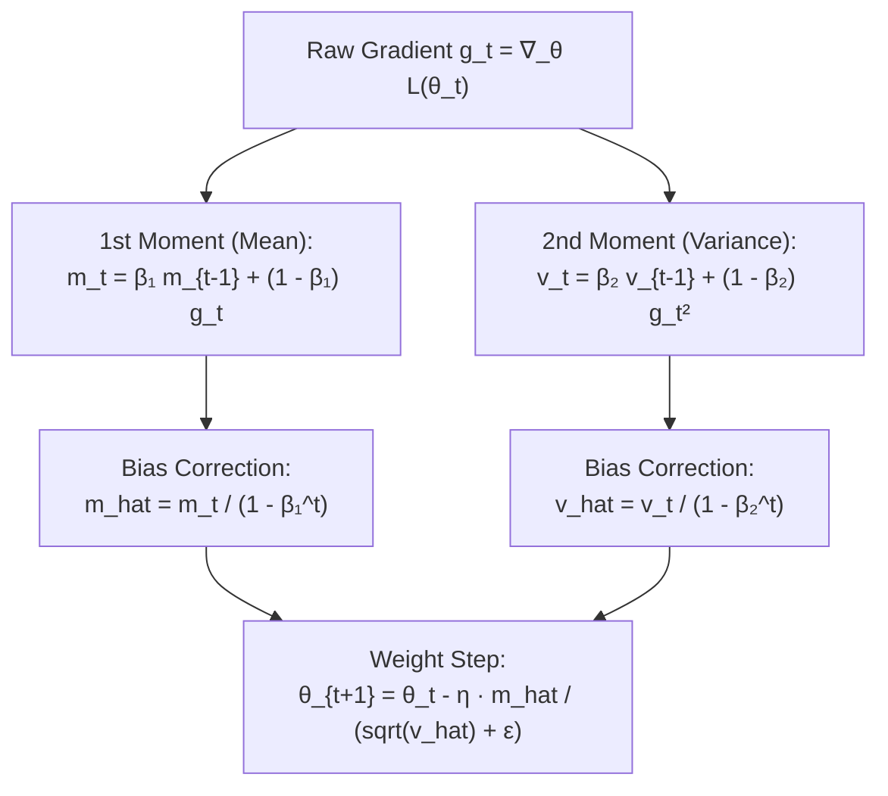

# Module 05: Neural Network from Scratch

> **AI Research Archive** · 7 lessons
> **Status:** 🔴 Scaffold — structure is in place, lesson content is not written.

---


## Adaptive Optimizers: Adam Moment Correction



## Why this module exists

<!-- The one question this module answers that no other module does. Two or
     three sentences, written before any lesson is drafted, because a module
     that cannot state its purpose in three sentences has the wrong scope. -->

TODO

## What you will be able to do

<!-- Module-level capabilities. These become the mastery checklist below. -->

- [ ] TODO
- [ ] TODO
- [ ] TODO

---

## Lessons

| # | Lesson | Status |
| :--- | :--- | :---: |
| 01 | [The Perceptron and Its Limits](lessons/01_The_Perceptron_and_Its_Limits.md) | 🔴 |
| 02 | [The Forward Pass in NumPy](lessons/02_The_Forward_Pass_in_NumPy.md) | 🔴 |
| 03 | [Loss Functions and Their Gradients](lessons/03_Loss_Functions_and_Their_Gradients.md) | 🔴 |
| 04 | [The Backward Pass, Derived and Coded](lessons/04_The_Backward_Pass_Derived_and_Coded.md) | 🔴 |
| 05 | [Gradient Checking Your Implementation](lessons/05_Gradient_Checking_Your_Implementation.md) | 🔴 |
| 06 | [Training on MNIST With No Framework](lessons/06_Training_on_MNIST_With_No_Framework.md) | 🔴 |
| 07 | [Checkpoint: Match PyTorch's Gradients to 1e-7](lessons/07_Checkpoint_Match_PyTorchs_Gradients_to_1e7.md) | 🔴 |

---

## Module project

See [PROJECT_GUIDE.md](PROJECT_GUIDE.md) for the 3-tier build path.

- **Tier 1 — Foundational:** TODO
- **Tier 2 — Practitioner:** TODO
- **Tier 3 — Architect:** TODO

## Assessment

- [SELF_ASSESSMENT_AND_CHALLENGES.md](SELF_ASSESSMENT_AND_CHALLENGES.md) — quiz, challenges and diagnostics
- [TROUBLESHOOTING_AND_EDGE_CASES.md](TROUBLESHOOTING_AND_EDGE_CASES.md) — documented failure modes
- `debug_lab/` — planted defects that produce plausible wrong answers

## You have mastered this module when you can…

<!-- Ten items, each one a thing the learner DOES, not a thing they know. -->

1. TODO

---

## Directory tour

```
Module_05_Neural_Network_from_Scratch/
├── README.md                            ← this file
├── PROJECT_GUIDE.md
├── SELF_ASSESSMENT_AND_CHALLENGES.md
├── TROUBLESHOOTING_AND_EDGE_CASES.md
├── lessons/                             ← 7 lessons
├── starter/                             ← stubs; the tests are the spec
├── project_solution/                    ← reference implementation + tests
└── debug_lab/                           ← defects to diagnose
```

## Navigation

- [Module 04 — TensorFlow Fundamentals](../Module_04_TensorFlow_Fundamentals/README.md)
- [Module 06 — Transformers](../Module_06_Transformers/README.md)
- [Course README](../README.md) · [Master Syllabus](../MASTER_SYLLABUS.md) · [Roadmap](../ROADMAP_AI_RESEARCH.md)