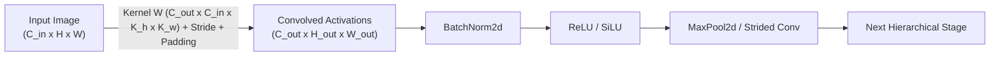

# Module 06: Transformers

> **AI Research Archive** · 3 lessons
> **Status:** 🔴 Scaffold — structure is in place, lesson content is not written.

---


## 2D Convolution Receptive Field & Feature Map Pipeline



## Why this module exists

<!-- The one question this module answers that no other module does. Two or
     three sentences, written before any lesson is drafted, because a module
     that cannot state its purpose in three sentences has the wrong scope. -->

TODO

## What you will be able to do

<!-- Module-level capabilities. These become the mastery checklist below. -->

- [ ] TODO
- [ ] TODO
- [ ] TODO

---

## Lessons

| # | Lesson | Status |
| :--- | :--- | :---: |
| 01 | [Attention From First Principles](lessons/01_Attention_From_First_Principles.md) | 🔴 |
| 02 | [Multi-Head Attention, Positional Encoding and the Block](lessons/02_MultiHead_Attention_Positional_Encoding_and_the_Block.md) | 🔴 |
| 03 | [Checkpoint: A Working Transformer in Under 300 Lines](lessons/03_Checkpoint_A_Working_Transformer_in_Under_300_Lines.md) | 🔴 |

---

## Module project

See [PROJECT_GUIDE.md](PROJECT_GUIDE.md) for the 3-tier build path.

- **Tier 1 — Foundational:** TODO
- **Tier 2 — Practitioner:** TODO
- **Tier 3 — Architect:** TODO

## Assessment

- [SELF_ASSESSMENT_AND_CHALLENGES.md](SELF_ASSESSMENT_AND_CHALLENGES.md) — quiz, challenges and diagnostics
- [TROUBLESHOOTING_AND_EDGE_CASES.md](TROUBLESHOOTING_AND_EDGE_CASES.md) — documented failure modes
- `debug_lab/` — planted defects that produce plausible wrong answers

## You have mastered this module when you can…

<!-- Ten items, each one a thing the learner DOES, not a thing they know. -->

1. TODO

---

## Directory tour

```
Module_06_Transformers/
├── README.md                            ← this file
├── PROJECT_GUIDE.md
├── SELF_ASSESSMENT_AND_CHALLENGES.md
├── TROUBLESHOOTING_AND_EDGE_CASES.md
├── lessons/                             ← 3 lessons
├── starter/                             ← stubs; the tests are the spec
├── project_solution/                    ← reference implementation + tests
└── debug_lab/                           ← defects to diagnose
```

## Navigation

- [Module 05 — Neural Network from Scratch](../Module_05_Neural_Network_from_Scratch/README.md)
- [Module 07 — Reinforcement Learning](../Module_07_Reinforcement_Learning/README.md)
- [Course README](../README.md) · [Master Syllabus](../MASTER_SYLLABUS.md) · [Roadmap](../ROADMAP_AI_RESEARCH.md)