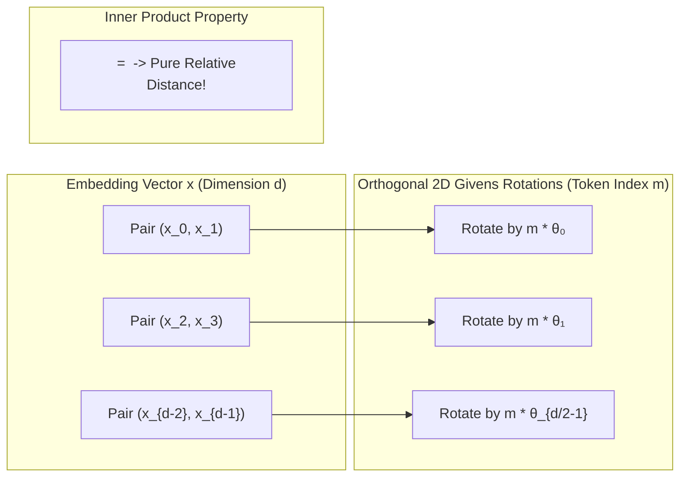

# Module 10: How to Fine-Tune Models

> **AI Research Archive** · 5 lessons
> **Status:** 🔴 Scaffold — structure is in place, lesson content is not written.

---

## 🗺️ Recommended Step-by-Step Learning Path

Follow this exact sequence to achieve complete mastery of this module:

| Step | File to Open | What You Will Do |
| :---: | :--- | :--- |
| **1** | **[README.md](README.md)** | Read conceptual overview, architectural foundations, and mental models. |
| **2** | **[02_FOUNDATIONS_PLAYGROUND.md](02_FOUNDATIONS_PLAYGROUND.md)** | Practice beginner spoonfed micro-drills and line-by-line syntax breakdowns. |
| **3** | **[03_try_it_yourself.py](03_try_it_yourself.py)** | Run in terminal (`python 03_try_it_yourself.py`) for an interactive zero-dependency sandbox. |
| **4** | **[01_Full_FineTuning_versus_ParameterEfficient_Methods.md](lessons/01_Full_FineTuning_versus_ParameterEfficient_Methods.md)** | Complete deep-dive curriculum lesson on 01 Full Finetuning Versus Parameterefficient Methods. |
| **5** | **[02_LoRA_and_QLoRA.md](lessons/02_LoRA_and_QLoRA.md)** | Complete deep-dive curriculum lesson on 02 Lora And Qlora. |
| **6** | **[03_Instruction_Tuning_and_Dataset_Construction.md](lessons/03_Instruction_Tuning_and_Dataset_Construction.md)** | Complete deep-dive curriculum lesson on 03 Instruction Tuning And Dataset Construction. |
| **7** | **[04_Preference_Optimization_RLHF_and_DPO.md](lessons/04_Preference_Optimization_RLHF_and_DPO.md)** | Complete deep-dive curriculum lesson on 04 Preference Optimization Rlhf And Dpo. |
| **8** | **[TROUBLESHOOTING_AND_EDGE_CASES.md](TROUBLESHOOTING_AND_EDGE_CASES.md)** | Study forensic runbooks, edge cases, and real-world failure post-mortems. |
| **9** | **[SELF_ASSESSMENT_AND_CHALLENGES.md](SELF_ASSESSMENT_AND_CHALLENGES.md)** | Test your knowledge with self-assessment quizzes, challenges, and diagnostic scenarios. |
| **10** | **[PROJECT_GUIDE.md](PROJECT_GUIDE.md)** | Follow guided project implementation for `starter/` and `project_solution/`. |
| **11** | **[problems/](problems/)** | Solve hands-on problem bank challenges and verify with `pytest problems/tests`. |
| **12** | **[debug_lab/](debug_lab/)** | Diagnose and fix silent production bugs in the Bug Hunter Drill. |

---


---


## Rotary Position Embedding (RoPE) 2D Subspace Rotation



## Why this module exists

<!-- The one question this module answers that no other module does. Two or
     three sentences, written before any lesson is drafted, because a module
     that cannot state its purpose in three sentences has the wrong scope. -->

TODO

## What you will be able to do

<!-- Module-level capabilities. These become the mastery checklist below. -->

- [ ] TODO
- [ ] TODO
- [ ] TODO

---

## Lessons

| # | Lesson | Status |
| :--- | :--- | :---: |
| 01 | [Full Fine-Tuning versus Parameter-Efficient Methods](lessons/01_Full_FineTuning_versus_ParameterEfficient_Methods.md) | 🔴 |
| 02 | [LoRA and QLoRA](lessons/02_LoRA_and_QLoRA.md) | 🔴 |
| 03 | [Instruction Tuning and Dataset Construction](lessons/03_Instruction_Tuning_and_Dataset_Construction.md) | 🔴 |
| 04 | [Preference Optimization: RLHF and DPO](lessons/04_Preference_Optimization_RLHF_and_DPO.md) | 🔴 |
| 05 | [Checkpoint: Fine-Tune and Beat the Base Model on a Held-Out Set](lessons/05_Checkpoint_FineTune_and_Beat_the_Base_Model_on_a_HeldOut_Set.md) | 🔴 |

---

## Module project

See [PROJECT_GUIDE.md](PROJECT_GUIDE.md) for the 3-tier build path.

- **Tier 1 — Foundational:** TODO
- **Tier 2 — Practitioner:** TODO
- **Tier 3 — Architect:** TODO

## Assessment

- [SELF_ASSESSMENT_AND_CHALLENGES.md](SELF_ASSESSMENT_AND_CHALLENGES.md) — quiz, challenges and diagnostics
- [TROUBLESHOOTING_AND_EDGE_CASES.md](TROUBLESHOOTING_AND_EDGE_CASES.md) — documented failure modes
- `debug_lab/` — planted defects that produce plausible wrong answers

## You have mastered this module when you can…

<!-- Ten items, each one a thing the learner DOES, not a thing they know. -->

1. TODO

---

## Directory tour

```
Module_10_How_to_FineTune_Models/
├── README.md                            ← this file
├── PROJECT_GUIDE.md
├── SELF_ASSESSMENT_AND_CHALLENGES.md
├── TROUBLESHOOTING_AND_EDGE_CASES.md
├── lessons/                             ← 5 lessons
├── starter/                             ← stubs; the tests are the spec
├── project_solution/                    ← reference implementation + tests
└── debug_lab/                           ← defects to diagnose
```

## Navigation

- [Module 09 — Write Research Paper](../Module_09_Write_Research_Paper/README.md)
- [Module 11 — Machine Learning Operations (MLOps)](../Module_11_Machine_Learning_Operations_MLOps/README.md)
- [Course README](../README.md) · [Master Syllabus](../MASTER_SYLLABUS.md) · [Roadmap](../ROADMAP_AI_RESEARCH.md)