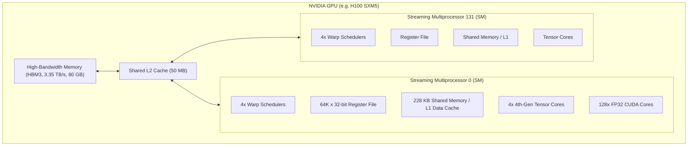

# Module 01: GPU Microarchitecture & Execution Model

> **Architectural Scope**: Streaming Multiprocessors (SMs), Warp Schedulers, Tensor Cores, Register Files, Shared Memory vs HBM3e, Warp Divergence, Little's Law, and the Roofline Model.

---


## GPU Hardware Execution Hierarchy



---

## 🗺️ Recommended Step-by-Step Learning Path

Follow this exact sequence to achieve complete mastery of this module:

| Step | File to Open | What You Will Do |
| :---: | :--- | :--- |
| **1** | **[01_README.md](01_README.md)** | Read conceptual overview, architectural foundations, and mental models. |
| **2** | **[00_FOUNDATIONS_PLAYGROUND.md](00_FOUNDATIONS_PLAYGROUND.md)** | Practice beginner spoonfed micro-drills and line-by-line syntax breakdowns. |
| **3** | **[00_try_it_yourself.py](00_try_it_yourself.py)** | Run in terminal (`python 00_try_it_yourself.py`) for an interactive zero-dependency sandbox. |
| **4** | **[04_TROUBLESHOOTING_AND_EDGE_CASES.md](04_TROUBLESHOOTING_AND_EDGE_CASES.md)** | Study forensic runbooks, edge cases, and real-world failure post-mortems. |
| **5** | **[03_SELF_ASSESSMENT_AND_CHALLENGES.md](03_SELF_ASSESSMENT_AND_CHALLENGES.md)** | Test your knowledge with self-assessment quizzes, challenges, and diagnostic scenarios. |
| **6** | **[02_PROJECT_GUIDE.md](02_PROJECT_GUIDE.md)** | Follow guided project implementation for `starter/` and `project_solution/`. |
| **7** | **[problems/](problems/)** | Solve hands-on problem bank challenges and verify with `pytest problems/tests`. |
| **8** | **[debug_lab/](debug_lab/)** | Diagnose and fix silent production bugs in the Bug Hunter Drill. |

---

## 1. Physical Hardware Microarchitecture of an SM

Modern NVIDIA GPUs (Ampere A100, Hopper H100, Blackwell B200) are arrays of independent hardware processors called **Streaming Multiprocessors (SMs)** connected via a high-bandwidth crossbar network to a shared Level 2 (L2) Cache and High Bandwidth Memory (HBM3e).

```
+--------------------------------------------------------------------------------------------------+
|                                    NVIDIA SM MICROARCHITECTURE                                   |
+--------------------------------------------------------------------------------------------------+
|  Warp Scheduler 0          Warp Scheduler 1          Warp Scheduler 2          Warp Scheduler 3  |
|  [Dispatch Unit]           [Dispatch Unit]           [Dispatch Unit]           [Dispatch Unit]   |
+--------------------------+-------------------------+-------------------------+-------------------+
|  Sub-Core 0              |  Sub-Core 1             |  Sub-Core 2             |  Sub-Core 3       |
|  - 16 FP32 Cores         |  - 16 FP32 Cores        |  - 16 FP32 Cores        |  - 16 FP32 Cores  |
|  - 16 INT32 Cores        |  - 16 INT32 Cores       |  - 16 INT32 Cores       |  - 16 INT32 Cores |
|  - 8 FP64 Cores          |  - 8 FP64 Cores         |  - 8 FP64 Cores         |  - 8 FP64 Cores   |
|  - 1 Tensor Core (4th/5th)| - 1 Tensor Core        |  - 1 Tensor Core        |  - 1 Tensor Core  |
|  - 16K 32-bit Registers  |  - 16K 32-bit Registers |  - 16K 32-bit Registers |  - 16K Registers  |
+--------------------------+-------------------------+-------------------------+-------------------+
|               UNIFIED REGISTER FILE: 65,536 x 32-bit Registers (256 KB per SM)                   |
+--------------------------------------------------------------------------------------------------+
|               CONFIGURABLE L1 DATA CACHE & SHARED MEMORY (SRAM: 192 KB - 228 KB)                 |
+--------------------------------------------------------------------------------------------------+
```

### Key Hardware Specifications
- **Streaming Multiprocessors (SMs)**: 108 on A100 SXM4, 132 on H100 SXM5, 148 on B200.
- **Warp Schedulers**: Exactly 4 warp schedulers per SM. Each scheduler can issue instructions to its dedicated sub-core every clock cycle.
- **Register File**: 65,536 32-bit registers ($256 \text{ KB}$) per SM. Registers provide zero-latency access (~0 clock cycles).
- **Shared Memory (SRAM)**: Software-managed cache directly adjacent to the compute units. Latency: ~19 to 30 clock cycles. Bandwidth: $>15 \text{ TB/s}$ aggregate on-chip.
- **High Bandwidth Memory (HBM3e)**: Off-chip DRAM. Latency: ~400 to 800 clock cycles. Bandwidth: $2{,}000 \text{ GB/s}$ (A100) to $3{,}350 \text{ GB/s}$ (H100) to $8{,}000 \text{ GB/s}$ (B200).

---

## 2. The SIMT Execution Model & Warp Divergence

### Single Instruction, Multiple Threads (SIMT)
In SIMT, instructions are not issued to single threads. Instructions are issued to **Warps** of **32 consecutive threads**:
- Threads in a warp share the **Instruction Pointer (IP)**.
- Each thread has its own private register state and can compute on distinct data.

### The Penalty of Warp Divergence
When conditional code causes threads in the same warp to take different execution branches:
```cpp
if (threadIdx.x < 16) {
    path_A(); // First half of warp
} else {
    path_B(); // Second half of warp
}
```
The GPU **cannot** execute both branches simultaneously. The hardware handles this via the **Active Mask**:
1. **Pass 1**: The warp scheduler sets active mask `0x0000FFFF`. Threads 0-15 execute `path_A()`. Threads 16-31 are hardware-masked (clock cycles wasted).
2. **Pass 2**: The warp scheduler sets active mask `0xFFFF0000`. Threads 16-31 execute `path_B()`. Threads 0-15 are masked.
3. **Execution Time**: The total time is $T_{\text{path\_A}} + T_{\text{path\_B}}$. Throughput is halved!

> **Architectural Invariant**: Avoid branch divergence within the same warp. If branching is required, organize work so that entire warps (multiples of 32 threads) evaluate the branch identically.

---

## 3. Latency Hiding & Little's Law for GPUs

CPUs hide memory latency using massive hardware caches (L1/L2/L3) and branch prediction.
GPUs hide memory latency through **Hardware Multithreading & High Occupancy**.

When Warp 0 issues a global memory read (stalling for ~500 cycles), the Warp Scheduler performs a **zero-cycle context switch** to Warp 1, Warp 2, etc.
By the time the scheduler cycles through all active warps, Warp 0's data has arrived.

### Little's Law
$$\text{Concurrency (Active Threads)} = \text{Throughput} \times \text{Latency}$$

To saturate a memory bus of $2{,}000 \text{ GB/s}$ with an average latency of $500 \text{ ns}$:
$$\text{Required In-Flight Bytes} = 2{,}000 \times 10^9 \text{ B/s} \times 500 \times 10^{-9} \text{ s} = 1{,}000{,}000 \text{ Bytes (1 MB)}$$
Each thread must have independent memory requests in flight, requiring hundreds of active warps across the SMs.

---

## 4. The Roofline Model: Arithmetic Intensity

Every kernel's attainable performance $P$ (TFLOPs/s) is bounded by:
$$P = \min\left(P_{\text{peak}},\; I \times B_{\text{peak}}\right)$$

Where:
- $P_{\text{peak}}$: Theoretical peak compute of the hardware (TFLOPs/s).
- $B_{\text{peak}}$: Peak memory bandwidth (GB/s).
- $I$: **Arithmetic Intensity** in FLOPs per Byte:
  $$I = \frac{\text{Total Operations (FLOPs)}}{\text{Total Global Memory Loaded & Stored (Bytes)}}$$

### The Ridge Point ($I_{\text{ridge}}$)
$$I_{\text{ridge}} = \frac{P_{\text{peak}}}{B_{\text{peak}}}$$

- **On NVIDIA A100 (FP32)**:
  $$I_{\text{ridge}} = \frac{19{,}500 \text{ GFLOPs/s}}{2{,}000 \text{ GB/s}} = 9.75 \text{ FLOPs/Byte}$$
- **On NVIDIA A100 (Tensor Core FP16)**:
  $$I_{\text{ridge}} = \frac{312{,}000 \text{ GFLOPs/s}}{2{,}000 \text{ GB/s}} = 156 \text{ FLOPs/Byte}$$

If your kernel has $I < I_{\text{ridge}}$, it is **Memory-Bound**. Optimizing ALUs or using Tensor Cores will yield **0% speedup**. You must reduce memory traffic using SRAM tiling or kernel fusion!

---

## 5. Module Study Progression
1. **Beginner Playground**: Read [00_FOUNDATIONS_PLAYGROUND.md](00_FOUNDATIONS_PLAYGROUND.md) for intuitive analogies.
2. **Architecture Theory**: Study this [01_README.md](01_README.md).
3. **Hands-on Project**: Follow [02_PROJECT_GUIDE.md](02_PROJECT_GUIDE.md).
4. **Staff Interview Challenges**: Test yourself in [03_SELF_ASSESSMENT_AND_CHALLENGES.md](03_SELF_ASSESSMENT_AND_CHALLENGES.md).
5. **Production Debugging**: Review [04_TROUBLESHOOTING_AND_EDGE_CASES.md](04_TROUBLESHOOTING_AND_EDGE_CASES.md).