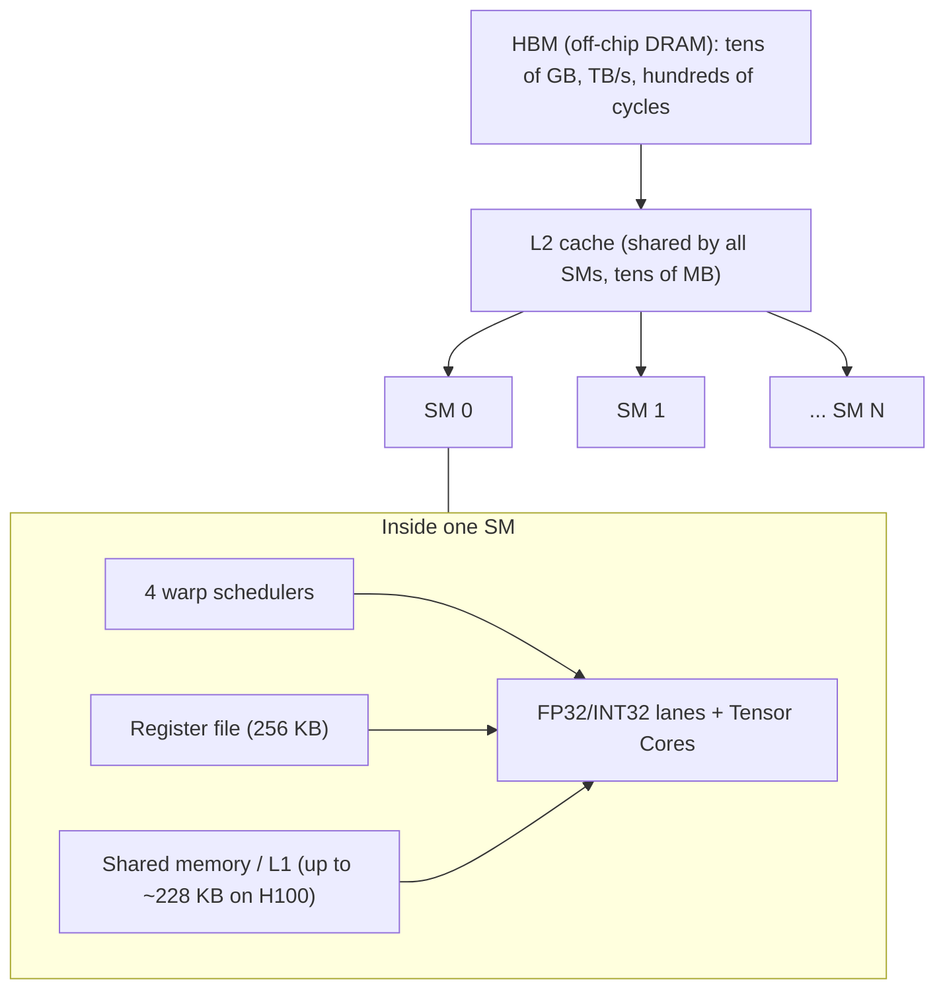

# Module 01: GPU Microarchitecture & Execution Model

> **Architectural Scope**: Streaming Multiprocessors (SMs), Warp Schedulers, Tensor Cores, Register Files, Shared Memory vs HBM3e, Warp Divergence, Little's Law, and the Roofline Model.

---

## Why this module matters

Every later module in this course (CUDA, Triton, FlashAttention, quantization kernels, distributed training) is an argument about **where bytes live and how fast they move**. A GPU is not "a faster CPU". It is a machine built to keep thousands of threads in flight so that the time spent waiting on memory is hidden behind other threads' work. If you understand the hardware hierarchy, the SIMT execution model, and the roofline, you can predict whether a kernel will be fast *before* you profile it.

By the end you should be able to:

1. Name the parts of an SM and say what each is for.
2. Explain why a warp is the unit of execution and what happens when its threads disagree on a branch.
3. Use Little's Law to explain why a GPU needs tens of thousands of threads in flight.
4. Compute a kernel's arithmetic intensity and say, with a number, whether it is memory-bound or compute-bound.

## Mental model: a factory with a tiny loading dock

Picture a factory (the GPU) made of ~100 independent workshops (SMs). Each workshop has many workers (CUDA cores and Tensor Cores), a few shelves right next to the workers (registers and shared memory), and one small door to a giant warehouse across the road (HBM). Walking to the warehouse takes a long time, but the road is wide: lots of trucks can travel at once. The workshop stays busy only if there are always other jobs ready to run while some jobs wait for their delivery. That is the whole design philosophy: **throughput over latency**.


```mermaid
flowchart TD
    HBM["HBM (off-chip DRAM): tens of GB, TB/s, hundreds of cycles"] --> L2["L2 cache (shared by all SMs, tens of MB)"]
    L2 --> SM0["SM 0"]
    L2 --> SM1["SM 1"]
    L2 --> SMn["... SM N"]
    subgraph Inside["Inside one SM"]
        SCH["4 warp schedulers"] --> EXE["FP32/INT32 lanes + Tensor Cores"]
        REG["Register file (256 KB)"] --> EXE
        SMEM["Shared memory / L1 (up to ~228 KB on H100)"] --> EXE
    end
    SM0 --- Inside
```

## 1. Anatomy of a Streaming Multiprocessor

A modern NVIDIA GPU is an array of **Streaming Multiprocessors (SMs)** connected through a crossbar to a shared **L2 cache** and off-chip **HBM**. The numbers below are for data-center parts; always check the datasheet for your exact SKU because enabled-SM counts, clocks and memory sizes vary.

| Resource | A100 (Ampere) | H100 SXM (Hopper) | Notes |
|---|---|---|---|
| SMs | 108 | 132 | B200 (Blackwell) has on the order of 148 enabled SMs across two dies |
| Warp schedulers per SM | 4 | 4 | Each issues one warp instruction per cycle to its sub-partition |
| FP32 lanes per SM | 64 | 128 | Counted as "CUDA cores" in marketing |
| Tensor Cores per SM | 4 (3rd gen) | 4 (4th gen) | Matrix-multiply-accumulate units; Blackwell adds 5th gen |
| Register file per SM | 64K x 32-bit = 256 KB | 256 KB | Per-thread private storage |
| Shared memory + L1 per SM | up to 192 KB | up to 228 KB | Software-managed shared memory is carved out of this |
| L2 cache | 40 MB | 50 MB | Shared by every SM |
| HBM | 40/80 GB, ~1.6-2.0 TB/s | 80 GB, ~3.35 TB/s | Blackwell HBM3e is roughly 8 TB/s |

Key limits that show up constantly in kernels:

- **Warp size = 32 threads.**
- **Max 1,024 threads per block**, and **max 2,048 resident threads (64 warps) per SM** on A100/H100.
- **Max 255 registers per thread.** Registers are split across all resident threads, so using more registers per thread means fewer threads fit (lower *occupancy*).
- Shared memory is **per block** and is allocated from the SM's pool, so a block that asks for a lot of it limits how many blocks share the SM.

### The memory hierarchy, by cost

| Level | Scope | Typical latency | Who manages it |
|---|---|---|---|
| Registers | one thread | ~1 cycle | compiler |
| Shared memory | one block | ~20-30 cycles | you (explicit) |
| L1 / L2 cache | SM / whole GPU | ~30 / ~200 cycles | hardware |
| HBM (global memory) | whole GPU | ~400-800 cycles | you (access pattern matters) |

The ratio matters more than any single number: **an HBM access costs roughly a hundred registers' worth of time**. Good GPU code moves data from HBM to on-chip memory once, reuses it many times, and writes results back once.

## 2. SIMT: how threads actually execute

You write code for one thread. The hardware groups 32 consecutive threads (by linearized thread index within a block) into a **warp** and issues one instruction for the whole warp at a time. This is **Single Instruction, Multiple Threads (SIMT)**.

Each thread still has its own registers and, since Volta, its own program counter, but the scheduler issues instructions to the warp as a unit. Lanes that are not on the issued path are *masked off* for that instruction.

### Warp divergence

```cpp
if (threadIdx.x < 16) {
    path_A();   // lanes 0-15
} else {
    path_B();   // lanes 16-31
}
```

The warp cannot run both paths at once. The hardware runs path A with lanes 16-31 masked, then path B with lanes 0-15 masked. Total time is `T(A) + T(B)` and half the lanes are idle in each pass.

Rules of thumb:

- Divergence is only a problem **within a warp**. If whole warps take the same branch (`if (blockIdx.x == 0)`, or a condition that is uniform across each group of 32 threads), there is no penalty.
- Short, cheap divergent branches are fine; the compiler often turns them into predicated instructions.
- If you must branch on data, try to **sort or bucket the work** so that neighbouring threads follow the same path.

## 3. Hiding latency: occupancy and Little's Law

A CPU hides memory latency with big caches, branch prediction and out-of-order execution. A GPU hides it by **switching between warps for free**: while warp 0 waits ~500 cycles for HBM, the scheduler issues instructions from warps 1, 2, 3... There is no context-switch cost because every resident warp already owns its registers.

**Little's Law** gives the amount of work you must keep in flight:

`concurrency = throughput x latency`

Example. To keep a 2 TB/s memory system busy when each request takes about 500 ns:

`2e12 B/s x 500e-9 s = 1,000,000 B` (about 1 MB in flight across the whole GPU).

Divided over 108 SMs that is roughly 9 KB per SM, which is several hundred independent 32-byte sectors outstanding per SM at any moment. You get there with **many resident warps** (high occupancy) or with **each thread issuing several independent loads** (instruction-level parallelism, e.g. `float4` loads).

**Occupancy** = resident warps / maximum warps per SM. It is limited by three budgets: registers per thread, shared memory per block, and threads per block. High occupancy helps hide latency, but it is not a goal in itself: a kernel with plenty of independent loads per thread can reach peak bandwidth at 25-50% occupancy.

## 4. The roofline model

For a kernel that performs `F` floating-point operations and moves `B` bytes to and from HBM, its **arithmetic intensity** is `I = F / B` (FLOP per byte). The attainable performance is:

`P = min(P_peak, I x BW_peak)`

The **ridge point** `I_ridge = P_peak / BW_peak` separates the two regimes. Below it the kernel is **memory-bound** (faster ALUs do nothing); above it the kernel is **compute-bound**.

| Device and datatype | Peak compute | HBM bandwidth | Ridge point |
|---|---|---|---|
| A100, FP32 (non-tensor) | 19.5 TFLOP/s | ~2.0 TB/s | ~10 FLOP/B |
| A100, FP16 Tensor Core (dense) | 312 TFLOP/s | ~2.0 TB/s | ~156 FLOP/B |
| H100 SXM, FP16 Tensor Core (dense) | ~990 TFLOP/s | ~3.35 TB/s | ~295 FLOP/B |

### Worked example: two kernels, two answers

**Vector add** `c[i] = a[i] + b[i]` in FP32: 1 FLOP per element, 12 bytes moved (read 8, write 4). `I = 1/12 = 0.083 FLOP/B`. At 2 TB/s the bound is `0.083 x 2e12 = 167 GFLOP/s`, under 1% of the 19.5 TFLOP/s peak. It is hopelessly memory-bound; the only optimisation that matters is moving fewer bytes or fusing it with a neighbour.

**Square matrix multiply** `N x N` in FP16: `F = 2N^3`, minimum traffic `B = 3 x N^2 x 2` bytes, so `I = N/3`. For `N = 4096`, `I ~ 1,365 FLOP/B`, far above the ridge point: compute-bound, so Tensor Cores are what matter.

This is why Transformers behave the way they do: large GEMMs (prefill, training) are compute-bound; elementwise ops, normalisation, softmax and decode-time attention are memory-bound. Fusion (Module 07) and FlashAttention (Module 08) exist to move kernels to the right of the ridge point by cutting HBM traffic.

## Common pitfalls

1. **Optimising the wrong bound.** Rewriting arithmetic in a memory-bound kernel changes nothing. Compute `I` first.
2. **Confusing peak with achievable.** Real kernels reach perhaps 60-90% of peak bandwidth; Tensor Core peaks assume ideal tile shapes and data layouts.
3. **Assuming divergence is always costly.** It is costly only when lanes in a *warp* diverge on expensive paths.
4. **Chasing 100% occupancy.** Past the point where latency is hidden, more occupancy often forces register spilling and gets slower.
5. **Counting "CUDA cores" across generations.** The FP32 lane counts changed (A100 64/SM, H100 128/SM); compare TFLOP/s, not core counts.

## How this connects

- **Next:** Module 02 turns this hierarchy into code: grids, blocks, threads and how indices map to warps.
- **Module 03** is about the cost of the HBM and shared-memory levels (coalescing, bank conflicts).
- **Module 05 and 08** are direct applications of the roofline: tiling raises `I` for GEMM; FlashAttention raises `I` for attention.
- **Course 09 (inference)** uses the same reasoning to explain why decoding is memory-bound.

## Go further

- roadmap.sh: *Inference Engineering* roadmap nodes **GPU architecture**, **compute**, **memory**, **roofline model**, **arithmetic intensity**, **opsbyte ratio**.
- NVIDIA Hopper architecture in depth (developer.nvidia.com blog) and the CUDA C++ Programming Guide chapter "Programming Model".
- Williams, Waterman, Patterson, *Roofline: an insightful visual performance model* (CACM 2009).

---

## Module Study Progression
1. **Beginner Playground**: Read [00_FOUNDATIONS_PLAYGROUND.md](00_FOUNDATIONS_PLAYGROUND.md) for intuitive analogies.
2. **Architecture Theory**: Study this [01_README.md](01_README.md).
3. **Hands-on Project**: Follow [02_PROJECT_GUIDE.md](02_PROJECT_GUIDE.md).
4. **Staff Interview Challenges**: Test yourself in [03_SELF_ASSESSMENT_AND_CHALLENGES.md](03_SELF_ASSESSMENT_AND_CHALLENGES.md).
5. **Production Debugging**: Review [04_TROUBLESHOOTING_AND_EDGE_CASES.md](04_TROUBLESHOOTING_AND_EDGE_CASES.md).
