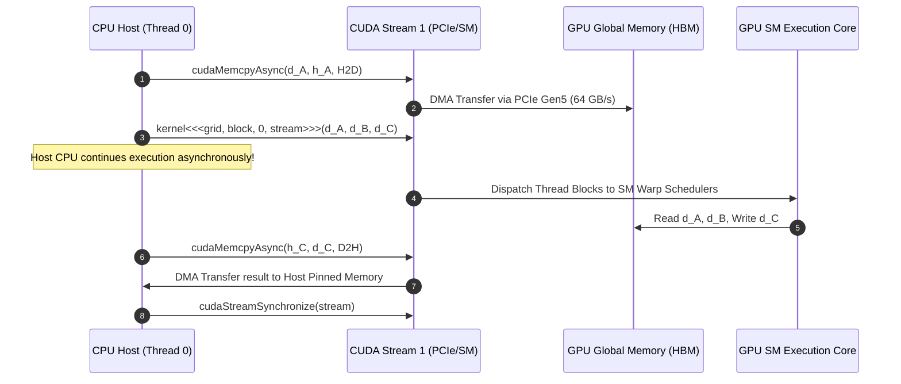

# Module 02: CUDA C++ Programming Fundamentals

> **Architectural Scope**: Grid/Block/Thread 3D Hierarchy, 1D/2D/3D Coordinate Indexing, Grid-Stride Loops, Memory Allocation, and Asynchronous Streams.

---


## CUDA Host-to-Device Asynchronous Execution Pipeline



---

## 🗺️ Recommended Step-by-Step Learning Path

Follow this exact sequence to achieve complete mastery of this module:

| Step | File to Open | What You Will Do |
| :---: | :--- | :--- |
| **1** | **[01_README.md](01_README.md)** | Read conceptual overview, architectural foundations, and mental models. |
| **2** | **[00_FOUNDATIONS_PLAYGROUND.md](00_FOUNDATIONS_PLAYGROUND.md)** | Practice beginner spoonfed micro-drills and line-by-line syntax breakdowns. |
| **3** | **[00_try_it_yourself.py](00_try_it_yourself.py)** | Run in terminal (`python 00_try_it_yourself.py`) for an interactive zero-dependency sandbox. |
| **4** | **[04_TROUBLESHOOTING_AND_EDGE_CASES.md](04_TROUBLESHOOTING_AND_EDGE_CASES.md)** | Study forensic runbooks, edge cases, and real-world failure post-mortems. |
| **5** | **[03_SELF_ASSESSMENT_AND_CHALLENGES.md](03_SELF_ASSESSMENT_AND_CHALLENGES.md)** | Test your knowledge with self-assessment quizzes, challenges, and diagnostic scenarios. |
| **6** | **[02_PROJECT_GUIDE.md](02_PROJECT_GUIDE.md)** | Follow guided project implementation for `starter/` and `project_solution/`. |
| **7** | **[problems/](problems/)** | Solve hands-on problem bank challenges and verify with `pytest problems/tests`. |
| **8** | **[debug_lab/](debug_lab/)** | Diagnose and fix silent production bugs in the Bug Hunter Drill. |

---

## 1. The 3D Execution Hierarchy

CUDA structures parallel execution into a three-level hierarchy:
1. **Thread**: Executes kernel instructions on a single processor lane.
2. **Block (`blockIdx`, `blockDim`)**: A cooperative group of threads (up to 1,024 threads) executed on a single SM with access to Shared Memory.
3. **Grid (`gridDim`)**: The collection of all blocks launched by a single kernel.

```
+-----------------------------------------------------------------------------------------------+
|                                         CUDA GRID                                             |
+-----------------------------------------------+-----------------------------------------------+
| Block (0, 0)                                  | Block (1, 0)                                  |
| [Thread (0,0), Thread (1,0), ... Thread (M,N)]| [Thread (0,0), Thread (1,0), ... Thread (M,N)]|
+-----------------------------------------------+-----------------------------------------------+
| Block (0, 1)                                  | Block (1, 1)                                  |
| [Thread (0,0), Thread (1,0), ... Thread (M,N)]| [Thread (0,0), Thread (1,0), ... Thread (M,N)]|
+-----------------------------------------------+-----------------------------------------------+
```

---

## 2. Linear Index Calculations

Because computer DRAM is a 1-dimensional byte array, multi-dimensional thread coordinates must be linearized:

### 1D Grid of 1D Blocks
$$\text{idx} = \text{blockIdx.x} \times \text{blockDim.x} + \text{threadIdx.x}$$

### 2D Grid of 2D Blocks (Matrix Processing)
$$\text{col} = \text{blockIdx.x} \times \text{blockDim.x} + \text{threadIdx.x}$$
$$\text{row} = \text{blockIdx.y} \times \text{blockDim.y} + \text{threadIdx.y}$$
$$\text{linear\_idx} = \text{row} \times \text{width} + \text{col}$$

### 3D Grid of 3D Blocks (Volumetric / Video / Batch Processing)
$$\text{x} = \text{blockIdx.x} \times \text{blockDim.x} + \text{threadIdx.x}$$
$$\text{y} = \text{blockIdx.y} \times \text{blockDim.y} + \text{threadIdx.y}$$
$$\text{z} = \text{blockIdx.z} \times \text{blockDim.z} + \text{threadIdx.z}$$
$$\text{linear\_idx} = \text{z} \times (\text{height} \times \text{width}) + \text{y} \times \text{width} + \text{x}$$

---

## 3. The Grid-Stride Loop Architecture

```cpp
__global__ void vector_add_grid_stride(const float *__restrict__ a,
                                       const float *__restrict__ b,
                                       float *__restrict__ c,
                                       int n) {
    int stride = gridDim.x * blockDim.x;
    for (int idx = blockIdx.x * blockDim.x + threadIdx.x; idx < n; idx += stride) {
        c[idx] = a[idx] + b[idx];
    }
}
```

### Advantages of Grid-Stride Loops:
1. **Decoupled Grid Size**: You can launch a fixed grid size (e.g. `gridDim=128, blockDim=256`) regardless of whether $N=1{,}000$ or $N=1{,}000{,}000{,}000$.
2. **Register & Cache Reuse**: Threads remain resident on the SM and reuse registers across loop iterations instead of tearing down thread context.
3. **Debuggability**: You can emulate serial execution on CPU by setting `gridDim=1, blockDim=1`.

---

## 4. Asynchronous Streams & Pinned Memory

CUDA operations on the default stream (`stream 0`) are synchronous and block the host.
For maximum pipeline throughput, production systems use **Non-Default Streams** and **Page-Locked (Pinned) Memory**:

```cpp
cudaStream_t stream1, stream2;
cudaStreamCreate(&stream1);
cudaStreamCreate(&stream2);

// Allocate pinned memory (prevents OS from paging memory to disk)
float *h_pinned;
cudaHostAlloc(&h_pinned, bytes, cudaHostAllocDefault);

// Overlap copy on stream 1 with kernel execution on stream 2
cudaMemcpyAsync(d_in1, h_pinned, bytes, cudaMemcpyHostToDevice, stream1);
my_kernel<<<grid, block, 0, stream2>>>(d_in2, d_out2);
```

---

## 5. Module Study Progression
1. **Beginner Playground**: Read [00_FOUNDATIONS_PLAYGROUND.md](00_FOUNDATIONS_PLAYGROUND.md).
2. **Architecture Theory**: Study this [01_README.md](01_README.md).
3. **Hands-on Project**: Follow [02_PROJECT_GUIDE.md](02_PROJECT_GUIDE.md).
4. **Staff Interview Challenges**: Review [03_SELF_ASSESSMENT_AND_CHALLENGES.md](03_SELF_ASSESSMENT_AND_CHALLENGES.md).
5. **Production Debugging**: Review [04_TROUBLESHOOTING_AND_EDGE_CASES.md](04_TROUBLESHOOTING_AND_EDGE_CASES.md).