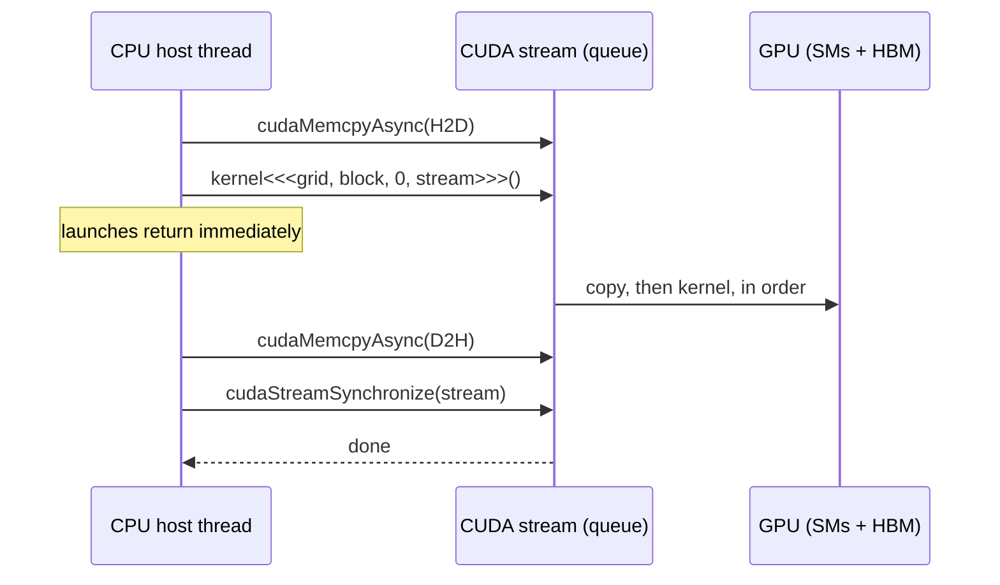

# Module 02: CUDA C++ Programming Fundamentals

> **Architectural Scope**: Grid/Block/Thread 3D Hierarchy, 1D/2D/3D Coordinate Indexing, Grid-Stride Loops, Memory Allocation, and Asynchronous Streams.

---

## Why this module matters

Module 01 described the machine. This module is how you talk to it. CUDA gives you a small number of ideas: a three-level thread hierarchy, a way to compute "which element am I responsible for", explicit device memory, and asynchronous queues called streams. Almost every kernel in this course, including the ones Triton generates for you, is built from these.

You should leave able to write, launch, and correctly check a kernel; choose a sensible launch configuration; and overlap copies with compute.

## Mental model: a kernel is a function that runs once per thread

You write the code for **one** thread. The launch `kernel<<<grid, block>>>(args)` creates `grid x block` copies of it. Each copy learns who it is through built-in variables and uses that identity to pick its slice of the data.


```mermaid
sequenceDiagram
    participant Host as CPU host thread
    participant Stream as CUDA stream (queue)
    participant GPU as GPU (SMs + HBM)
    Host->>Stream: cudaMemcpyAsync(H2D)
    Host->>Stream: kernel<<<grid, block, 0, stream>>>()
    Note over Host: launches return immediately
    Stream->>GPU: copy, then kernel, in order
    Host->>Stream: cudaMemcpyAsync(D2H)
    Host->>Stream: cudaStreamSynchronize(stream)
    Stream-->>Host: done
```

## 1. The thread hierarchy

1. **Thread**: one execution of the kernel body, with private registers.
2. **Block** (`blockIdx`, `blockDim`): up to **1,024 threads**, scheduled on **one SM**, able to cooperate through shared memory and `__syncthreads()`.
3. **Grid** (`gridDim`): all blocks of one launch. Blocks are independent: they may run in any order and on any SM, so **never assume one block can wait for another**.

Why two levels? Blocks are what the hardware distributes across SMs (scalability), while threads within a block can share fast on-chip memory (cooperation). Hardware executes blocks in groups of 32 threads called **warps** (Module 01), so choose block sizes that are multiples of 32. 128 or 256 threads per block is a good default; tune from there.

## 2. Turning coordinates into indices

Memory is a flat array, so each thread converts its coordinates into a linear index.

```cpp
// 1D
int i = blockIdx.x * blockDim.x + threadIdx.x;

// 2D (image / matrix, row-major)
int col = blockIdx.x * blockDim.x + threadIdx.x;
int row = blockIdx.y * blockDim.y + threadIdx.y;
int idx = row * width + col;
```

For 3D add `z` and use `idx = (z * height + y) * width + x`.

Two rules that prevent most bugs:

- **Always bounds-check.** The grid is rounded up to whole blocks, so the last block usually has threads past the end: `if (i < n) ...`.
- **Map `threadIdx.x` to the fastest-changing (contiguous) dimension.** Neighbouring threads in a warp should touch neighbouring addresses; Module 03 explains why.

Launch configuration for `n` elements: `blocks = (n + threads - 1) / threads` (ceiling division).

## 3. A complete first kernel

```cpp
#include <cstdio>
#include <cuda_runtime.h>

#define CUDA_CHECK(x) do { cudaError_t e = (x); if (e != cudaSuccess) { \
    fprintf(stderr, "CUDA error %s at %s:%d\n", cudaGetErrorString(e), __FILE__, __LINE__); exit(1);} } while (0)

__global__ void add(const float* a, const float* b, float* c, int n) {
    int i = blockIdx.x * blockDim.x + threadIdx.x;
    if (i < n) c[i] = a[i] + b[i];
}

int main() {
    const int n = 1 << 20;
    size_t bytes = n * sizeof(float);
    float *h_a = (float*)malloc(bytes), *h_b = (float*)malloc(bytes), *h_c = (float*)malloc(bytes);
    for (int i = 0; i < n; ++i) { h_a[i] = 1.f; h_b[i] = 2.f; }

    float *d_a, *d_b, *d_c;
    CUDA_CHECK(cudaMalloc(&d_a, bytes)); CUDA_CHECK(cudaMalloc(&d_b, bytes)); CUDA_CHECK(cudaMalloc(&d_c, bytes));
    CUDA_CHECK(cudaMemcpy(d_a, h_a, bytes, cudaMemcpyHostToDevice));
    CUDA_CHECK(cudaMemcpy(d_b, h_b, bytes, cudaMemcpyHostToDevice));

    add<<<(n + 255) / 256, 256>>>(d_a, d_b, d_c, n);
    CUDA_CHECK(cudaGetLastError());          // launch-time errors
    CUDA_CHECK(cudaDeviceSynchronize());     // execution-time errors

    CUDA_CHECK(cudaMemcpy(h_c, d_c, bytes, cudaMemcpyDeviceToHost));
    printf("c[0] = %f\n", h_c[0]);           // expect 3.0
    cudaFree(d_a); cudaFree(d_b); cudaFree(d_c); free(h_a); free(h_b); free(h_c);
}
```

Key facts: `__global__` functions run on the device and are launched from the host; `cudaMalloc` allocates **device** memory (host pointers cannot be dereferenced on the device and vice versa); kernel launches are **asynchronous**, so errors surface later unless you check `cudaGetLastError()` and synchronise. Wrap every API call in a checking macro from day one.

## 4. Grid-stride loops

Instead of one thread per element, launch a fixed-size grid and let each thread loop:

```cpp
__global__ void add_gs(const float* a, const float* b, float* c, int n) {
    int stride = gridDim.x * blockDim.x;
    for (int i = blockIdx.x * blockDim.x + threadIdx.x; i < n; i += stride)
        c[i] = a[i] + b[i];
}
```

Why: the kernel is correct for any `n`, you can size the grid to the GPU (for example a few waves of blocks per SM) instead of to the data, per-thread setup cost is amortised, and consecutive iterations of a warp still touch consecutive addresses, so loads stay coalesced. Launching with `<<<1, 1>>>` also gives you a serial reference run for debugging.

## 5. Streams, pinned memory and overlap

Operations in one stream run **in order**; operations in different streams **may overlap**. Overlapping a host-to-device copy with a kernel needs three things: non-default streams, **pinned** (page-locked) host memory, and independent data.

```cpp
cudaStream_t s1, s2;
cudaStreamCreate(&s1); cudaStreamCreate(&s2);
float* h_pinned;  cudaMallocHost(&h_pinned, bytes);       // page-locked

cudaMemcpyAsync(d_in1, h_pinned, bytes, cudaMemcpyHostToDevice, s1);
my_kernel<<<grid, block, 0, s2>>>(d_in2, d_out2);           // runs while copy proceeds
cudaStreamSynchronize(s1); cudaStreamSynchronize(s2);
```

Pageable memory forces the driver to stage through a pinned buffer, which blocks overlap. Pinned memory is a limited resource: allocate a few large buffers, not thousands of small ones. The classic pattern is a **pipeline**: split work into chunks and cycle copy-in, compute, copy-out across 2 to 3 streams.

## Worked example: choosing a launch configuration

Vector length `n = 10,000,000`, block size 256. Blocks needed: `ceil(10,000,000 / 256) = 39,063`, which launches 10,000,128 threads, so 128 are out of range and must be guarded by `if (i < n)`. With a grid-stride loop on a 108-SM GPU, 108 x 8 = 864 blocks of 256 threads would cover the same work with each thread handling about 45 elements, with no loss in bandwidth because accesses stay coalesced.

## Common pitfalls

1. **Forgetting the bounds check**, causing out-of-bounds writes that corrupt memory silently.
2. **Not checking errors.** A failed launch just does nothing, and your output is the old data.
3. **Timing without synchronising.** Launch returns immediately; use CUDA events or `cudaDeviceSynchronize()` before reading a clock.
4. **Assuming block ordering** or inter-block waits (deadlocks).
5. **Block sizes that are not multiples of 32**, wasting lanes in the last warp.
6. **Pageable host buffers** with `cudaMemcpyAsync`, which silently serialises.
7. **Allocating in a hot loop.** `cudaMalloc` is slow and synchronising; allocate once and reuse (or use a pool).

## How this connects

- **Module 03** explains which index patterns are fast.
- **Module 04** uses `threadIdx` and warps for cooperative reductions.
- **Module 06 (Triton)** hides block/thread indexing: you write per-*block* programs instead.
- **Course 08** uses streams heavily to overlap communication with compute.

## Go further

- roadmap.sh: *Inference Engineering* nodes **CUDA**, **kernel selection / fusion**.
- NVIDIA blog "An Even Easier Introduction to CUDA" and the CUDA C++ Programming Guide.
- NVIDIA CUDA Best Practices Guide: memory and execution configuration chapters.

---

## Module Study Progression
1. **Beginner Playground**: Read [00_FOUNDATIONS_PLAYGROUND.md](00_FOUNDATIONS_PLAYGROUND.md).
2. **Architecture Theory**: Study this [01_README.md](01_README.md).
3. **Hands-on Project**: Follow [02_PROJECT_GUIDE.md](02_PROJECT_GUIDE.md).
4. **Staff Interview Challenges**: Review [03_SELF_ASSESSMENT_AND_CHALLENGES.md](03_SELF_ASSESSMENT_AND_CHALLENGES.md).
5. **Production Debugging**: Review [04_TROUBLESHOOTING_AND_EDGE_CASES.md](04_TROUBLESHOOTING_AND_EDGE_CASES.md).
