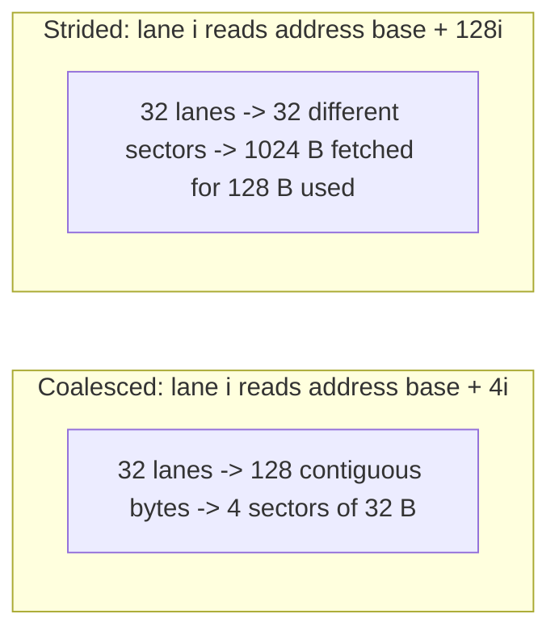

# Module 03: CUDA Memory Hierarchy & Coalescing

> **Architectural Scope**: 128-Byte Coalescing Rules, Shared Memory 32-Bank Structure, Bank Conflicts, Padding Mechanics, and Cache Bypass with `__ldg()`.

---

## Why this module matters

Module 01's roofline says most of the kernels you will write are limited by memory, not arithmetic. This module is about the two memory levels you control directly: **global memory** (HBM), where the *access pattern* decides whether you get 100% or 10% of the bandwidth, and **shared memory**, where the *bank layout* decides whether a warp's accesses take one cycle or thirty-two. Getting these two right is usually worth more than any other optimisation.

## Mental model: buses and lockers

Global memory is a **bus** that moves fixed-size chunks. If 32 neighbours each want a 4-byte item from the same chunk, one trip serves them all. If each wants an item from a different chunk, you pay for 32 trips and throw most of each chunk away.

Shared memory is a wall of **32 lockers** (banks) with one door each. A warp can open 32 different doors in one cycle, but if two threads need *different shelves of the same locker*, one must wait.



## 1. Global memory coalescing

The memory system serves requests in aligned **32-byte sectors** (grouped into 128-byte cache lines). When a warp executes a load, the hardware looks at the 32 addresses and counts the distinct sectors touched; each distinct sector is one unit of DRAM/L2 traffic.

| Pattern (4-byte floats) | Sectors fetched | Bytes fetched | Useful bytes | Efficiency |
|---|---|---|---|---|
| Lane `i` reads `a[base + i]` (aligned) | 4 | 128 | 128 | 100% |
| Same, but misaligned by one element | 5 | 160 | 128 | 80% |
| Lane `i` reads `a[base + 2i]` (stride 2) | 8 | 256 | 128 | 50% |
| Lane `i` reads `a[base + 32i]` (stride 32) | 32 | 1,024 | 128 | 12.5% |
| All lanes read the same address | 1 | 32 | 4 | broadcast, one sector |

(Older material quotes 3% for the stride-32 case by comparing against whole 128-byte lines; with 32-byte sectors, which modern GPUs use, the figure is 12.5%. Either way the lesson is the same: strided access wastes most of the bandwidth you paid for.)

**Rules**

1. Make `threadIdx.x` the index of the contiguous dimension. In a row-major matrix, adjacent threads should read adjacent columns.
2. Prefer **structure of arrays (SoA)** over array of structures (AoS): reading `particles.x[i]` is coalesced, reading `particles[i].x` strides by `sizeof(struct)`.
3. Align base pointers (`cudaMalloc` returns 256-byte aligned memory; sub-views may not be).

### Vector loads

A thread can load 16 bytes at once with `float4` (or `int4`, `uint4`):

```cpp
float4 v = reinterpret_cast<const float4*>(in)[i];   // requires 16-byte alignment
```

This issues one instruction instead of four, which reduces instruction pressure and helps keep enough bytes in flight (Little's Law, Module 01). Make sure `n` and the pointer are multiples of 4 elements, or handle the tail separately.

### Read-only data and `__ldg`

Marking a pointer `const __restrict__` lets the compiler route loads through the read-only (texture) data path; `__ldg(&p[i])` requests that explicitly. On recent architectures the compiler does it automatically when it can prove the data is not written, so you mostly need `const` and `__restrict__` correctness rather than manual `__ldg`.

## 2. Shared memory and its 32 banks

Shared memory is on-chip, roughly two orders of magnitude lower latency than HBM, and **explicitly managed**. It is divided into **32 banks**, each 4 bytes wide; consecutive 4-byte words go to consecutive banks:

`bank = (byte_address / 4) mod 32`

For one warp-wide access:

- **All 32 threads hit 32 different banks:** one cycle.
- **Many threads read the same address in one bank:** one cycle (broadcast).
- **Threads hit different addresses in the same bank:** a **k-way bank conflict**, which takes `k` serialised cycles.

Stride examples (in 4-byte words): stride 1 is conflict-free; stride 2 is a 2-way conflict; stride 32 puts every thread in the same bank, a 32-way conflict. Any odd stride is conflict-free because it is coprime with 32.

## 3. Worked example: the matrix transpose

A transpose reads rows (coalesced) and must write columns (strided). The fix is to stage a tile in shared memory so *both* global accesses are coalesced and the transposition happens on chip:

```cpp
#define TILE 32
__global__ void transpose(const float* in, float* out, int n) {
    __shared__ float tile[TILE][TILE + 1];             // +1 padding, explained below
    int x = blockIdx.x * TILE + threadIdx.x;
    int y = blockIdx.y * TILE + threadIdx.y;
    if (x < n && y < n) tile[threadIdx.y][threadIdx.x] = in[y * n + x];   // coalesced read
    __syncthreads();
    x = blockIdx.y * TILE + threadIdx.x;               // swap block coordinates
    y = blockIdx.x * TILE + threadIdx.y;
    if (x < n && y < n) out[y * n + x] = tile[threadIdx.x][threadIdx.y];  // coalesced write
}
// launch with dim3 block(TILE, TILE) (1024 threads), dim3 grid(ceil(n/TILE), ceil(n/TILE))
```

**Why `TILE + 1`?** The write phase reads `tile[threadIdx.x][threadIdx.y]`, so within a warp (varying `threadIdx.x`) the word address is `x * rowLength + y`.

- With `rowLength = 32`: bank `= (32x + y) mod 32 = y`, so all 32 threads hit **the same bank**: a 32-way conflict.
- With `rowLength = 33`: bank `= (33x + y) mod 32 = (x + y) mod 32`, which is **distinct for every x**: conflict-free.

One wasted column per row removes a 32x slowdown in that phase. The same padding or an XOR swizzle of the column index is used in GEMM tiles (Module 05).

## 4. Putting a number on it

Copying a 1 GB array on a GPU with 2 TB/s peak moves 2 GB in total (1 GB read, 1 GB written). A coalesced copy kernel should reach roughly 1.6 to 1.8 TB/s, so about 1.2 ms (`time = 2 x bytes / measured_bandwidth`). A naive transpose that writes with stride `n` often lands at 10 to 20% of that bandwidth. Always measure **effective bandwidth** `= bytes_moved / time` and compare it against a plain copy kernel, which is the practical ceiling for any memory-bound kernel.

## Common pitfalls

1. **Row/column mix-up**: `a[threadIdx.x * width + col]` is strided across the warp. The contiguous dimension must vary with `threadIdx.x`.
2. **AoS layouts** silently produce strided access.
3. **Forgetting `__syncthreads()`** between writing and reading the tile (race), or placing it inside divergent code (deadlock).
4. **Assuming padding is free**: it increases shared memory per block and can reduce occupancy.
5. **Misaligned vector loads** (`float4` on a pointer offset by 4 bytes) fault or fall back to slow paths.
6. **Optimising bank conflicts before coalescing**: global traffic usually dominates; fix it first.

## How this connects

- **Module 02** gave you the index maths; here you learn which index maps are fast.
- **Module 04** reduces data in shared memory and registers with conflict-free access patterns.
- **Module 05 (GEMM)** is tiling plus padding at scale.
- **Module 08 (FlashAttention)** is the same idea as the transpose tile: keep working sets on chip.

## Go further

- roadmap.sh: *Inference Engineering* nodes **memory**, **GPU architecture**, **kernel selection / fusion**.
- NVIDIA blogs: "How to Access Global Memory Efficiently in CUDA C/C++ Kernels" and "Using Shared Memory in CUDA C/C++".
- CUDA C++ Best Practices Guide, *Memory Optimizations*.

---

## Module Study Progression
1. **Beginner Playground**: Read [00_FOUNDATIONS_PLAYGROUND.md](00_FOUNDATIONS_PLAYGROUND.md).
2. **Architecture Theory**: Study this [01_README.md](01_README.md).
3. **Hands-on Project**: Follow [02_PROJECT_GUIDE.md](02_PROJECT_GUIDE.md).
4. **Staff Interview Challenges**: Check [03_SELF_ASSESSMENT_AND_CHALLENGES.md](03_SELF_ASSESSMENT_AND_CHALLENGES.md).
5. **Production Debugging**: Review [04_TROUBLESHOOTING_AND_EDGE_CASES.md](04_TROUBLESHOOTING_AND_EDGE_CASES.md).
