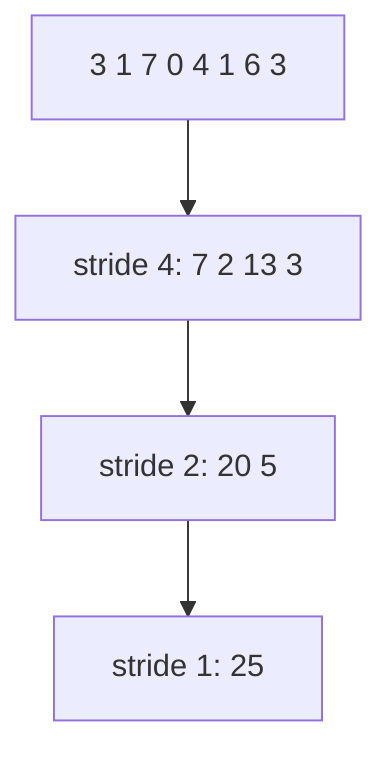

# Module 04: Parallel Reduction & Warp Primitives

> **Architectural Scope**: Parallel Tree Reductions, Warp Shuffle Instructions (`__shfl_down_sync`), Blelloch Work-Efficient Parallel Prefix Sum.

---

## Why this module matters

Reductions (sum, max, norm) and scans (prefix sums) are the glue of deep-learning kernels: softmax needs a max and a sum per row, LayerNorm and RMSNorm need a mean and a variance, loss functions need totals, and top-k, sorting and stream compaction are built on scans. They are also the first place where threads must **cooperate**, which makes them the best classroom for warp-level programming.

## Mental model: a tournament bracket

A serial sum is one person adding numbers one by one: `N - 1` steps. A parallel sum is a tournament bracket: in round one, pairs add up; in round two, pairs of pairs; after `log2(N)` rounds there is one winner. The work is still `N - 1` additions, but the *depth* (the number of sequential rounds) is only `log2(N)`.



On a GPU the bracket is mapped onto three levels, each with its own mechanism:

| Level | Cooperation tool | Cost of a step |
|---|---|---|
| Within a warp (32 lanes) | **shuffle** instructions (register to register) | ~1 instruction, no memory |
| Within a block | shared memory + `__syncthreads()` | on-chip memory + barrier |
| Across blocks | atomics, a second kernel, or a cooperative launch | global memory |

## 1. Block-level tree reduction in shared memory

Each thread loads one (or several) elements, then the block halves the number of active threads each round:

```cpp
__global__ void reduce_sum(const float* in, float* out, int n) {
    extern __shared__ float s[];
    int tid = threadIdx.x;
    int i = blockIdx.x * (blockDim.x * 2) + tid;
    float v = 0.f;
    if (i < n) v += in[i];
    if (i + blockDim.x < n) v += in[i + blockDim.x];     // each thread loads two elements
    s[tid] = v;
    __syncthreads();
    for (int stride = blockDim.x / 2; stride > 0; stride >>= 1) {
        if (tid < stride) s[tid] += s[tid + stride];       // sequential addressing
        __syncthreads();
    }
    if (tid == 0) out[blockIdx.x] = s[0];                  // one partial sum per block
}
```

Design choices that matter:

- **Sequential addressing** (`s[tid] += s[tid + stride]`, stride halving) keeps active threads contiguous, so whole warps retire together (little divergence) and bank accesses stay conflict-free. The "interleaved" variant (`if (tid % (2*stride) == 0)`) diverges badly and creates bank conflicts.
- **Load multiple elements per thread** before the tree: it raises the useful work per thread and is the single biggest win for large inputs.
- The partial sums (one per block) still need combining: launch a second small kernel, or use `atomicAdd` on a single float.

## 2. Warp shuffles: reductions without shared memory

Since Kepler, threads in a warp can read each other's registers directly:

```cpp
__device__ float warp_reduce_sum(float v) {
    for (int offset = 16; offset > 0; offset >>= 1)
        v += __shfl_down_sync(0xffffffffu, v, offset);
    return v;                                   // lane 0 holds the warp total
}
```

- `0xffffffff` is the **mask** of participating lanes; it must name every lane that executes the call, and Volta-and-later require the `_sync` forms.
- Five steps reduce 32 values (`16, 8, 4, 2, 1`), with **no shared memory and no barrier**, because lanes of a warp execute in lockstep with respect to the instruction.
- Related primitives: `__shfl_xor_sync` (butterfly: every lane ends with the total), `__shfl_up_sync` (scans), `__ballot_sync` and `__any_sync` (votes), and `__reduce_add_sync` for integers on recent hardware.

### The standard block reduce = warp reduce + one shared array

```cpp
__device__ float block_reduce_sum(float v) {
    __shared__ float warp_sums[32];
    int lane = threadIdx.x & 31, warp = threadIdx.x >> 5;
    v = warp_reduce_sum(v);                      // 1. reduce inside each warp
    if (lane == 0) warp_sums[warp] = v;          // 2. one value per warp to shared memory
    __syncthreads();
    v = (threadIdx.x < (blockDim.x + 31) / 32) ? warp_sums[lane] : 0.f;
    if (warp == 0) v = warp_reduce_sum(v);       // 3. first warp reduces the warp sums
    return v;                                    // valid in thread 0
}
```

This uses 128 bytes of shared memory and **two** barriers' worth of coordination instead of `log2(blockDim)` of them. It is the building block for softmax and layer-norm kernels (Module 07).

## 3. Prefix sum (scan)

An **inclusive scan** of `[3, 1, 7, 0]` is `[3, 4, 11, 11]`; an **exclusive scan** is `[0, 3, 4, 11]`. Scans turn "who goes where" questions into array indices: stream compaction (keep elements that pass a predicate), radix sort, and the offsets for variable-length outputs.

Two classic parallel algorithms:

| Algorithm | Depth | Work | Comment |
|---|---|---|---|
| Hillis-Steele | `log N` | `N log N` | simple, but does more additions than serial |
| **Blelloch** | `2 log N` | `2 (N - 1)` = `O(N)` | **work-efficient**; the right choice when memory bandwidth is the limit |

### Blelloch scan in two phases

1. **Up-sweep (reduce):** build the tree of partial sums bottom-up; the root holds the total.
2. **Down-sweep:** set the root to 0 (exclusive scan), then at each level, for a node with value `p` whose left child holds `l`: left child gets `p`, right child gets `p + l`.

Example on `[3, 1, 7, 0]`: up-sweep gives pairs `[3, 4, 7, 7]`, then root `11`. Set root to 0. Down-sweep: left half gets 0, right half gets `0 + 4 = 4`; then within each half, `[0, 3]` and `[4, 11]`. Result `[0, 3, 4, 11]`, the exclusive scan.

For arrays larger than a block, the standard recipe is: scan each block, scan the array of block totals, add each block's offset back. Modern libraries (CUB, Thrust) use a single-pass **decoupled look-back** scan, which is why you should call them rather than hand-roll large scans.

## Worked example: row-wise softmax denominators

Row length 4,096, one block of 256 threads per row. Each thread accumulates `4096 / 256 = 16` values in a register (no sync), then `block_reduce_sum` combines the 256 partials with 8 warp shuffles plus one 8-element shared pass. Compare with a naive version where thread 0 sums all 4,096 elements: it uses 1/256th of the machine and 4,096 sequential loads. Same answer, hundreds of times slower.

## Common pitfalls

1. **Floating-point non-associativity.** Different reduction orders give slightly different sums. Do not compare bitwise against a CPU; use a tolerance, or accumulate in FP32 when inputs are FP16 or BF16.
2. **Wrong shuffle mask** (some lanes inactive or out of range), causing undefined results or hangs.
3. **Barrier inside divergent code**: every thread of the block must reach `__syncthreads()`.
4. **Reading `warp_sums` beyond the number of warps** (garbage); zero-fill the unused entries.
5. **One `atomicAdd` per element** serialises on one address. Reduce inside the block first, then one atomic per block.
6. **Hand-rolling large scans.** Use CUB/Thrust.

## How this connects

- **Module 03**'s conflict-free access rules are why sequential addressing wins.
- **Module 07** builds fused RMSNorm and online softmax on `block_reduce_sum`.
- **Module 08**'s online softmax is a reduction that carries `(max, sum)` pairs: a reduction with a non-trivial combine operator.
- **Triton (Module 06)** exposes `tl.sum`, `tl.max` and `tl.cumsum`, compiled to exactly these patterns.

## Go further

- roadmap.sh: *Inference Engineering* node **kernel selection / fusion**.
- Mark Harris, *Optimizing Parallel Reduction in CUDA* (NVIDIA); NVIDIA blogs "Faster Parallel Reductions on Kepler" and "Using CUDA Warp-Level Primitives".
- GPU Gems 3, chapter 39, *Parallel Prefix Sum (Scan) with CUDA*; CUB documentation.

---

## Module Study Progression
1. **Beginner Playground**: Read [00_FOUNDATIONS_PLAYGROUND.md](00_FOUNDATIONS_PLAYGROUND.md).
2. **Architecture Theory**: Study this [01_README.md](01_README.md).
3. **Hands-on Project**: Follow [02_PROJECT_GUIDE.md](02_PROJECT_GUIDE.md).
4. **Staff Interview Challenges**: Check [03_SELF_ASSESSMENT_AND_CHALLENGES.md](03_SELF_ASSESSMENT_AND_CHALLENGES.md).
5. **Production Debugging**: Review [04_TROUBLESHOOTING_AND_EDGE_CASES.md](04_TROUBLESHOOTING_AND_EDGE_CASES.md).
