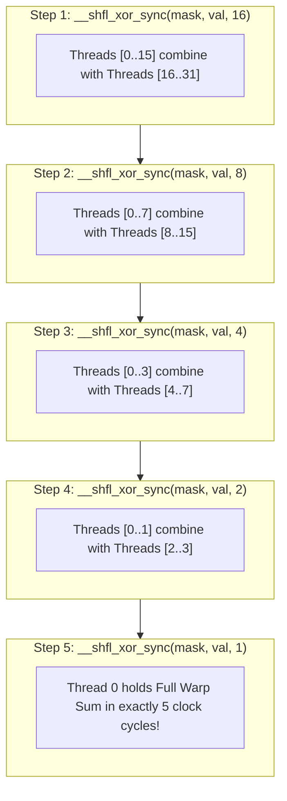

# Module 05: Tiled Matrix Multiplication (GEMM)

> **Architectural Scope**: Shared Memory Tiling, Register Micro-Tiling, Double Buffering, Bank Conflict Elimination, and Arithmetic Intensity Boost.

---


## Warp Shuffle Butterfly Reduction Topology



---

## 1. The Naive GEMM Memory Wall

Computing matrix multiplication $C = A \times B$ for $M \times K$ and $K \times N$ matrices:
$$C_{ij} = \sum_{k=0}^{K-1} A_{ik} B_{kj}$$

In naive global memory GEMM:
- Each thread computes 1 element of $C_{ij}$.
- To compute $C_{ij}$, the thread reads $K$ elements from row $i$ of $A$ and $K$ elements from column $j$ of $B$.
- **Total FLOPs**: $2 M N K$.
- **Total DRAM Reads**: $2 M N K \times 4 \text{ bytes}$.
- **Arithmetic Intensity**:
  $$I_{\text{naive}} = \frac{2 M N K}{2 M N K \times 4} = 0.25 \text{ FLOPs/Byte}$$
On an NVIDIA A100 (Peak Compute = $19.5 \text{ TFLOPs}$ FP32, Memory Bandwidth = $2{,}000 \text{ GB/s}$):
$$\text{Attainable Performance} = 0.25 \times 2{,}000 \text{ GB/s} = 500 \text{ GFLOPs/s}$$
Your GPU runs at **2.5% of its hardware capacity**! The GPU is starved for memory bandwidth.

---

## 2. 2D Shared Memory Block Tiling ($B_M \times B_N \times B_K$)

Instead of streaming elements from slow DRAM independently:
1. Divide matrix $C$ into tiles of size $B_M \times B_N$ (e.g. $32 \times 32$).
2. Assign each block of threads to compute one $C$-tile.
3. In outer loop across $K$ with step $B_K$:
   - Threads load a $B_M \times B_K$ slice of $A$ into `__shared__ float sA[BM][BK]`.
   - Threads load a $B_K \times B_N$ slice of $B$ into `__shared__ float sB[BK][BN]`.
   - Call `__syncthreads()` to ensure SRAM is fully written.
   - Accumulate partial matrix multiplication using ultra-fast SRAM!
   - Call `__syncthreads()` before loading the next phase.

```
+-----------------------------------------------------------------------------------------------+
| TILED GEMM MEMORY TRAFFIC REUSE                                                               |
+-----------------------------------------------------------------------------------------------+
| Global Memory (DRAM): Read each tile of A (N / BN) times, each tile of B (M / BM) times      |
| Memory Traffic:       Reduced by a factor of Tile Size!                                       |
| Arithmetic Intensity: I_tiled = (Tile_Size / 4) FLOPs/Byte                                    |
| For Tile_Size = 32:   I_tiled = 8.0 FLOPs/Byte (32x improvement over naive GEMM!)             |
+-----------------------------------------------------------------------------------------------+
```

---

## 3. Register Micro-Tiling & Double Buffering

Production libraries like NVIDIA CUTLASS and cuBLAS take tiling to the register level:
1. **Register Micro-Tiling**: Each thread in the block does not compute 1 element; each thread holds a small $m_m \times n_n$ matrix (e.g. $8 \times 8$) in **registers**.
   - Threads load elements from Shared Memory into registers, achieving another $8\times$ reuse!
2. **Double Buffering (Software Pipelining)**:
   - Allocate two sets of shared memory buffers: `sA[2][BM][BK]` and `sB[2][BK][BN]`.
   - While Tensor Cores/ALUs compute on buffer 0, memory hardware loads buffer 1 asynchronously from DRAM!
   - Latency of DRAM loads is **100% hidden** behind compute.

---

## 4. Module Study Progression
1. **Beginner Playground**: Read [00_FOUNDATIONS_PLAYGROUND.md](00_FOUNDATIONS_PLAYGROUND.md).
2. **Architecture Theory**: Study this [01_README.md](01_README.md).
3. **Hands-on Project**: Follow [02_PROJECT_GUIDE.md](02_PROJECT_GUIDE.md).
4. **Staff Interview Challenges**: Check [03_SELF_ASSESSMENT_AND_CHALLENGES.md](03_SELF_ASSESSMENT_AND_CHALLENGES.md).
5. **Production Debugging**: Review [04_TROUBLESHOOTING_AND_EDGE_CASES.md](04_TROUBLESHOOTING_AND_EDGE_CASES.md).