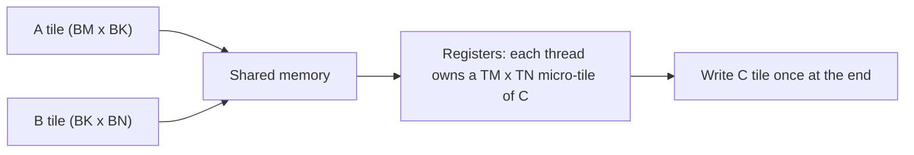

# Module 05: Tiled Matrix Multiplication (GEMM)

> **Architectural Scope**: Shared Memory Tiling, Register Micro-Tiling, Double Buffering, Bank Conflict Elimination, and Arithmetic Intensity Boost.

---

## Why this module matters

General matrix multiply (GEMM), `C = A x B`, is where almost all the FLOPs of a Transformer go: attention projections, MLP layers, the LM head. A GEMM kernel is the cleanest example of the central GPU idea: **do not fetch from HBM what you can reuse on chip**. The optimisation ladder in this module (naive, shared-memory tiles, register tiles, double buffering, Tensor Cores) is the same ladder that CUTLASS, cuBLAS and Triton climb, and it is the template for FlashAttention in Module 08.

## Mental model: carry the groceries in bulk

Computing one output element `C[i][j]` needs a whole row of A and a whole column of B. A naive kernel assigns one thread per output and each thread walks to the warehouse (HBM) for all of its inputs, even though neighbouring outputs need almost the same rows and columns. Tiling means a block of threads *together* fetches a small tile of A and a small tile of B into shared memory once, and every thread uses it many times before fetching the next tile.


```mermaid
flowchart LR
    A["A tile (BM x BK)"] --> S["Shared memory"]
    B["B tile (BK x BN)"] --> S
    S --> R["Registers: each thread owns a TM x TN micro-tile of C"]
    R --> C["Write C tile once at the end"]
```

## 1. Count the traffic (arithmetic intensity)

For `M = N = K` and FP32:

- **Naive:** each output does `2K` FLOPs and loads `2K` words (8K bytes). Intensity `= 2K / 8K = 0.25 FLOP/B`. On a GPU with a ridge point near 10 FLOP/B (FP32), this is memory-bound, even though GEMM is the poster child for compute-bound work. (Caches rescue some reuse, but not enough.)
- **Shared-memory tiling with a `T x T` tile:** every element loaded into the tile is used by `T` threads, so global traffic drops by a factor `T`. Intensity rises to about `T / 4 FLOP/B`: `T = 32` gives ~8 FLOP/B.
- **Register tiling (each thread computes a `TM x TN` patch):** one value loaded from shared memory into a register feeds `TN` (or `TM`) multiply-adds. With a block tile of `128 x 128` the global intensity is about `128 / 4 = 32 FLOP/B` for FP32 and shared-memory traffic per FLOP falls by another large factor.

Rule: a bigger tile means more reuse, but it costs shared memory and registers, and lowers occupancy. GEMM kernels are tuned for the best compromise on each architecture.

## 2. Step 1: shared-memory tiling

```cpp
#define T 32
__global__ void gemm_tiled(const float* A, const float* B, float* C, int M, int N, int K) {
    __shared__ float As[T][T], Bs[T][T];
    int row = blockIdx.y * T + threadIdx.y;
    int col = blockIdx.x * T + threadIdx.x;
    float acc = 0.f;
    for (int k0 = 0; k0 < K; k0 += T) {
        As[threadIdx.y][threadIdx.x] = (row < M && k0 + threadIdx.x < K) ? A[row * K + k0 + threadIdx.x] : 0.f;
        Bs[threadIdx.y][threadIdx.x] = (k0 + threadIdx.y < K && col < N) ? B[(k0 + threadIdx.y) * N + col] : 0.f;
        __syncthreads();                               // tile fully loaded
        #pragma unroll
        for (int k = 0; k < T; ++k) acc += As[threadIdx.y][k] * Bs[k][threadIdx.x];
        __syncthreads();                               // everyone done before overwriting
    }
    if (row < M && col < N) C[row * N + col] = acc;
}
```

Notes: both global loads are coalesced (`threadIdx.x` indexes the contiguous dimension); `As[threadIdx.y][k]` is a broadcast within a warp; `Bs[k][threadIdx.x]` is stride-1 and conflict-free; the zero-fill handles ragged edges; the two barriers are both required.

## 3. Step 2: register micro-tiling

In the kernel above each multiply-add needs two shared-memory reads, so the kernel is limited by shared-memory bandwidth. Give each thread a `TM x TN` (for example `8 x 8`) block of outputs held in registers:

```cpp
// inner loop over k, per thread, accumulators float acc[TM][TN]
float a_reg[TM], b_reg[TN];
for (int i = 0; i < TM; ++i) a_reg[i] = As[ty * TM + i][k];
for (int j = 0; j < TN; ++j) b_reg[j] = Bs[k][tx * TN + j];
for (int i = 0; i < TM; ++i)
    for (int j = 0; j < TN; ++j) acc[i][j] += a_reg[i] * b_reg[j];   // TM*TN FMAs per TM+TN loads
```

For `8 x 8`: 64 FMAs for 16 shared loads, a 4x better compute-to-load ratio, with the 64 accumulators living in registers. A block tile of `128 x 128 x 8` with 256 threads (each thread `8 x 8`) is a classic starting configuration.

## 4. Step 3: hide latency with double buffering

While threads compute on tile `k`, the next tile `k+1` can already be on its way. Allocate **two** shared-memory buffers and alternate: compute from buffer 0 while loading into buffer 1. On Ampere and later, asynchronous copies (`cp.async`, or `cuda::memcpy_async`) move data from global to shared memory **without passing through registers**, and on Hopper the Tensor Memory Accelerator (Module 09) generalises this. The cost is double the shared memory, which again trades against occupancy.

## 5. Bank conflicts and swizzling

If threads of a warp read a column of a shared tile whose row length is a multiple of 32 words, they all hit one bank (Module 03). Pad (`[T][T+1]`) or **swizzle** the column index (for example XOR it with the row), which keeps the data layout compact and conflict-free. Tensor Core fragment loads (`ldmatrix`) require particular swizzles; libraries handle them for you.

## 6. Tensor Cores

Tensor Cores execute small matrix-multiply-accumulate operations on whole fragments (for example 16x8x16 in FP16 on Ampere) and are an order of magnitude faster than FP32 lanes. From CUDA you reach them through WMMA (`nvcuda::wmma`), PTX `mma.sync`, or, in practice, CUTLASS and cuBLAS; Triton emits them automatically for `tl.dot`. Everything above still applies: Tensor Cores shift the ridge point to a much higher intensity (Module 01), so tiling matters *more*, not less.

## Worked example: how much does each step buy?

Illustrative numbers for a 4096 x 4096 x 4096 FP32 GEMM on a GPU with ~19.5 TFLOP/s FP32 peak:

| Kernel | Typical fraction of peak | Why |
|---|---|---|
| Naive | ~1-5% | memory-bound, ~0.25 FLOP/B |
| Shared-memory tiling (32x32) | ~10-20% | traffic cut ~32x, but shared-memory bound |
| + register tiling (8x8 per thread) | ~50-70% | far fewer shared loads per FMA |
| + double buffering, vectorised loads, tuned tiles | ~80-95% | latency hidden, instruction overhead trimmed |
| cuBLAS / CUTLASS (with Tensor Cores for FP16/TF32) | at or near hardware limit | architecture-specific tiling and swizzles |

Treat the percentages as order-of-magnitude guides and measure on your own device. The shape is what matters: each step removes the bottleneck exposed by the last.

## Common pitfalls

1. **Missing the second `__syncthreads()`**: a fast warp overwrites the tile while a slow warp is still reading it.
2. **Barrier inside a conditional** that some threads skip: deadlock.
3. **Tiles that do not divide the matrix**: handle edges with guards and zero-fill, never by reading out of bounds.
4. **Too many registers**: the compiler spills accumulators to local memory (slow); inspect with `--ptxas-options=-v`.
5. **Benchmarking only square powers of two.** Real shapes (batch x hidden x vocabulary, skinny matrices) behave differently; prefer the library for production.
6. **Comparing FP32 kernels against TF32/FP16 library kernels** without saying so.

## How this connects

- **Module 03** supplies coalescing and bank-conflict rules used here.
- **Module 06** shows the same algorithm in a dozen lines of Triton.
- **Module 08** tiles attention's `Q K^T` and `P V` the same way, with an extra trick to avoid materialising the score matrix.
- **Course 08** splits GEMMs across GPUs (tensor parallelism).

## Go further

- roadmap.sh: *Inference Engineering* nodes **GPU architecture**, **kernel selection / fusion**, **roofline model**.
- Simon Boehm, *How to Optimize a CUDA Matmul Kernel for cuBLAS-like Performance* (siboehm.com).
- NVIDIA *Matrix Multiplication Background* (deep learning performance guide) and CUTLASS documentation.

---

## Module Study Progression
1. **Beginner Playground**: Read [00_FOUNDATIONS_PLAYGROUND.md](00_FOUNDATIONS_PLAYGROUND.md).
2. **Architecture Theory**: Study this [01_README.md](01_README.md).
3. **Hands-on Project**: Follow [02_PROJECT_GUIDE.md](02_PROJECT_GUIDE.md).
4. **Staff Interview Challenges**: Check [03_SELF_ASSESSMENT_AND_CHALLENGES.md](03_SELF_ASSESSMENT_AND_CHALLENGES.md).
5. **Production Debugging**: Review [04_TROUBLESHOOTING_AND_EDGE_CASES.md](04_TROUBLESHOOTING_AND_EDGE_CASES.md).
