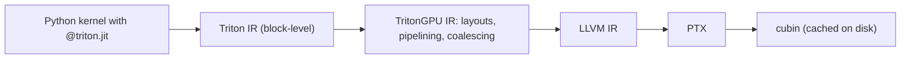

# Module 06: OpenAI Triton Programming Fundamentals

> **Architectural Scope**: Block-Level Programming Model, Block Pointers, Strided Memory Access, Masked Loads/Stores, and the Triton JIT Compiler Pipeline.

---

## Why this module matters

Writing a fast CUDA kernel by hand means managing thread indices, coalescing, shared-memory layouts, bank conflicts, barriers and Tensor Core fragments (Modules 02 to 05). Triton is a Python-embedded language and compiler that lets you write at the level of a **block of data** while the compiler handles most of that machinery. Most modern fused kernels in PyTorch 2.x (`torch.compile` generates Triton), FlashAttention variants, quantized GEMMs and many serving kernels are written in Triton, so reading and writing it is now a core skill.

## Mental model: one program per tile, vectors not threads

In CUDA you write code for **one thread**. In Triton you write code for **one program instance**, which owns a *block* of elements (say 1,024 of them) and operates on all of them with vector operations. The compiler decides how many threads and warps implement that block, which memory layout to use, and when to use shared memory or Tensor Cores.

| | CUDA | Triton |
|---|---|---|
| Unit you program | a thread | a block (tile) of data |
| Index source | `blockIdx`, `threadIdx` | `tl.program_id`, `tl.arange` |
| Shared memory | explicit | inferred by the compiler |
| Synchronisation | explicit `__syncthreads()` | inserted by the compiler |
| Coalescing | your responsibility | handled via layouts (you still choose block shapes and contiguity) |
| Matrix multiply | WMMA / `mma` by hand | `tl.dot` |



## 1. Your first kernel

```python
import torch, triton
import triton.language as tl

@triton.jit
def add_kernel(x_ptr, y_ptr, out_ptr, n_elements, BLOCK_SIZE: tl.constexpr):
    pid = tl.program_id(axis=0)                       # which block am I?
    offsets = pid * BLOCK_SIZE + tl.arange(0, BLOCK_SIZE)   # a vector of indices
    mask = offsets < n_elements                       # guard the ragged tail
    x = tl.load(x_ptr + offsets, mask=mask)
    y = tl.load(y_ptr + offsets, mask=mask)
    tl.store(out_ptr + offsets, x + y, mask=mask)

def add(x, y):
    out = torch.empty_like(x)
    n = out.numel()
    grid = lambda meta: (triton.cdiv(n, meta["BLOCK_SIZE"]),)   # number of programs
    add_kernel[grid](x, y, out, n, BLOCK_SIZE=1024)
    return out
```

Everything important is here:

- `@triton.jit` compiles the function the first time it is called with a given set of `constexpr` values and tensor dtypes.
- Pointers arrive as raw addresses; **pointer arithmetic** (`x_ptr + offsets`) builds a *vector of addresses*.
- `tl.constexpr` parameters are compile-time constants (block shapes). Different values produce different compiled kernels.
- **Masks** are mandatory whenever the data size is not a multiple of the block: masked-off lanes do not touch memory. `other=` supplies the value for masked loads (for example `-float("inf")` for a max).
- The launch grid says how many program instances to create, like CUDA's grid, but each instance is a whole block.

## 2. Strided and 2D access

Tensors in PyTorch carry **strides** (elements to step per dimension). Triton kernels take strides as arguments and build 2D address blocks by broadcasting:

```python
rm = pid_m * BM + tl.arange(0, BM)          # rows of this tile
rn = pid_n * BN + tl.arange(0, BN)          # columns of this tile
ptrs = base + rm[:, None] * stride_m + rn[None, :] * stride_n   # (BM, BN) addresses
tile = tl.load(ptrs, mask=(rm[:, None] < M) & (rn[None, :] < N), other=0.0)
```

`[:, None]` and `[None, :]` add axes so the two vectors broadcast into a matrix of addresses. Make sure the dimension with stride 1 is the contiguous one in the *last* axis; that is what lets the compiler emit wide, coalesced loads. Newer Triton versions also offer **block pointers** (`tl.make_block_ptr`) and tensor descriptors, which describe a tile by shape, strides, offsets and order so the compiler can use bulk copy hardware (TMA on Hopper) and skip manual masks.

## 3. A real fused kernel: row-wise softmax

```python
@triton.jit
def softmax_kernel(out_ptr, in_ptr, in_stride, out_stride, n_cols, BLOCK: tl.constexpr):
    row = tl.program_id(0)
    cols = tl.arange(0, BLOCK)
    mask = cols < n_cols
    x = tl.load(in_ptr + row * in_stride + cols, mask=mask, other=-float("inf"))
    x = x - tl.max(x, axis=0)                 # numerical stability
    num = tl.exp(x)
    den = tl.sum(num, axis=0)
    tl.store(out_ptr + row * out_stride + cols, num / den, mask=mask)
```

Each program loads one row once, computes max, exp and sum **in registers**, and writes once. PyTorch's eager softmax can launch several kernels and round-trip through HBM between them; the fused version reads the row once and writes it once. Here `BLOCK = triton.next_power_of_2(n_cols)` (a Triton block dimension must be a power of two). Rows longer than a block need the online-softmax loop of Module 07/08.

## 4. Matrix multiply and autotuning

```python
acc = tl.zeros((BM, BN), dtype=tl.float32)
for k in range(0, K, BK):
    a = tl.load(a_ptrs, mask=..., other=0.0)
    b = tl.load(b_ptrs, mask=..., other=0.0)
    acc += tl.dot(a, b)                         # Tensor Cores when dtype and shape allow
    a_ptrs += BK * stride_ak
    b_ptrs += BK * stride_bk
```

This is the Module 05 algorithm in a few lines; the compiler picks the shared-memory staging, vectorised loads and Tensor Core instructions. Performance now depends on the **meta-parameters**: block shapes `BM, BN, BK`, `num_warps` and `num_stages` (the software pipelining depth, the double-buffering of Module 05). `@triton.autotune(configs=[...], key=["M", "N", "K"])` benchmarks a list of configurations the first time each key is seen and caches the winner. Also use `GROUP_SIZE_M` style block-ID swizzling so neighbouring programs share tiles in L2.

## 5. Compilation, caching and debugging

- The first call pays JIT compile time (hundreds of ms to seconds); results are cached in `~/.triton/cache`. Warm up before timing, and benchmark with `triton.testing.do_bench`.
- Specialisation: Triton specialises on `constexpr` values, dtype, and whether integer arguments are divisible by 16 or equal to 1; unnecessary variation causes recompiles.
- Debugging: `TRITON_INTERPRET=1` runs kernels in a Python interpreter (slow but supports prints and breakpoints); `tl.device_print` and `tl.static_print` help in real runs; `MLIR_ENABLE_DUMP=1` dumps IR between passes.
- Correctness first: compare against a PyTorch reference with `torch.testing.assert_close`, including shapes that are not multiples of the block.

## Worked example: when Triton beats eager PyTorch

`y = x * sigmoid(x)` on a 100M-element FP16 tensor. Eager PyTorch runs `sigmoid` (read 200 MB, write 200 MB) then multiply (read 400 MB, write 200 MB): about 1.0 GB moved. A Triton kernel that computes `x * (1 / (1 + exp(-x)))` reads 200 MB and writes 200 MB: 0.4 GB. For a memory-bound op that is a 2.5x speedup, with zero change to the maths. `torch.compile` does this fusion automatically for many patterns; you write Triton by hand when the pattern is custom or when you need control (FlashAttention, quantization, MoE routing).

## Common pitfalls

1. **Missing masks** leading to out-of-bounds reads/writes or NaNs from garbage in the reduction.
2. **Non-power-of-two block sizes** (`tl.arange` needs a power of two).
3. **Wrong `other` value** for masked loads in reductions (use `-inf` for max, `0` for sum).
4. **Accumulating in FP16**: accumulate in FP32 and cast on store.
5. **Timing the first call**, which includes compilation.
6. **Block too large**: register spills or failed launches; reduce `BLOCK`/`num_warps`.
7. **Forgetting contiguity**: a transposed or non-contiguous input silently gets slow strided loads; pass real strides and pick which axis is contiguous.

## How this connects

- **Module 05** is the algorithm Triton compiles from `tl.dot`.
- **Module 07** writes fused normalisation and activations in Triton.
- **Module 08** shows FlashAttention as a Triton kernel; **Module 10** writes quantized GEMMs in Triton.
- **Course 09** serving engines (vLLM, SGLang) ship many Triton kernels.

## Go further

- roadmap.sh: *Inference Engineering* nodes **kernel selection / fusion**, **frameworks / libraries**.
- Triton tutorials (triton-lang.org): vector add, fused softmax, matrix multiplication, layer norm.
- Tillet, Kung, Cox, *Triton: an intermediate language and compiler for tiled neural network computations* (MAPL 2019).

---

## Module Study Progression
1. **Beginner Playground**: Read [00_FOUNDATIONS_PLAYGROUND.md](00_FOUNDATIONS_PLAYGROUND.md).
2. **Architecture Theory**: Study this [01_README.md](01_README.md).
3. **Hands-on Project**: Follow [02_PROJECT_GUIDE.md](02_PROJECT_GUIDE.md).
4. **Staff Interview Challenges**: Check [03_SELF_ASSESSMENT_AND_CHALLENGES.md](03_SELF_ASSESSMENT_AND_CHALLENGES.md).
5. **Production Debugging**: Review [04_TROUBLESHOOTING_AND_EDGE_CASES.md](04_TROUBLESHOOTING_AND_EDGE_CASES.md).
