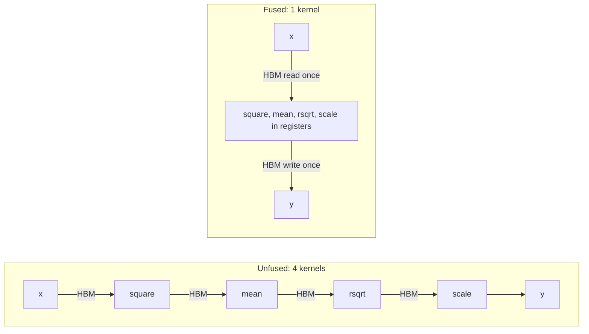

# Module 07: Fused Activations & Normalization Kernels

> **Architectural Scope**: Overcoming the Memory Wall, Kernel Fusion Mechanics, Fused RMSNorm, Fused SwiGLU, and Single-Pass Online Safe Softmax.

---

## Why this module matters

In a Transformer block the big matrix multiplies are compute-bound, but everything *between* them (normalisation, activation functions, residual adds, softmax, rotary embeddings) is **memory-bound**: a handful of FLOPs per byte. Run separately, each of these operations reads its input from HBM and writes its output back, even though the very next kernel needs that data immediately. **Kernel fusion** removes those round trips. On modern GPUs, where compute has grown much faster than memory bandwidth, fusion is often the largest single speedup available to a model that is already using good GEMMs.

## Mental model: stop mailing the intermediate results

Imagine a four-step recipe where after every step you must put the dish in a warehouse across town and fetch it back for the next step. Fusion is cooking all four steps at the stove: the intermediates stay in registers, and only the final dish goes to the warehouse.



## 1. The memory-wall arithmetic

For a memory-bound op the runtime is roughly `bytes_moved / bandwidth`. So the speedup from fusion is the ratio of bytes moved:

**RMSNorm**: `y = x * rsqrt(mean(x^2) + eps) * g`, on a `[tokens, d]` FP16 tensor of `T` bytes.

- *Unfused (PyTorch eager, roughly):* `x.pow(2)` (read T, write T), `mean` (read T, write ~0), `rsqrt`/add (tiny), `x * r` (read T, write T), `* g` (read T, write T). About **6 T** of traffic across ~5 launches.
- *Fused:* read `x` once (T), keep the row in registers/shared memory while computing the reduction, write `y` once (T). About **2 T** in one launch.

That is roughly a 3x reduction in bytes, and because each launch also has fixed overhead (several microseconds), small tensors benefit even more.

## 2. Fused RMSNorm (and LayerNorm)

One program (Triton) or one block (CUDA) handles one row of `d` elements:

1. Load the row once. Promote to FP32 for the reduction (`x_f32 = x.to(tl.float32)`).
2. Compute `ms = sum(x_f32 * x_f32) / d` using a block reduction (Module 04).
3. `inv = rsqrt(ms + eps)`, multiply by the learned weight `g`, cast back, store.

```python
@triton.jit
def rmsnorm_fwd(x_ptr, g_ptr, y_ptr, inv_ptr, stride, d, eps, BLOCK: tl.constexpr):
    row = tl.program_id(0)
    cols = tl.arange(0, BLOCK)
    m = cols < d
    x = tl.load(x_ptr + row * stride + cols, mask=m, other=0.0).to(tl.float32)
    inv = tl.rsqrt(tl.sum(x * x, axis=0) / d + eps)
    g = tl.load(g_ptr + cols, mask=m, other=0.0).to(tl.float32)
    tl.store(y_ptr + row * stride + cols, (x * inv * g).to(tl.float16), mask=m)
    tl.store(inv_ptr + row, inv)               # saved for the backward pass
```

Details that matter:

- **FP32 accumulation** is non-negotiable: squares of FP16 values overflow or lose precision quickly.
- **Save `inv`** (one scalar per row) for the backward pass instead of recomputing from scratch; the backward kernel is fused the same way and also needs a cross-row reduction for the weight gradient.
- LayerNorm additionally computes the mean and subtracts it (and adds a bias); the pattern is identical, with a second reduction (or Welford's algorithm for one-pass numerical stability).
- For rows too wide for one block (very large `d`), loop over chunks and keep running sums.

## 3. Fused SwiGLU (gated activations)

The gated MLP in LLaMA-style models computes `h = SiLU(x W_gate) * (x W_up)` and then `y = h W_down`, with `SiLU(z) = z * sigmoid(z)`. After the two GEMMs, an unfused graph runs `silu` and then an elementwise multiply: reading and writing the large `[tokens, hidden]` intermediate twice. A fused elementwise kernel does `silu(a) * b` in one pass (read `a`, `b`; write `h`), cutting that part's traffic by about a third to a half. Going one step further, a **GEMM epilogue fusion** applies the activation to the accumulator while it is still in registers, so the pre-activation tensor is never written to HBM at all. CUTLASS epilogues and `torch.compile` both do this.

## 4. Single-pass online softmax

A numerically safe softmax needs the row maximum first (`exp(x - max)`), which naively means three passes over the row: max, sum of exponentials, then divide. The **online** algorithm does max and sum in a single pass by maintaining a running pair `(m, l)`:

For each new element (or block) with local max `m_b` and local sum `s_b = sum(exp(x - m_b))`:

```
m_new = max(m, m_b)
l     = l * exp(m - m_new) + s_b * exp(m_b - m_new)
m     = m_new
```

At the end `softmax_i = exp(x_i - m) / l`. The rescaling factor `exp(m - m_new)` corrects the old sum when a bigger maximum shows up. The combine rule is associative, so it also works as a parallel reduction (Module 04) over lanes, warps and blocks. This is exactly the trick that lets FlashAttention (Module 08) process attention in tiles without ever holding the full score row.

## Worked example: counting bytes in a norm layer

Batch of 8,192 tokens, `d = 4096`, FP16: `T = 8192 x 4096 x 2 = 64 MiB`. At about 2 TB/s effective bandwidth, the unfused RMSNorm (about `6T` = 384 MiB) takes about 0.2 ms plus launch gaps; the fused version (about `2T` = 128 MiB) takes about 0.07 ms. Across 80 layers with two norms each, per forward pass that is roughly 160 x 0.13 ms = 21 ms saved per step. Small numbers add up because every layer repeats them.

## When *not* to fuse

- Fusing a compute-bound op into a memory-bound one gains little.
- Over-fusion can exceed register or shared-memory limits (spills, low occupancy).
- Fusing across a reduction boundary (a row-wide reduction followed by an elementwise op) is fine, but across a global synchronisation point (all-reduce, cross-block reduction) you generally need separate launches.
- Always verify numerics: fused kernels reorder operations, so compare to a reference with tolerances and test extreme values.

## Common pitfalls

1. **Accumulating in low precision** (FP16 or BF16 sum of squares).
2. **Forgetting `eps` inside the rsqrt**, causing NaNs on zero rows.
3. **Only benchmarking forward**: training also needs fused backward kernels or you lose half the gain.
4. **Masked lanes poisoning reductions**: use `other=0.0` for sums.
5. **Ignoring launch overhead** for tiny shapes; consider CUDA graphs.
6. **Hand-fusing what `torch.compile` already fuses**: profile first.

## How this connects

- **Module 04** supplies the block reduction; **Module 06** supplies the Triton skeleton.
- **Module 08** extends online softmax to full attention.
- **Course 09**: decode-time kernels (norm, rotary, sampling) are all memory-bound and fused for latency.

## Go further

- roadmap.sh: *Inference Engineering* nodes **kernel selection / fusion**, **attention optimization**.
- Triton tutorials "Fused Softmax" and "Layer Normalization"; Horace He, *Making Deep Learning Go Brrrr From First Principles*.
- Milakov and Gimelshein, *Online normalizer calculation for softmax* (2018).

---

## Module Study Progression
1. **Beginner Playground**: Read [00_FOUNDATIONS_PLAYGROUND.md](00_FOUNDATIONS_PLAYGROUND.md).
2. **Architecture Theory**: Study this [01_README.md](01_README.md).
3. **Hands-on Project**: Follow [02_PROJECT_GUIDE.md](02_PROJECT_GUIDE.md).
4. **Staff Interview Challenges**: Check [03_SELF_ASSESSMENT_AND_CHALLENGES.md](03_SELF_ASSESSMENT_AND_CHALLENGES.md).
5. **Production Debugging**: Review [04_TROUBLESHOOTING_AND_EDGE_CASES.md](04_TROUBLESHOOTING_AND_EDGE_CASES.md).
