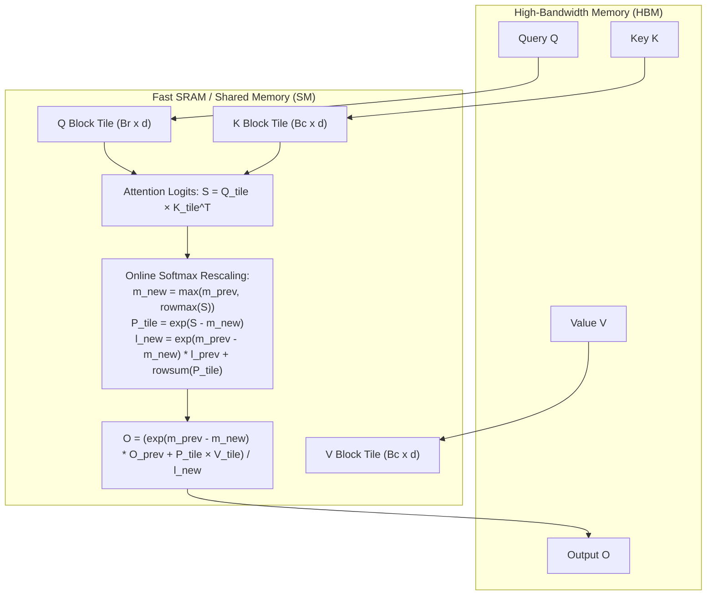

# Module 08: FlashAttention-1 & 2 Internals

> **Architectural Scope**: IO-Aware Attention Math, SRAM Block Tiling, Online Softmax Scaling, Eliminating $O(N^2)$ DRAM Roundtrips, and Backward Pass Recomputation.

---


## FlashAttention Tiling & Online Softmax Algorithm



---

## 🗺️ Recommended Step-by-Step Learning Path

Follow this exact sequence to achieve complete mastery of this module:

| Step | File to Open | What You Will Do |
| :---: | :--- | :--- |
| **1** | **[01_README.md](01_README.md)** | Read conceptual overview, architectural foundations, and mental models. |
| **2** | **[00_FOUNDATIONS_PLAYGROUND.md](00_FOUNDATIONS_PLAYGROUND.md)** | Practice beginner spoonfed micro-drills and line-by-line syntax breakdowns. |
| **3** | **[00_try_it_yourself.py](00_try_it_yourself.py)** | Run in terminal (`python 00_try_it_yourself.py`) for an interactive zero-dependency sandbox. |
| **4** | **[04_TROUBLESHOOTING_AND_EDGE_CASES.md](04_TROUBLESHOOTING_AND_EDGE_CASES.md)** | Study forensic runbooks, edge cases, and real-world failure post-mortems. |
| **5** | **[03_SELF_ASSESSMENT_AND_CHALLENGES.md](03_SELF_ASSESSMENT_AND_CHALLENGES.md)** | Test your knowledge with self-assessment quizzes, challenges, and diagnostic scenarios. |
| **6** | **[02_PROJECT_GUIDE.md](02_PROJECT_GUIDE.md)** | Follow guided project implementation for `starter/` and `project_solution/`. |
| **7** | **[problems/](problems/)** | Solve hands-on problem bank challenges and verify with `pytest problems/tests`. |
| **8** | **[debug_lab/](debug_lab/)** | Diagnose and fix silent production bugs in the Bug Hunter Drill. |

---

## 1. The IO Complexity Problem of Standard Attention

Standard Transformer Attention (Vaswani et al., 2017):
$$S = \frac{Q K^T}{\sqrt{d}} \in \mathbb{R}^{N \times N}, \quad P = \text{softmax}(S) \in \mathbb{R}^{N \times N}, \quad O = P V \in \mathbb{R}^{N \times d}$$

```
+-----------------------------------------------------------------------------------------------+
| STANDARD ATTENTION: DRAM MEMORY ROUNDTRIPS                                                    |
+-----------------------------------------------------------------------------------------------+
| 1. Read Q, K from HBM  --> Compute S = Q @ K.T / sqrt(d)  --> Write S (N x N) to HBM          |
| 2. Read S from HBM     --> Compute P = softmax(S)         --> Write P (N x N) to HBM          |
| 3. Read P, V from HBM  --> Compute O = P @ V              --> Write O (N x d) to HBM          |
| Total Memory Traffic:  O(N^2) HBM Accesses! Catastrophic for Long Contexts!                   |
+-----------------------------------------------------------------------------------------------+
```

For sequence length $N = 32{,}768$, the attention matrix $S$ has **1 billion elements (2 GB per head)**.
With 32 heads and 32 layers, memory demand exceeds **2 Terabytes**—an immediate out-of-memory crash.

---

## 2. Tri Dao's Breakthrough: IO-Aware SRAM Tiling

**Core Architectural Realization**: The GPU is not compute-bound; it is throttled by memory transfers between slow HBM and fast SRAM.
FlashAttention splits matrices into SRAM-sized blocks:
- Divide $Q$ into blocks of size $B_r \times d$ (e.g. $64 \times 128$).
- Divide $K$ and $V$ into blocks of size $B_c \times d$ (e.g. $64 \times 128$).
- Load block $Q_i$ into SRAM once.
- Stream $K_j$ and $V_j$ through SRAM.
- Use **Online Safe Softmax** to incrementally accumulate output block $O_i$ in fast registers!
- Write $O_i$ to HBM **only once**!

### Memory Complexity:
- Standard Attention HBM IO: $O(N^2)$
- FlashAttention HBM IO: $O(N)$

---

## 3. Backward Pass: Recomputation vs Memory Storage

In standard attention, the $N \times N$ matrix $P$ is stored in HBM during forward pass so it can be used during backward backprop.
FlashAttention **never saves $P$**!
Instead, in the backward pass:
- FlashAttention recomputes the block attention scores $S_{ij} = Q_i K_j^T$ **on the fly** in SRAM using stored running statistics $(m_i, l_i)$.
- Recomputing arithmetic in fast registers is **faster than reading memory from slow HBM**!

---

## 4. FlashAttention-2 Improvements
1. **Splitting Over Sequence Length**: FA-1 parallelized over Batch and Heads. When Batch was 1, only a few SMs were used. FA-2 parallelizes over query sequence length blocks $B_r$, keeping all 132 SMs active!
2. **Simplified Rescaling**: FA-2 defers division by $l_i$ to the end of the outer loop, saving non-matmul FLOPs.

---

## 5. Module Study Progression
1. **Beginner Playground**: Read [00_FOUNDATIONS_PLAYGROUND.md](00_FOUNDATIONS_PLAYGROUND.md).
2. **Architecture Theory**: Study this [01_README.md](01_README.md).
3. **Hands-on Project**: Follow [02_PROJECT_GUIDE.md](02_PROJECT_GUIDE.md).
4. **Staff Interview Challenges**: Check [03_SELF_ASSESSMENT_AND_CHALLENGES.md](03_SELF_ASSESSMENT_AND_CHALLENGES.md).
5. **Production Debugging**: Review [04_TROUBLESHOOTING_AND_EDGE_CASES.md](04_TROUBLESHOOTING_AND_EDGE_CASES.md).