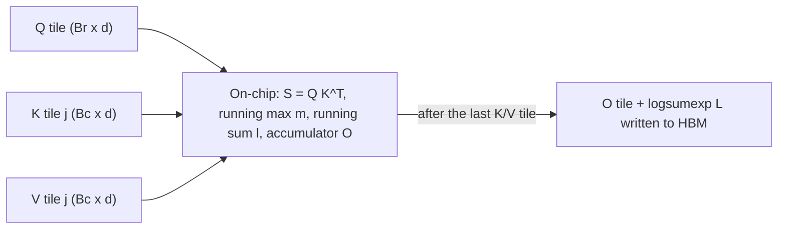

# Module 08: FlashAttention-1 & 2 Internals

> **Architectural Scope**: IO-Aware Attention Math, SRAM Block Tiling, Online Softmax Scaling, Eliminating $O(N^2)$ DRAM Roundtrips, and Backward Pass Recomputation.

---

## Why this module matters

Self-attention is the one Transformer operation whose cost grows **quadratically** with sequence length. For years the quadratic *compute* got the blame, but the real bottleneck on GPUs is quadratic *memory traffic*: the standard implementation writes an `N x N` score matrix to HBM, reads it back for the softmax, writes the probabilities, and reads them again for the value multiply. FlashAttention computes the **exact same result** while never materialising that matrix in HBM. It is the reason long-context training and serving are practical, and it is the best worked example of "IO-aware" algorithm design.

## Mental model: do the whole sandwich on the cutting board

Standard attention is a four-stage assembly line with a warehouse trip after every stage. FlashAttention carries a small tile of queries to the cutting board (SRAM), streams tiles of keys and values past it, and keeps a running answer on the board; only the finished output tile goes back to the warehouse.


```mermaid
flowchart LR
    Q["Q tile (Br x d)"] --> ON["On-chip: S = Q K^T, running max m, running sum l, accumulator O"]
    K["K tile j (Bc x d)"] --> ON
    V["V tile j (Bc x d)"] --> ON
    ON -->|"after the last K/V tile"| OUT["O tile + logsumexp L written to HBM"]
```

## 1. Standard attention and why it is slow

For one head with `Q, K, V` of shape `N x d`:

`S = Q K^T / sqrt(d)`  (`N x N`),  `P = softmax(S)` row-wise,  `O = P V`  (`N x d`).

Memory traffic for the standard implementation is `Theta(N d + N^2)` per head: Q, K, V and O are small (`N d`), but S and P (`N^2`) are written and read multiple times. FLOPs are `Theta(N^2 d)`, with arithmetic intensity per byte of S around 1 to 2 FLOP/B, far below the ridge point (Module 01). The kernels between the two GEMMs (mask, softmax, dropout) are memory-bound, and for large `N` they dominate the runtime.

**Memory footprint** is just as bad: one head at `N = 8,192` in FP16 has `8192^2 x 2 B = 128 MiB` of scores; 32 heads and a batch of 4 would need about 16 GiB for S alone, before the backward pass keeps P.

## 2. The three ideas inside FlashAttention

1. **Tiling.** Split Q into row blocks of size `B_r` and K, V into column blocks of size `B_c`, sized so a tile of each plus the working set fits in shared memory (the paper picks `B_c = ceil(M / 4d)` and `B_r = min(B_c, d)` for SRAM size `M`).
2. **Online softmax** (Module 07). For each query row keep a running maximum `m` and denominator `l`, and rescale the partial output when the max changes.
3. **Recomputation in the backward pass.** Instead of storing the `N x N` matrix P for backprop, store only the per-row **logsumexp** `L = m + log(l)` (size `N`) and recompute the needed tiles of S and P on chip. This spends extra FLOPs (about one extra forward-sized matmul) to save a huge amount of HBM traffic, which is a good trade because the kernel is memory-bound.

### The forward loop, step by step

For each query block `i`, initialise `O_i = 0`, `l_i = 0`, `m_i = -inf`. For each key/value block `j`:

```
S_ij   = Q_i K_j^T / sqrt(d)                      # (Br x Bc), on chip
m_new  = max(m_i, rowmax(S_ij))
P_ij   = exp(S_ij - m_new)                        # unnormalised probabilities
l_i    = exp(m_i - m_new) * l_i + rowsum(P_ij)
O_i    = exp(m_i - m_new) * O_i + P_ij V_j        # rescale old output, add new contribution
m_i    = m_new
```

After the last block: `O_i = O_i / l_i` and store `L_i = m_i + log(l_i)`. Because the final division by `l_i` is exact, the result equals standard attention up to floating-point rounding. FlashAttention is **not an approximation**.

### IO complexity

With SRAM of size `M`, FlashAttention performs `Theta(N^2 d^2 / M)` HBM accesses, versus `Theta(N d + N^2)` for the standard method. For typical `d = 64` to `128` and `M` of order 100 KB, that is a several-times reduction, and the memory *footprint* drops from `O(N^2)` to `O(N)`.

## 3. FlashAttention-2: better work partitioning

FlashAttention-1 reached roughly 25 to 40% of an A100's peak FP16 throughput. FlashAttention-2 (Dao, 2023) keeps the same algorithm and changes how work is scheduled, roughly doubling speed (up to about 70% of peak on A100):

1. **Fewer non-matmul FLOPs.** Tensor Cores are far faster than the FP32 units that compute `exp`, rescale and divide, so those scalar operations become the bottleneck. FA2 delays the division by `l` until the end of the loop and tweaks the rescaling to cut them.
2. **Parallelise over the sequence dimension.** FA1 launched one thread block per (batch, head), which under-fills the GPU for long sequences with small batch. FA2 also assigns different **query blocks** to different thread blocks, so occupancy stays high.
3. **Split work across warps differently.** FA1 split K and V across the warps of a block, so warps had to communicate partial results through shared memory. FA2 splits **Q** across warps, so each warp owns whole output rows and needs no inter-warp communication in the inner loop.
4. **Causal masking skips blocks.** For autoregressive attention, tiles entirely above the diagonal are never computed (about half the work), and only diagonal tiles apply the element mask.

## 4. Backward pass sketch

Given `dO`, the backward pass loops over K/V blocks (outer) and Q blocks (inner), recomputing `S_ij` and `P_ij = exp(S_ij - L_i)` on chip, then accumulates `dV_j += P_ij^T dO_i`, `dP_ij = dO_i V_j^T`, `dS_ij = P_ij * (dP_ij - D_i)` where `D_i = rowsum(dO_i * O_i)`, then `dQ_i += dS_ij K_j` (via atomics or a separate pass) and `dK_j += dS_ij^T Q_i`. It stores only `Q, K, V, O, L`.

## Worked example: HBM traffic for one head

`N = 4096`, `d = 128`, FP16. Standard attention moves about: Q, K, V read (3 x 1 MiB), S written (32 MiB), S read for softmax and P written (64 MiB), P read for `PV` (32 MiB), O written (1 MiB): roughly **132 MiB**. FlashAttention reads Q once and streams K, V in tiles (each K/V tile is re-read once per query block, a few MiB in total) and writes O once: a **handful of MiB**. At 2 TB/s the difference is tens of microseconds versus a few, per head, per layer, per step, and more importantly the 32 MiB score matrices never exist.

## Common pitfalls

1. **Believing it is approximate.** It is exact (modulo rounding); sparse and linear attention are the approximate families.
2. **Expecting a win at tiny sequence lengths.** For `N` of a few hundred the overhead can equal the standard path; the gain grows with `N`.
3. **Non-causal masks and arbitrary bias tensors** can force slower code paths or need variants (FlexAttention); check kernel support (head dimension, dtype, mask type).
4. **Dropout RNG consistency**: forward and backward must regenerate the same mask (seed and offset are stored).
5. **Numerics**: accumulate in FP32; BF16 inputs with FP32 softmax statistics are standard.
6. **Wrong layout** (`[B, H, N, d]` vs `[B, N, H, d]`) silently hits slow strided paths.

## How this connects

- **Module 07** supplied online softmax; **Modules 03 and 05** supplied tiling.
- **Module 09 (FlashAttention-3)** adapts the same loop to Hopper's asynchronous hardware.
- **Course 09**: PagedAttention and FlashDecoding handle the *decode* case, where the query block has one row.
- **Course 08**: ring attention distributes this same loop across GPUs.

## Go further

- roadmap.sh: *Inference Engineering* nodes **flashattention**, **attention optimization**, **attention variants**.
- Dao et al., *FlashAttention: Fast and Memory-Efficient Exact Attention with IO-Awareness* (NeurIPS 2022); Dao, *FlashAttention-2* (2023).
- Stanford CRFM FlashAttention-2 blog post; Triton fused-attention tutorial.

---

## Module Study Progression
1. **Beginner Playground**: Read [00_FOUNDATIONS_PLAYGROUND.md](00_FOUNDATIONS_PLAYGROUND.md).
2. **Architecture Theory**: Study this [01_README.md](01_README.md).
3. **Hands-on Project**: Follow [02_PROJECT_GUIDE.md](02_PROJECT_GUIDE.md).
4. **Staff Interview Challenges**: Check [03_SELF_ASSESSMENT_AND_CHALLENGES.md](03_SELF_ASSESSMENT_AND_CHALLENGES.md).
5. **Production Debugging**: Review [04_TROUBLESHOOTING_AND_EDGE_CASES.md](04_TROUBLESHOOTING_AND_EDGE_CASES.md).
