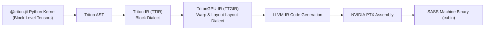

# Module 09: FlashAttention-3 & Hopper/Blackwell Features

> **Architectural Scope**: Tensor Memory Accelerator (TMA), Asynchronous Transaction Barriers (`mbarrier`), Warp Group Matrix Multiply (WGMMA), FP8 Tensor Cores, and Ping-Pong Pipelining.

---


## Triton Compiler Pipeline: Python AST to PTX



## 1. Hardware Architectural Leap: Ampere vs Hopper vs Blackwell

Modern LLM scaling reached a point where traditional SM-driven memory copies became the primary bottleneck.
NVIDIA Hopper (H100) and Blackwell (B200) introduced dedicated hardware coprocessors:

```
+-----------------------------------------------------------------------------------------------+
| HOPPER / BLACKWELL ASYNCHRONOUS DATAFLOW PIPELINE                                             |
+-----------------------------------------------------------------------------------------------+
| Global Memory (HBM3e: 3.35 TB/s)                                                              |
|       |                                                                                       |
|       |  [Tensor Memory Accelerator (TMA): Hardware 5D Tensor Copy Engine]                    |
|       |  --> Zero Register File Overhead! Zero SM Instruction Issue Cycles!                   |
|       v                                                                                       |
| Shared Memory (SRAM: 228 KB per SM)                                                           |
|       |                                                                                       |
|       |  [WGMMA: Warp Group Matrix Multiply (128 Threads / 4 Warps)]                          |
|       |  --> Reads Directly from SRAM into Accumulators! Bypasses Registers!                  |
|       v                                                                                       |
| Tensor Cores (FP8 / FP16: 1 PFLOP/s)                                                          |
+-----------------------------------------------------------------------------------------------+
```

---

## 2. Tensor Memory Accelerator (TMA) & Asynchronous Barriers

On Ampere (A100):
- Moving data from HBM to Shared Memory required threads to execute `LDG` instructions into registers, then `STS` instructions into Shared Memory.
- Tied up thread registers and memory load pipelines.

On Hopper (H100) & Blackwell (B200):
- **TMA**: A single thread issues a **TMA descriptor**:
  `cuda::memcpy_async(sram_ptr, tma_tensor_map, barrier);`
- The hardware copy engine directly streams multidimensional tensor tiles into SRAM.
- **Asynchronous Transaction Barriers (`mbarrier`)**: Hardware counters that track the arrival of TMA bytes and wake up waiting warps without software polling.

---

## 3. Warp Group Matrix Multiply and Accumulate (WGMMA)

Traditional Tensor Core instructions (MMA) operate at the single warp level (32 threads).
**WGMMA** coordinates an entire **Warp Group (128 threads / 4 warps)**:
- WGMMA executes asynchronous matrix multiplies where operands are read **directly from Shared Memory**.
- Leaves thread registers completely free to hold large FP32 accumulator matrices ($64 \times 128$).

---

## 4. FlashAttention-3: Ping-Pong Double Buffering

FlashAttention-3 achieves up to **$75\%$ of H100 theoretical peak FLOPs** (over 700 TFLOPs/s FP16) by interleaving two warp groups:
1. **Warpgroup 0**: Executes WGMMA on Tile $k$.
2. **Warpgroup 1**: Issues TMA loads and barrier synchronization for Tile $k+1$.
3. **Next Phase**: They swap roles in a zero-bubble ping-pong pipeline. Memory latency is **100% hidden behind compute**.

---

## 5. Module Study Progression
1. **Beginner Playground**: Read [00_FOUNDATIONS_PLAYGROUND.md](00_FOUNDATIONS_PLAYGROUND.md).
2. **Architecture Theory**: Study this [01_README.md](01_README.md).
3. **Hands-on Project**: Follow [02_PROJECT_GUIDE.md](02_PROJECT_GUIDE.md).
4. **Staff Interview Challenges**: Check [03_SELF_ASSESSMENT_AND_CHALLENGES.md](03_SELF_ASSESSMENT_AND_CHALLENGES.md).
5. **Production Debugging**: Review [04_TROUBLESHOOTING_AND_EDGE_CASES.md](04_TROUBLESHOOTING_AND_EDGE_CASES.md).