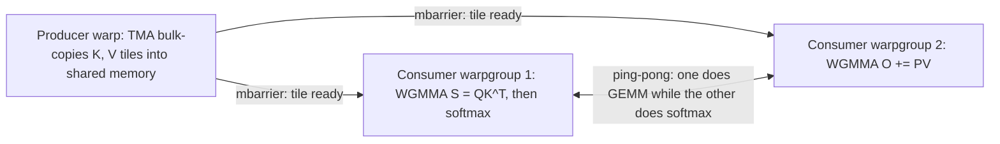

# Module 09: FlashAttention-3 & Hopper/Blackwell Innovations

> **Architectural Scope**: Tensor Memory Accelerator (TMA), Asynchronous Transaction Barriers (`mbarrier`), Warp Group Matrix Multiply (WGMMA), FP8 Tensor Cores, and Ping-Pong Pipelining.

---

## Why this module matters

FlashAttention-2 reaches roughly 35% of an H100's peak FP16 throughput, far below the 70% it achieves on an A100. The algorithm did not get worse; the hardware changed under it. Hopper made Tensor Cores so fast that everything *around* the matrix multiply (loading data, computing `exp`, synchronising) became the bottleneck. FlashAttention-3 (Shah et al., 2024) rebuilds the same attention loop around Hopper's **asynchronous** features and reaches roughly 740 TFLOP/s in FP16 (about 75% of peak) and over 1 PFLOP/s in FP8. The same ideas underpin most high-performance Hopper and Blackwell kernels (CUTLASS 3, cuBLAS, DeepGEMM), so this module is really a tour of modern GPU kernel design.

## Mental model: an assembly line with specialised stations

On older GPUs every warp did everything: load, compute, store, synchronise. On Hopper you build an **assembly line**: one station fetches tiles with a bulk-copy engine, another runs the matrix units, another computes softmax, and they hand work to each other through lightweight flags. Because loading, matrix multiply and softmax use *different* hardware, they can all run at the same time.

```mermaid
flowchart LR
    TMA["Producer warp: TMA bulk-copies K, V tiles into shared memory"] -->|"mbarrier: tile ready"| W1["Consumer warpgroup 1: WGMMA S = QK^T, then softmax"]
    TMA -->|"mbarrier: tile ready"| W2["Consumer warpgroup 2: WGMMA O += PV"]
    W1 <-->|"ping-pong: one does GEMM while the other does softmax"| W2
```

## 1. The new Hopper hardware features

| Feature | What it does | Why it matters |
|---|---|---|
| **TMA (Tensor Memory Accelerator)** | A DMA engine that copies whole multi-dimensional tiles between global and shared memory, described by a *tensor map* (shape, strides, swizzle) | One thread issues the copy; address generation, bounds handling and swizzling are done in hardware, freeing registers and instruction slots |
| **WGMMA (warpgroup MMA)** | Matrix-multiply-accumulate issued by a **warpgroup** (4 warps = 128 threads), asynchronous, operands taken from shared memory (A can come from registers), results in registers | Much larger tile per instruction and it does not block the issuing warps |
| **`mbarrier` with transaction counts** | Barriers in shared memory that complete when both a thread-arrival count and a number of **bytes** from TMA have landed | Lets consumers wait for exactly "tile k has arrived" with no thread-wide `__syncthreads()` |
| **Thread block clusters / distributed shared memory** | Several blocks on neighbouring SMs can read each other's shared memory | Larger cooperative tiles and TMA multicast to several SMs |
| **FP8 Tensor Cores** (E4M3, E5M2) | Twice the FP16 matrix throughput | Used for training and inference when accuracy allows |

## 2. Why FlashAttention-2 underuses Hopper

Two facts from the FlashAttention-3 paper explain it. First, an H100's FP16 Tensor Core peak is roughly 989 TFLOP/s but its **special function units (exp)** deliver only about 4 TFLOP/s, so each `exp` costs hundreds of times more than a matching FMA on a Tensor Core. In attention there is one `exp` per score element for two matrix FLOPs per element per head dimension, which makes softmax a real bottleneck at small head sizes. Second, FA2 issued loads, GEMMs and softmax in sequence within a warp, so the Tensor Cores sat idle while softmax ran.

## 3. The three techniques in FlashAttention-3

1. **Warp specialisation with TMA.** The block is split into a **producer** warp, which only issues TMA loads of K and V tiles into a circular shared-memory buffer (several stages deep), and **consumer warpgroups**, which only compute. Producers get *fewer* registers and consumers *more* (dynamic register reallocation), because loads need almost none and the accumulators need many. `mbarrier`s tell consumers when a stage is full and producers when a stage is free.
2. **Ping-pong scheduling between two warpgroups.** While warpgroup A runs its WGMMAs for tile `j`, warpgroup B runs softmax for tile `j-1`, then they swap. Named barriers enforce the alternation. This hides the slow `exp` behind matrix work, and the paper's ablation shows it is one of the larger single contributors to the final speed.
3. **Intra-warpgroup pipelining.** Within one warpgroup, the softmax of block `j` is overlapped with the first GEMM of block `j+1`, using the asynchrony of WGMMA. Together with ping-pong this reaches about 740 TFLOP/s.

## 4. FP8 attention

FP8 doubles Tensor Core throughput but has only 3 or 2 mantissa bits, and attention is sensitive to outliers in `Q` and `K`. FlashAttention-3's FP8 path uses:

- **Block-wise (per-tile) scaling** instead of one scale per tensor, so one large value does not crush the resolution of everything else.
- **Incoherent processing**: multiply `Q` and `K` by a random orthogonal (Hadamard-style) matrix before quantising. The product `Q K^T` is unchanged, but outliers are spread across dimensions, which in the paper cut quantisation error by about 2.6x.
- A layout shuffle so the accumulator layout of the first GEMM matches the operand layout the FP8 second GEMM needs, avoiding extra data movement.

## 5. Blackwell and beyond (what changes)

Blackwell (B200/GB200) pushes the same direction. The details differ across SKUs, so check NVIDIA's documentation, but the main ideas are:

- **5th-generation Tensor Cores with `tcgen05` instructions** issued by a single thread, with accumulators in a new on-chip **Tensor Memory (TMEM)** rather than in registers, which frees registers and removes the register-file bottleneck.
- **2-CTA MMA**: two SMs cooperate on one larger tile.
- **Lower-precision formats**: FP6 and FP4 (including block-scaled micro-scaling formats such as MXFP4/NVFP4) for inference.
- Much higher memory bandwidth (HBM3e) and NVLink 5, which shift the ridge point again.

The design pattern is stable: **more asynchrony, more specialisation, more explicit data movement**. Kernels that ignore it leave most of the hardware idle.

## Worked example: where do the cycles go?

Per query block and key block of 128 x 128 with head dimension 128: the two GEMMs do `2 x 2 x 128^3 = 8.4 MFLOP`. On a Hopper SM that takes on the order of a few thousand cycles. The `128 x 128 = 16,384` exponentials, at a handful of SFU results per cycle per SM, take on the order of a thousand or more cycles. Without overlap the exp time adds directly to the total (a loss of 20 to 40%); with ping-pong plus pipelining it is almost entirely hidden. That arithmetic is why scheduling, not new maths, delivered a 1.5 to 2x gain.

## Common pitfalls

1. **Porting Ampere-style (`cp.async`, `mma.sync`) kernels to Hopper and expecting peak.** They cannot use WGMMA/TMA and top out far lower.
2. **Barrier bugs**: wrong arrival counts or phase bits cause hangs that are hard to debug.
3. **Register pressure**: producer/consumer register budgets must sum to the SM limit; over-allocation fails at launch.
4. **FP8 without scaling discipline**: saturation/overflow produces NaNs or silent accuracy loss; evaluate task metrics, not just kernel error.
5. **Assuming portability**: Hopper kernels do not run on Ampere; Blackwell needs new instructions. Keep fallbacks and dispatch by compute capability.

## How this connects

- **Module 08** is the algorithm; this module is the hardware-specific schedule.
- **Module 10** uses the same FP8/low-bit machinery for quantised GEMMs.
- **Course 09**: serving engines select between FA2/FA3/FlashInfer by GPU and shape.
- **Course 08**: TMA multicast and clusters foreshadow communication/computation overlap across GPUs.

## Go further

- roadmap.sh: *Inference Engineering* nodes **hopper**, **blackwell**, **flashattention**, **quantization**.
- Shah et al., *FlashAttention-3: Fast and Accurate Attention with Asynchrony and Low-precision* (2024) and Tri Dao's blog post.
- NVIDIA Hopper Architecture In-Depth; CUTLASS 3 documentation (CuTe, warp-specialised kernels).

---

## Module Study Progression
1. **Beginner Playground**: Read [00_FOUNDATIONS_PLAYGROUND.md](00_FOUNDATIONS_PLAYGROUND.md).
2. **Architecture Theory**: Study this [01_README.md](01_README.md).
3. **Hands-on Project**: Follow [02_PROJECT_GUIDE.md](02_PROJECT_GUIDE.md).
4. **Staff Interview Challenges**: Check [03_SELF_ASSESSMENT_AND_CHALLENGES.md](03_SELF_ASSESSMENT_AND_CHALLENGES.md).
5. **Production Debugging**: Review [04_TROUBLESHOOTING_AND_EDGE_CASES.md](04_TROUBLESHOOTING_AND_EDGE_CASES.md).
