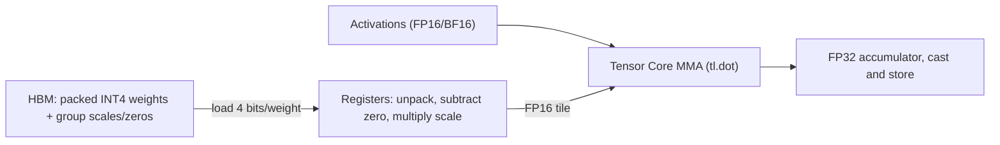

# Module 10: Quantization Kernels in Triton (FP8 & INT4)

> **Architectural Scope**: Sub-Byte Bitwise Packing, On-the-Fly Register Dequantization, AWQ Outlier Protection, and Grouped Quantized GEMMs.

---

## Why this module matters

A 70-billion-parameter model in FP16 is 140 GB: more than one GPU holds, and during token-by-token decoding every one of those bytes must stream from HBM for each generated token. Decoding is **memory-bound** (Module 01), so shrinking the bytes shrinks the latency almost proportionally. Quantisation stores weights in 8, 4 or even fewer bits. But a quantised tensor is only useful if a *kernel* can read the small format and turn it back into something the Tensor Cores can multiply, without paying the savings back in extra memory traffic or instruction overhead. This module is about writing those kernels.

## Mental model: ship it compressed, unpack at the workbench

Compression helps shipping (HBM to chip). Unpacking happens at the workbench (registers), where it is nearly free because the ALUs are idle while waiting for memory. The kernel therefore: loads packed integers, unpacks and rescales them **in registers**, feeds the resulting FP16/BF16 tile to `tl.dot`, and never writes the dequantised weights back to memory.



## 1. Number formats

| Format | Bits | Idea | Typical use |
|---|---|---|---|
| INT8 | 8 | 256 uniform levels with a scale | weights and activations (W8A8), KV cache |
| INT4 | 4 | 16 levels, group-wise scale (+ zero-point) | weight-only (W4A16) for LLM serving |
| FP8 E4M3 | 8 | 4 exponent, 3 mantissa bits, range about +-448 | forward activations and weights |
| FP8 E5M2 | 8 | 5 exponent, 2 mantissa bits, wide range | gradients |
| FP4 / MXFP4 / NVFP4 | 4 | tiny float with per-block scale | newest hardware (Blackwell) |

**Uniform affine quantisation:** `q = clamp(round(w / s) + z, qmin, qmax)` and `w ~ s * (q - z)`. The **scale** `s` (and optional **zero-point** `z`) can be shared per tensor, per output channel, or per **group** of `g` consecutive weights (commonly `g = 64` or `128`). Finer granularity means better accuracy and more metadata.

**Storage cost with groups:** INT4 with `g = 128`, an FP16 scale and an FP16 zero per group adds `32 / 128 = 0.25` bits per weight, so about **4.25 bits/weight**, roughly 3.8x smaller than FP16 (about 37 GB for 70B parameters).

## 2. Sub-byte packing and unpacking

GPUs address bytes, so two 4-bit values share one byte. A common layout stores element `2i` in the low nibble and `2i+1` in the high nibble:

```python
packed = tl.load(w_ptr + offs)                        # uint8, each holds two weights
lo = (packed & 0xF).to(tl.float16)                    # elements 2i
hi = ((packed >> 4) & 0xF).to(tl.float16)             # elements 2i+1
w_lo = (lo - zero) * scale                            # dequantise
w_hi = (hi - zero) * scale
```

Real kernels pack **32 bits at a time** (eight 4-bit values per `int32`) and permute the interleaving so the unpacked elements land directly in the order the MMA instruction expects; Marlin and similar kernels are carefully designed around this. Whatever the layout, the producer (the quantiser script) and the consumer (the kernel) must agree *exactly*; most INT4 bugs are packing-order or sign mismatches (signed INT4 needs sign extension, unsigned with a zero-point does not).

## 3. A weight-only INT4 GEMM kernel (structure)

```python
@triton.jit
def w4a16_gemm(a_ptr, wq_ptr, scale_ptr, zero_ptr, c_ptr, M, N, K,
               BM: tl.constexpr, BN: tl.constexpr, BK: tl.constexpr, G: tl.constexpr):
    pid_m, pid_n = tl.program_id(0), tl.program_id(1)
    acc = tl.zeros((BM, BN), dtype=tl.float32)
    for k in range(0, K, BK):
        a = tl.load(a_ptrs, ...)                                   # (BM, BK) FP16 activations
        packed = tl.load(wq_ptrs, ...)                             # (BK//2, BN) uint8
        w = unpack_int4(packed)                                    # (BK, BN) integers in registers
        s = tl.load(scale_ptr + (k // G) * N + n_offs)             # one scale per group per column
        z = tl.load(zero_ptr  + (k // G) * N + n_offs)
        w = ((w - z) * s).to(tl.float16)                           # dequantise in registers
        acc += tl.dot(a, w)                                        # Tensor Core, FP32 accumulate
    tl.store(c_ptrs, acc.to(tl.float16), ...)
```

Design points: `BK` should be a multiple of the group size `G` so each K-block uses whole groups of scales; scales are small and cached in L2/L1; accumulate in FP32; and the FP16 weight tile exists only in registers/shared memory. For **small batch (decode)** this is a bandwidth win; for **large batch (prefill)** the GEMM is compute-bound and dequantisation overhead can make W4A16 *slower* than FP16, so engines pick kernels by batch size (or use W8A8/FP8 for prefill).

## 4. FP8 GEMM

FP8 operands feed Hopper Tensor Cores directly, at twice the FP16 rate, with FP32 accumulation. Each operand carries a scale (per-tensor or, better, per-block) and the kernel applies `scale_a * scale_b` to the accumulator at the end (or per K-block when block-scaled). In Triton, `tl.dot` accepts `tl.float8e4nv`-typed tiles on supporting hardware. The critical engineering is **scale management**: computing amax statistics, delayed or just-in-time scaling, and keeping activations out of saturation.

## 5. AWQ: protecting the salient channels

Naive rounding treats all weights alike, but a small fraction of input channels (about 1%) see **large activations**, so their weights matter disproportionately. Activation-aware Weight Quantization (AWQ, Lin et al.) finds a per-input-channel scale `s_c > 1` from activation statistics, multiplies the weight columns by `s_c` before quantising (so the salient columns get relatively finer resolution) and divides the activations by `s_c` (folded into the preceding operation). Unlike mixed-precision schemes it keeps a uniform INT4 layout, which kernels handle efficiently. GPTQ is an alternative that quantises layer by layer using second-order (Hessian) information to compensate rounding error.

## 6. Grouped (and MoE) GEMMs

Mixture-of-experts layers need many small GEMMs with different weights and row counts. A **grouped GEMM** kernel launches one persistent kernel that walks a list of problems (expert id, row range), avoiding per-expert launches and padding. Quantised MoE kernels combine this with the dequantisation above, loading each expert's packed weights and scales on demand.

## Worked example: why INT4 speeds up decode

Decode one token on a 70B model, batch 1. FP16 weights: 140 GB read per token; at 2 TB/s that is about 70 ms/token (two GPUs worth of memory; ignoring KV cache). INT4 with groups: about 37 GB, or about 18 ms/token: close to **3.8x** faster *if* the dequantising kernel stays memory-bound. At batch 64 the same layer does 64x the FLOPs on the same bytes and becomes compute-bound, so the weight-only advantage shrinks, which is why the benefit is largest for latency-sensitive, small-batch serving.

## Common pitfalls

1. **Packing/sign mismatch** between quantiser and kernel (nibble order, signed vs unsigned).
2. **Group size not dividing K** or misaligned scale pointers.
3. **Accumulating in FP16**: use FP32.
4. **Judging by perplexity only**: also test task accuracy, long context, and outlier-heavy layers (embeddings, the LM head are often left unquantised).
5. **Benchmarking at one batch size**: W4A16 helps decode but may hurt prefill.
6. **Ignoring metadata traffic**: with tiny groups the scales cost real bandwidth.
7. **FP8 without calibration**: saturation silently wrecks accuracy.

## How this connects

- **Module 01** and **09/Module 08**: the roofline says why fewer bytes means faster decode.
- **Module 09** gave FP8 hardware; **Module 06** gave the Triton skeleton.
- **Course 09, Module 08** covers serving-time choices (FP8, AWQ, Marlin) built on these kernels.

## Go further

- roadmap.sh: *Inference Engineering* nodes **quantization**, **post training quantization**, **quantization aware training**, **modelopt**.
- Lin et al., *AWQ* (2023); Frantar et al., *GPTQ* (2022); Micikevicius et al., *FP8 Formats for Deep Learning* (2022); Frantar et al., *Marlin* (2024).
- Hugging Face quantization overview; PyTorch blog "Accelerating Triton Dequantization Kernels for GPTQ" (and related INT4 decoding posts).

---

## Module Study Progression
1. **Beginner Playground**: Read [00_FOUNDATIONS_PLAYGROUND.md](00_FOUNDATIONS_PLAYGROUND.md).
2. **Architecture Theory**: Study this [01_README.md](01_README.md).
3. **Hands-on Project**: Follow [02_PROJECT_GUIDE.md](02_PROJECT_GUIDE.md).
4. **Staff Interview Challenges**: Check [03_SELF_ASSESSMENT_AND_CHALLENGES.md](03_SELF_ASSESSMENT_AND_CHALLENGES.md).
5. **Production Debugging**: Review [04_TROUBLESHOOTING_AND_EDGE_CASES.md](04_TROUBLESHOOTING_AND_EDGE_CASES.md).
