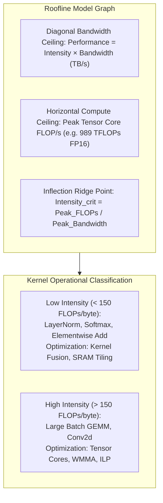

# Module 11: Profiling & Kernel Tuning (NCU & NSYS)

> **Architectural Scope**: Top-Down Nsight Systems Timeline Tracing, Bottom-Up Nsight Compute Analysis, Roofline Model Diagnosis, Warp Stall Breakdown, and Amdahl Speedup Modeling.

---


## GPU Roofline Model: Memory-Bound vs Compute-Bound Regimes



---

## 🗺️ Recommended Step-by-Step Learning Path

Follow this exact sequence to achieve complete mastery of this module:

| Step | File to Open | What You Will Do |
| :---: | :--- | :--- |
| **1** | **[01_README.md](01_README.md)** | Read conceptual overview, architectural foundations, and mental models. |
| **2** | **[00_FOUNDATIONS_PLAYGROUND.md](00_FOUNDATIONS_PLAYGROUND.md)** | Practice beginner spoonfed micro-drills and line-by-line syntax breakdowns. |
| **3** | **[00_try_it_yourself.py](00_try_it_yourself.py)** | Run in terminal (`python 00_try_it_yourself.py`) for an interactive zero-dependency sandbox. |
| **4** | **[04_TROUBLESHOOTING_AND_EDGE_CASES.md](04_TROUBLESHOOTING_AND_EDGE_CASES.md)** | Study forensic runbooks, edge cases, and real-world failure post-mortems. |
| **5** | **[03_SELF_ASSESSMENT_AND_CHALLENGES.md](03_SELF_ASSESSMENT_AND_CHALLENGES.md)** | Test your knowledge with self-assessment quizzes, challenges, and diagnostic scenarios. |
| **6** | **[02_PROJECT_GUIDE.md](02_PROJECT_GUIDE.md)** | Follow guided project implementation for `starter/` and `project_solution/`. |
| **7** | **[problems/](problems/)** | Solve hands-on problem bank challenges and verify with `pytest problems/tests`. |
| **8** | **[debug_lab/](debug_lab/)** | Diagnose and fix silent production bugs in the Bug Hunter Drill. |

---

## 1. The Two-Phase Profiling Methodology

Professional GPU performance optimization follows a structured two-phase diagnostic workflow:

```
+-----------------------------------------------------------------------------------------------+
| PHASE 1: TOP-DOWN SYSTEM TRACING (Nsight Systems - nsys)                                      |
| - Target: Host-Device interactions, launch bubbles, NCCL collective synchronization.          |
| - Questions: Is the GPU busy? Are there CPU launch gaps? Which 3 kernels consume 80% runtime? |
+-----------------------------------------------------------------------------------------------+
|                                                |                                              |
|                                                v                                              |
+-----------------------------------------------------------------------------------------------+
| PHASE 2: BOTTOM-UP KERNEL ANALYSIS (Nsight Compute - ncu)                                     |
| - Target: Single kernel instruction-level analysis.                                           |
| - Questions: Speed of Light %? Compute vs Memory bound? Why are warps stalled?                 |
+-----------------------------------------------------------------------------------------------+
```

---

## 2. Deciphering Nsight Compute (NCU) Speed of Light (SOL)

NCU reports two primary **Speed of Light (SOL)** metrics:
1. **Compute (SM) Throughput %**: Percentage of theoretical peak ALU / Tensor Core cycles utilized.
2. **Memory Throughput %**: Percentage of theoretical peak DRAM (HBM) and SRAM bandwidth utilized.

### Bottleneck Identification Matrix:
- **Memory SOL > 80%, Compute SOL < 40%**: **Memory-Bound**. Focus on SRAM tiling, memory coalescing, vectorizing loads (`float4`), or kernel fusion.
- **Compute SOL > 80%, Memory SOL < 40%**: **Compute-Bound**. Saturated math pipelines. Optimize instruction mix, use FP16/FP8 Tensor Cores, or increase ILP.
- **Both SOL < 40%**: **Latency-Bound / Occupancy Limited**. Warps are stalled waiting for dependencies or barriers.

---

## 3. The 4 Critical Warp Stall Reasons in NCU

1. **`stall_long_scoreboard` (DRAM Latency)**:
   - Warps are stalled waiting for Global Memory loads/stores.
   - *Optimization*: Increase thread occupancy to hide latency; use asynchronous copy (`cuda::memcpy_async` or TMA); vectorize to 128-byte transactions.
2. **`stall_short_scoreboard` (SRAM Latency)**:
   - Warps are stalled waiting for Shared Memory access.
   - *Optimization*: Eliminate shared memory bank conflicts (add padding); increase Instruction-Level Parallelism (ILP).
3. **`stall_barrier` (Synchronization)**:
   - Warps are halted at `__syncthreads()` waiting for slow threads.
   - *Optimization*: Minimize barrier count; use warp shuffle instructions (`__shfl_down_sync`) to eliminate block barriers.
4. **`stall_math_pipe_throttle` (Compute Saturation)**:
   - Execution units are 100% occupied.
   - *Optimization*: Excellent! The kernel is compute-saturated.

---

## 4. Module Study Progression
1. **Beginner Playground**: Read [00_FOUNDATIONS_PLAYGROUND.md](00_FOUNDATIONS_PLAYGROUND.md).
2. **Architecture Theory**: Study this [01_README.md](01_README.md).
3. **Hands-on Project**: Follow [02_PROJECT_GUIDE.md](02_PROJECT_GUIDE.md).
4. **Staff Interview Challenges**: Check [03_SELF_ASSESSMENT_AND_CHALLENGES.md](03_SELF_ASSESSMENT_AND_CHALLENGES.md).
5. **Production Debugging**: Review [04_TROUBLESHOOTING_AND_EDGE_CASES.md](04_TROUBLESHOOTING_AND_EDGE_CASES.md).