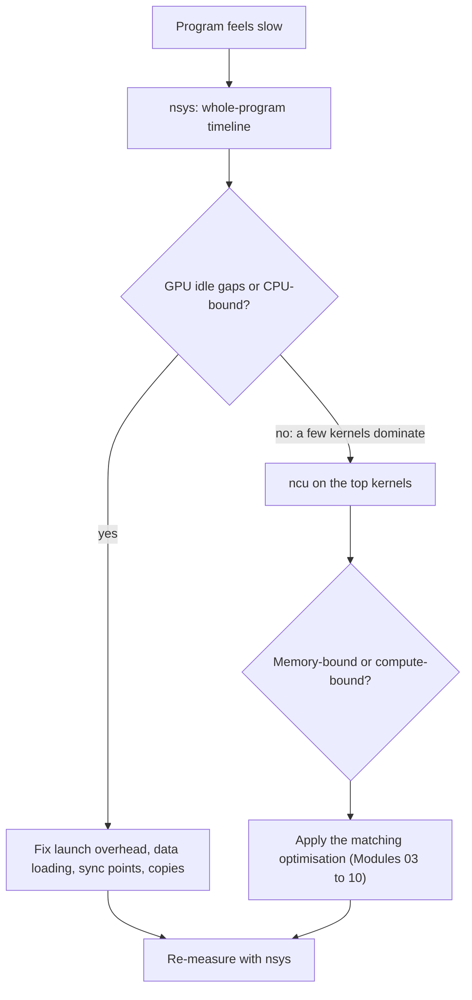

# Module 11: Profiling & Tuning with Nsight (Compute & Systems)

> **Architectural Scope**: Top-Down Nsight Systems Timeline Tracing, Bottom-Up Nsight Compute Analysis, Roofline Model Diagnosis, Warp Stall Breakdown, and Amdahl Speedup Modeling.

---

## Why this module matters

Every earlier module gave you a *theory* of what makes GPU code fast. This one gives you the instruments that tell you which theory applies to **your** program. Without a profiler you are guessing; with one, most performance work becomes a short, repeatable loop: find where the time goes, find why, fix one thing, measure again. NVIDIA ships two complementary tools, and using them in the right order is the skill.

## Mental model: a map first, then a microscope

- **Nsight Systems (`nsys`)** is the **map**: a timeline of the *whole program*: CPU threads, CUDA API calls, kernels, memory copies, NCCL calls, and your own annotations. It answers "where is the time going and is the GPU even busy?"
- **Nsight Compute (`ncu`)** is the **microscope**: a deep, per-**kernel** analysis with hardware counters. It answers "why is *this* kernel slow?"


```mermaid
flowchart TD
    A["Program feels slow"] --> B["nsys: whole-program timeline"]
    B --> C{"GPU idle gaps or CPU-bound?"}
    C -->|"yes"| D["Fix launch overhead, data loading, sync points, copies"]
    C -->|"no: a few kernels dominate"| E["ncu on the top kernels"]
    E --> F{"Memory-bound or compute-bound?"}
    F --> G["Apply the matching optimisation (Modules 03 to 10)"]
    D --> H["Re-measure with nsys"]
    G --> H
```

## 1. Top-down with Nsight Systems

Typical capture:

```bash
nsys profile -o report --trace=cuda,nvtx,osrt --capture-range=cudaProfilerApi python train.py
# or: nsys profile -t cuda,nvtx -o report ./my_app ; open report.nsys-rep in the GUI
```

How to read the timeline:

1. **GPU utilisation rows.** Long white gaps between kernels mean the GPU is starved: Python overhead, tiny kernels with launch latency (a few microseconds each), `cudaDeviceSynchronize()` or `.item()` calls forcing waits, synchronous H2D copies, or a slow data loader.
2. **Kernel list / "CUDA GPU Kernel Summary".** Sort by total time. Usually 5 to 10 kernels account for most of the time; those are your `ncu` targets.
3. **Memory operations.** Many small copies, pageable-memory copies, or copies that do not overlap with compute (Module 02 streams).
4. **NVTX ranges.** Wrap your code in `torch.cuda.nvtx.range_push("forward")` / `range_pop()` (or `nvtx.annotate`) so the timeline shows *your* phases, not just kernel names. Warm up first, then profile a few steady-state iterations.
5. **Multi-GPU runs.** Look at NCCL kernels: if communication does not overlap with backward compute you will see GPUs idle in lockstep (Course 08).

## 2. Bottom-up with Nsight Compute

```bash
ncu --set full -k regex:my_kernel -s 5 -c 1 -o kernel_report python run.py
```

`-k` selects kernels by name, `-s` skips warm-up launches, `-c` limits how many are profiled (ncu replays the kernel many times, so it is slow). Sections to read in order:

1. **GPU Speed Of Light (SOL).** Two headline numbers: *Compute (SM) Throughput* and *Memory Throughput*, each as a percentage of peak. Both low means latency-bound (not enough parallelism or dependent stalls). Memory high, compute low means memory-bound. Compute high means compute-bound. This is the roofline question answered with counters.
2. **Roofline chart.** Plots achieved FLOP/s against arithmetic intensity with the device's ceilings; the distance to the roof tells you the headroom (Module 01).
3. **Memory Workload Analysis.** Hit rates in L1 and L2, DRAM throughput, **sectors per request** (near 4 for a perfectly coalesced FP32 warp load; high values mean strided access, Module 03), and shared-memory **bank conflicts**.
4. **Warp State Statistics (stall reasons).** Why warps could not issue each cycle:
   - *Long scoreboard*: waiting on global/local memory. Improve coalescing, reuse, prefetch, raise occupancy or instruction-level parallelism.
   - *Short scoreboard / MIO throttle*: shared memory, special functions; check bank conflicts and `exp`-heavy code.
   - *Barrier*: waiting at `__syncthreads()`; imbalanced work between warps.
   - *Math pipe throttle*: pipes saturated; you are compute-bound (good).
   - *Not selected / dispatch stall / no instruction*: too few eligible warps or instruction cache misses.
5. **Occupancy.** Theoretical vs achieved, and which resource limits it (registers, shared memory, block size). Also check **register spilling** ("local memory" traffic).
6. **Source counters.** Per-line SASS/CUDA metrics to find the hot instructions.

## 3. Turning findings into fixes

| Symptom in the profile | Likely cause | Where the fix lives |
|---|---|---|
| GPU idle between many tiny kernels | launch overhead | fuse kernels (Module 07), CUDA Graphs, `torch.compile` |
| Memory throughput high, SM throughput low | memory-bound | reduce bytes: fusion, tiling, lower precision (Modules 05 to 10) |
| High sectors-per-request | uncoalesced access | change index mapping, SoA layout (Module 03) |
| Shared-memory bank conflicts | stride is multiple of 32 words | pad or swizzle (Module 03) |
| Both throughputs low, long-scoreboard stalls | latency-bound | more resident warps, more loads in flight per thread |
| Low achieved occupancy, high registers | register pressure | `__launch_bounds__`, smaller tiles, `-maxrregcount` |
| Tensor Core utilisation low in a GEMM | wrong dtype/shape/layout | multiples of 8/16, FP16/BF16/FP8, library kernels |

## 4. Amdahl's law: deciding what to optimise

If a kernel accounts for a fraction `p` of total time and you speed it up by `s`, the whole program speeds up by

`speedup = 1 / ((1 - p) + p / s)`.

**Worked example.** A forward pass is 100 ms. Attention is 40 ms and an elementwise chain is 10 ms. Making attention 2x faster saves 20 ms: overall `1 / (0.6 + 0.4/2) = 1.25x`. Making the elementwise chain 10x faster saves 9 ms: `1 / (0.9 + 0.1/10) = 1.10x`. Even an *infinite* speedup of the chain caps at `1 / 0.9 = 1.11x`. Always compute the ceiling before investing a week in a kernel. The profiler's kernel-time table is exactly the `p` for each candidate.

## 5. Good profiling hygiene

- **Warm up** (JIT compile, cuDNN autotune, allocator growth) and profile steady state.
- Use **realistic shapes and batch sizes**: kernels behave differently at toy sizes.
- Remember `ncu` serialises and replays kernels and locks clocks by default: use it for *relative* diagnosis, and use `nsys` or CUDA events for real wall-clock numbers.
- Change **one thing at a time** and keep the reports for before/after comparison (ncu can diff baselines in the GUI).
- Check correctness after every optimisation; a fast wrong kernel is worthless.
- Profiling adds overhead; limit capture windows (`cudaProfilerStart/Stop`, NVTX ranges, `--capture-range`).

## Common pitfalls

1. **Optimising a kernel that does not matter** (low `p`).
2. **Ignoring the CPU side**: a perfectly tuned kernel behind a slow Python loop is still slow.
3. **Profiling cold start** or a debug build.
4. **Reading stall percentages in isolation**: a dominant stall reason on an already-saturated kernel is expected, not a bug.
5. **Trusting average occupancy** instead of looking at what limits it.
6. **Comparing runs on different clocks/power states**; lock clocks or repeat runs.

## How this connects

- Every previous module appears as a row in the table above; this module is the feedback loop that tells you which to apply.
- **Course 08, Module 10** uses the same discipline for cluster-level profiling (PyTorch profiler, NCCL timelines).
- **Course 09**: serving benchmarks (TTFT/TPOT) are the application-level analogue of nsys timelines.

## Go further

- roadmap.sh: *Inference Engineering* nodes **profiling performance**, **bottleneck analysis**, **benchmarking / profiling**, **roofline model**.
- NVIDIA Nsight Compute profiling guide and Nsight Systems user guide; NVIDIA blog "Using Nsight Compute to Inspect your Kernels".
- PyTorch profiler recipe (exports traces viewable in TensorBoard or Perfetto).

---

## Module Study Progression
1. **Beginner Playground**: Read [00_FOUNDATIONS_PLAYGROUND.md](00_FOUNDATIONS_PLAYGROUND.md).
2. **Architecture Theory**: Study this [01_README.md](01_README.md).
3. **Hands-on Project**: Follow [02_PROJECT_GUIDE.md](02_PROJECT_GUIDE.md).
4. **Staff Interview Challenges**: Check [03_SELF_ASSESSMENT_AND_CHALLENGES.md](03_SELF_ASSESSMENT_AND_CHALLENGES.md).
5. **Production Debugging**: Review [04_TROUBLESHOOTING_AND_EDGE_CASES.md](04_TROUBLESHOOTING_AND_EDGE_CASES.md).
