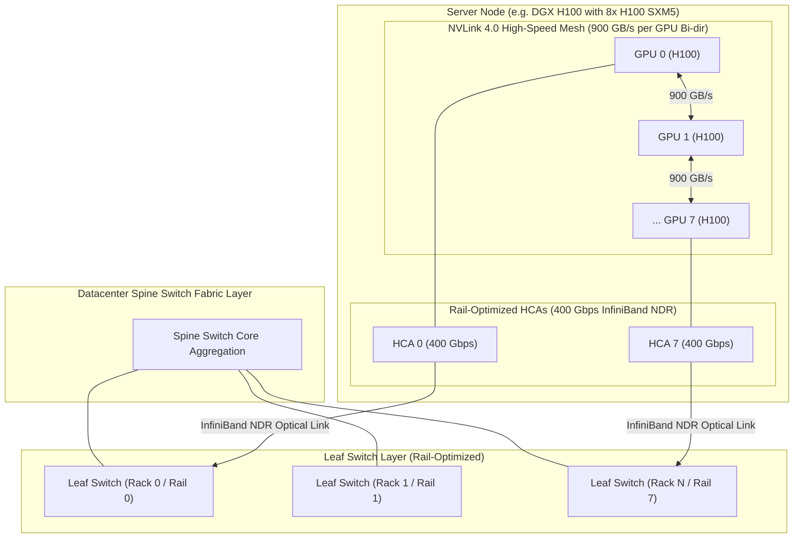

# Module 01: GPU Cluster Hardware & Interconnect Topologies

> **Architectural Scope**: NVLink 4.0, NVSwitch (900 GB/s), InfiniBand NDR (400 Gbps), RoCE v2, Rail-Optimized Network Fabrics, Fat-Tree vs Dragonfly, and Bisection Bandwidth.

---

---

## 🗺️ Recommended Step-by-Step Learning Path

Follow this exact sequence to achieve complete mastery of this module:

| Step | File to Open | What You Will Do |
| :---: | :--- | :--- |
| **1** | **[01_README.md](01_README.md)** | Read conceptual overview, architectural foundations, and mental models. |
| **2** | **[00_FOUNDATIONS_PLAYGROUND.md](00_FOUNDATIONS_PLAYGROUND.md)** | Practice beginner spoonfed micro-drills and line-by-line syntax breakdowns. |
| **3** | **[00_try_it_yourself.py](00_try_it_yourself.py)** | Run in terminal (`python 00_try_it_yourself.py`) for an interactive zero-dependency sandbox. |
| **4** | **[04_TROUBLESHOOTING_AND_EDGE_CASES.md](04_TROUBLESHOOTING_AND_EDGE_CASES.md)** | Study forensic runbooks, edge cases, and real-world failure post-mortems. |
| **5** | **[03_SELF_ASSESSMENT_AND_CHALLENGES.md](03_SELF_ASSESSMENT_AND_CHALLENGES.md)** | Test your knowledge with self-assessment quizzes, challenges, and diagnostic scenarios. |
| **6** | **[02_PROJECT_GUIDE.md](02_PROJECT_GUIDE.md)** | Follow guided project implementation for `starter/` and `project_solution/`. |
| **7** | **[problems/](problems/)** | Solve hands-on problem bank challenges and verify with `pytest problems/tests`. |
| **8** | **[debug_lab/](debug_lab/)** | Diagnose and fix silent production bugs in the Bug Hunter Drill. |

---

## 1. The Physical Hierarchy of Modern AI Supercomputers

Modern foundation model training infrastructure is organized hierarchically into compute, node, rack, and cluster fabric layers:

### Physical Specifications Matrix
| Interconnect | Physical Media | Bandwidth per GPU | Latency | Scope |
| :--- | :--- | :---: | :---: | :--- |
| **NVLink 4.0 / NVSwitch** | On-board copper traces | $900 \text{ GB/s}$ bi-dir | $\approx 100 \text{ ns}$ | Intra-node (8 GPUs) |
| **PCIe Gen 5** | Motherboard PCIe lanes | $64 \text{ GB/s}$ bi-dir | $\approx 500 \text{ ns}$ | Host CPU to GPU |
| **InfiniBand NDR** | Optical / DAC cables | $400 \text{ Gbps (50 GB/s)}$ | $\approx 1.5 \; \mu\text{s}$ | Inter-node cluster |
| **RoCE v2 Ethernet** | 400GbE / 800GbE fiber | $50 - 100 \text{ GB/s}$ | $\approx 2.5 \; \mu\text{s}$ | Inter-node cluster |

---

## 2. Bisection Bandwidth & Fat-Tree Network Topology

In large clusters (1,024 to 24,000 GPUs), network switches are arranged in a **Fat-Tree topology** (Clos network):
- Leaf switches connect to compute nodes.
- Spine switches aggregate leaf switches.
- **1:1 Non-Blocking Guarantee**: The aggregate uplink bandwidth from all leaf switches to the spine equals the downlink bandwidth to the nodes.
- Bisection Bandwidth:
  $$\text{BW}_{\text{bisection}} = \frac{\text{Total Nodes}}{2} \times \text{Uplink Bandwidth per Node}$$

---

## 3. Module Study Progression
1. **Beginner Playground**: Read [00_FOUNDATIONS_PLAYGROUND.md](00_FOUNDATIONS_PLAYGROUND.md).
2. **Architecture Theory**: Study this [01_README.md](01_README.md).
3. **Hands-on Project**: Follow [02_PROJECT_GUIDE.md](02_PROJECT_GUIDE.md).
4. **Staff Interview Challenges**: Check [03_SELF_ASSESSMENT_AND_CHALLENGES.md](03_SELF_ASSESSMENT_AND_CHALLENGES.md).
5. **Production Debugging**: Review [04_TROUBLESHOOTING_AND_EDGE_CASES.md](04_TROUBLESHOOTING_AND_EDGE_CASES.md).
