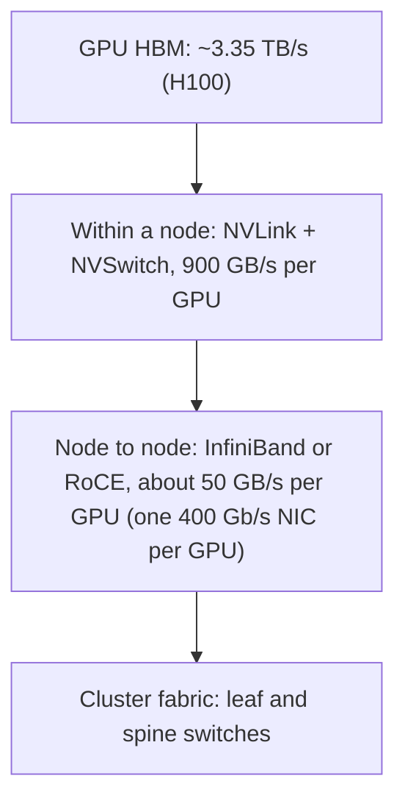

# Module 01: GPU Cluster Hardware & Interconnects

> **Architectural Scope**: NVLink 4.0, NVSwitch (900 GB/s), InfiniBand NDR (400 Gbps), RoCE v2, Rail-Optimized Network Fabrics, Fat-Tree vs Dragonfly, and Bisection Bandwidth.

---

## Why this module matters

A single GPU cannot hold or train a frontier model, so training runs on hundreds to tens of thousands of GPUs. At that scale the question stops being "how fast is one GPU?" and becomes "how fast can GPUs **talk to each other**?". Every parallelism strategy in this course (data, tensor, pipeline, sequence) is a choice about *which tensors cross which wires*. If you know the bandwidth of each wire, you can predict which strategy will work before you launch a job that costs thousands of dollars per hour.

## Mental model: a hierarchy of roads

Think of a city with highways inside each district (very fast), arterial roads between districts (fast), and a countryside network between cities (slow). Traffic that fits inside a district never leaves it. A good training job puts the chattiest traffic on the fastest roads.

```mermaid
flowchart TD
    GPU["GPU HBM: ~3.35 TB/s (H100)"] --> NVL["Within a node: NVLink + NVSwitch, 900 GB/s per GPU"]
    NVL --> NIC["Node to node: InfiniBand or RoCE, about 50 GB/s per GPU (one 400 Gb/s NIC per GPU)"]
    NIC --> SPINE["Cluster fabric: leaf and spine switches"]
```

Each step down the hierarchy loses roughly an order of magnitude of bandwidth. Memorise the ratios rather than the exact numbers: **HBM : NVLink : network is about 70 : 9 : 1** on an H100 DGX-class node (3.35 TB/s : 450 GB/s per direction : 50 GB/s per GPU).

## 1. Inside the node: NVLink and NVSwitch

- **PCIe** connects GPUs to CPUs and NICs. PCIe Gen5 x16 gives about 64 GB/s per direction, far too slow for GPU-to-GPU tensor traffic.
- **NVLink** is NVIDIA's GPU-to-GPU link. Fourth-generation NVLink (Hopper) provides **900 GB/s total bidirectional bandwidth per GPU** (18 links at 50 GB/s each, so about 450 GB/s in each direction). Fifth generation (Blackwell) doubles it to 1.8 TB/s per GPU.
- **NVSwitch** chips make the 8 GPUs of an HGX/DGX node a **full all-to-all crossbar**: any GPU can talk to any other at full NVLink speed concurrently, with no topology tricks needed. NVSwitch also performs some reductions in the switch (**SHARP-style in-network reduction** on newer generations), which makes all-reduce faster.
- Rack-scale systems (GB200 NVL72) extend the NVLink domain across 72 GPUs in a rack through NVLink switch trays, so tensor-parallel groups can span far more GPUs than one node.

Consequence: **bandwidth-hungry parallelism (tensor parallelism) stays inside the NVLink domain.**

## 2. Between nodes: InfiniBand and RoCE v2

- **InfiniBand NDR** runs at **400 Gb/s per port**, which is **50 GB/s** per direction. A DGX H100 node has 8 compute NICs (ConnectX-7), **one per GPU**, so each GPU has its own 50 GB/s path out. XDR (800 Gb/s) is arriving.
- **RDMA (Remote Direct Memory Access)** lets a NIC read or write remote memory without involving the CPU or OS; **GPUDirect RDMA** extends that to GPU memory, so a gradient moves from one GPU's HBM across the wire into another's HBM with no staging copy through host RAM.
- **RoCE v2** is RDMA over Converged Ethernet (UDP/IP). It lets you build the fabric from Ethernet switches, but it needs a carefully tuned **lossless** network: Priority Flow Control (PFC), ECN-based congestion control (DCQCN), and good load balancing. InfiniBand gives this out of the box (credit-based flow control, adaptive routing, built-in SHARP); RoCE offers cost and ecosystem advantages and is widely used at hyperscale when well engineered.

## 3. Cluster topologies

| Topology | Idea | Strength | Weakness |
|---|---|---|---|
| **Fat-tree (Clos)** | Leaf switches connect to hosts; spine switches connect leaves; bandwidth is constant at each level | Full **bisection bandwidth**, predictable, simple routing | Many switches and cables as scale grows |
| **Rail-optimised fat-tree** | GPU `k` of every node connects to the same "rail" leaf switch | Traffic between same-index GPUs of different nodes crosses only one switch hop; matches how NCCL builds rings and trees | Cross-rail traffic must go via NVLink first or traverse the spine |
| **Dragonfly / Dragonfly+** | Groups of switches fully connected inside, with global links between groups | Fewer switches and cables at very large scale | Needs adaptive routing; bandwidth between groups is lower |
| **Torus** (e.g. TPU pods) | Each chip links to neighbours in a grid | Cheap neighbour links, great for stencil/ring traffic | Less flexible for arbitrary all-to-all |

**Bisection bandwidth** is the bandwidth available between two halves of the cluster when you cut it in the worst way. It bounds all-to-all and cross-half all-reduce performance. A fat-tree built with equal up and down links has *full* bisection (no oversubscription); an **oversubscribed** fabric (say 2:1) halves it, which shows up as slowdowns only when many jobs or collectives hit the spine together.

## 4. Why this decides your parallelism plan

| Traffic | Per-step volume (rough) | Where it should live |
|---|---|---|
| Tensor-parallel all-reduce (twice per layer, activations) | very large and latency-critical | NVLink domain (within a node or NVL rack) |
| Pipeline-parallel send/recv (activations between stages) | modest, point-to-point | across nodes (InfiniBand/RoCE) |
| Data-parallel gradient all-reduce / ZeRO all-gather | proportional to parameters, overlappable with backward | across nodes, hierarchical |
| Expert-parallel all-to-all (MoE) | large, bursty | NVLink if possible; otherwise a well-provisioned rail |

## Worked example: the cost of sending one gradient tensor

All-reduce of 1 GB of gradients with a bandwidth-optimal ring moves about `2 x (p - 1)/p x 1 GB ~ 2 GB` through each GPU's link (Module 02). On NVLink at ~450 GB/s per direction that takes roughly 4.5 ms. Across nodes at 50 GB/s per GPU it takes about 40 ms, nearly 9x longer. For a model with 7B parameters in BF16 (14 GB of gradients) the inter-node all-reduce is on the order of half a second per step if nothing overlaps, which is why data parallelism overlaps communication with the backward pass (Module 03) and why we shard (Module 04) rather than replicate.

## Common pitfalls

1. **Putting tensor parallelism across nodes.** A TP group that spans the InfiniBand boundary can run several times slower than one inside NVLink.
2. **Ignoring NIC-to-GPU affinity**: a NIC attached to the "wrong" CPU socket or PCIe switch adds hops. Check `nvidia-smi topo -m`.
3. **Quoting bidirectional numbers as one-way.** NVLink's 900 GB/s is bidirectional; per-direction is half.
4. **Assuming RoCE works out of the box**: misconfigured PFC/ECN gives mysterious stalls and congestion collapse.
5. **Forgetting oversubscription** in shared clusters; benchmark collectives at full scale.
6. **Treating all GPUs as equal**: stragglers (thermal throttling, a flaky link) slow the whole synchronous job.

## How this connects

- **Module 02** (NCCL) builds collective algorithms that exploit this topology.
- **Modules 03 to 08** decide what to place on which link.
- **Course 07, Module 01** gave the on-GPU memory hierarchy; this extends it outward past the chip.
- **Course 09**: multi-node inference and prefill/decode disaggregation depend on the same interconnect budgets.

## Go further

- roadmap.sh: *Inference Engineering* nodes **instances / interconnects**, **multi node inference**, **gpu architecture**.
- NVIDIA Hopper architecture whitepaper (NVLink/NVSwitch sections); NVIDIA DGX H100/SuperPOD reference architecture.
- Wikipedia: InfiniBand, NVLink; *Fat-tree* topology literature (Leiserson 1985); Dragonfly (Kim et al., ISCA 2008).

---

## Module Study Progression
1. **Beginner Playground**: Read [00_FOUNDATIONS_PLAYGROUND.md](00_FOUNDATIONS_PLAYGROUND.md).
2. **Architecture Theory**: Study this [01_README.md](01_README.md).
3. **Hands-on Project**: Follow [02_PROJECT_GUIDE.md](02_PROJECT_GUIDE.md).
4. **Staff Interview Challenges**: Check [03_SELF_ASSESSMENT_AND_CHALLENGES.md](03_SELF_ASSESSMENT_AND_CHALLENGES.md).
5. **Production Debugging**: Review [04_TROUBLESHOOTING_AND_EDGE_CASES.md](04_TROUBLESHOOTING_AND_EDGE_CASES.md).
