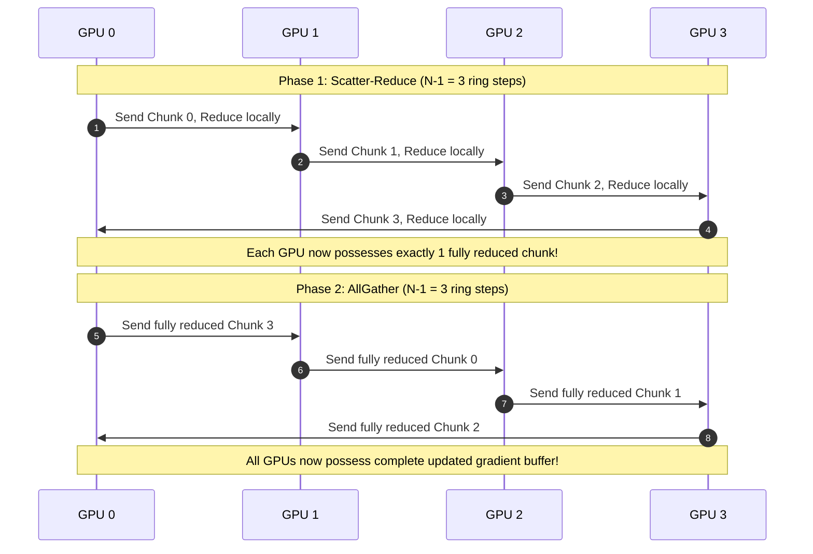

# Module 02: Collective Communications (NCCL)

> **Architectural Scope**: Ring AllReduce, Tree AllReduce, AllGather, ReduceScatter, AllToAll, and the $\alpha$-$\beta$ Latency-Bandwidth Cost Model.

---


## NCCL Ring AllReduce Step Progression



---

## 1. Core Collective Communication Operations

In distributed machine learning, communication between ranks is defined by standard collective primitives:

```
+-----------------------------------------------------------------------------------------------+
| NCCL COLLECTIVE PRIMITIVES OVERVIEW                                                           |
+-----------------------------------------------------------------------------------------------+
| Broadcast:     One rank sends identical tensor to all other ranks.                            |
| Reduce:        All ranks sum/max their tensors into a single root rank.                       |
| AllReduce:     All ranks sum their tensors and ALL ranks receive the identical sum.           |
| AllGather:     Each rank has a slice; all ranks gather all slices into a concatenated tensor. |
| ReduceScatter: All ranks reduce tensors, but each rank only receives its assigned slice.      |
| AllToAll:      Matrix transpose of communication: Rank i sends j-th slice to Rank j.          |
+-----------------------------------------------------------------------------------------------+
```

---

## 2. Tree AllReduce vs Ring AllReduce

Modern NCCL chooses between algorithms depending on tensor size and network topology:
1. **Ring AllReduce**:
   - Optimal for **large payloads** ($S > 10 \text{ MB}$).
   - Bandwidth optimal: each link sends exactly $\frac{N-1}{N} S$ bytes per phase.
   - High latency: $2 (N-1)$ hops.
2. **Double Binary Tree AllReduce**:
   - Optimal for **small payloads** ($S < 1 \text{ MB}$).
   - Latency optimal: $O(\log N)$ steps instead of $O(N)$.
   - Lower effective bandwidth efficiency than ring.

---

## 3. Module Study Progression
1. **Beginner Playground**: Read [00_FOUNDATIONS_PLAYGROUND.md](00_FOUNDATIONS_PLAYGROUND.md).
2. **Architecture Theory**: Study this [01_README.md](01_README.md).
3. **Hands-on Project**: Follow [02_PROJECT_GUIDE.md](02_PROJECT_GUIDE.md).
4. **Staff Interview Challenges**: Check [03_SELF_ASSESSMENT_AND_CHALLENGES.md](03_SELF_ASSESSMENT_AND_CHALLENGES.md).
5. **Production Debugging**: Review [04_TROUBLESHOOTING_AND_EDGE_CASES.md](04_TROUBLESHOOTING_AND_EDGE_CASES.md).