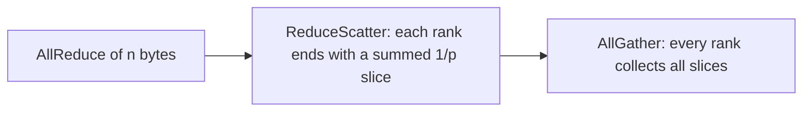

# Module 02: NCCL Collective Communication Primitives

> **Architectural Scope**: Ring AllReduce, Tree AllReduce, AllGather, ReduceScatter, AllToAll, and the $\alpha$-$\beta$ Latency-Bandwidth Cost Model.

---

## Why this module matters

Distributed training is single-GPU training plus a small vocabulary of **collective operations**: a group of GPUs calls the same operation together, and the library moves data between them. NCCL (NVIDIA Collective Communications Library, pronounced "nickel") implements that vocabulary for GPUs, and PyTorch's `torch.distributed` with the `nccl` backend is a thin wrapper over it. DDP, ZeRO/FSDP, tensor parallelism, sequence parallelism and MoE are all expressed in a handful of these primitives. Knowing what each one *costs* is how you predict which strategy is communication-bound.

## Mental model: five verbs

Let `p` GPUs (ranks) each hold a buffer of `n` bytes.

| Collective | What it does | Typical use |
|---|---|---|
| **Broadcast** | one rank's buffer is copied to all | initial weights |
| **Reduce** | all buffers are summed (or max, ...) onto one rank | rarely on its own |
| **AllReduce** | all buffers are summed and **every** rank receives the sum | DDP gradients, tensor-parallel activations |
| **ReduceScatter** | buffers are summed, and rank `i` gets only the `i`-th `1/p` slice of the result | ZeRO/FSDP gradients |
| **AllGather** | rank `i` has slice `i`; every rank ends with the full concatenation | ZeRO/FSDP parameters, sequence parallelism |
| **AllToAll** | rank `i` sends a different chunk to every rank `j` (a transpose across ranks) | MoE expert routing, Ulysses-style sequence parallelism |

Key identity: **AllReduce = ReduceScatter followed by AllGather.** That is how ring all-reduce works and why ZeRO can replace an all-reduce with a reduce-scatter and an all-gather at the same total cost.

```mermaid
flowchart LR
    AR["AllReduce of n bytes"] --> RS["ReduceScatter: each rank ends with a summed 1/p slice"]
    RS --> AG["AllGather: every rank collects all slices"]
```

## 1. The alpha-beta cost model

Sending a message of `m` bytes over one link costs

`T(m) = alpha + m / beta`

where `alpha` is the **latency** per message (microseconds: software, NIC and switch hops) and `beta` is the **bandwidth** (bytes per second). Small messages are dominated by `alpha`; large messages by `m / beta`. Every collective algorithm trades the number of steps (paying `alpha` each) against the bytes each link carries (paying `1/beta`).

## 2. Ring algorithms

Arrange the `p` ranks in a ring. For **AllReduce** with a buffer of `n` bytes split into `p` chunks:

1. **Reduce-scatter phase** (`p - 1` steps): in each step every rank sends one chunk to its right neighbour and adds the chunk it receives from the left into its own copy. After `p - 1` steps, rank `i` holds the fully reduced chunk `i`.
2. **All-gather phase** (`p - 1` steps): each rank forwards its finished chunk around the ring until everyone has all chunks.

Each step moves `n / p` bytes per link, so:

`T_ring = 2 (p - 1) alpha + 2 (p - 1)/p x n / beta`

The bandwidth term approaches `2 n / beta` as `p` grows: **per-GPU traffic is almost independent of the number of GPUs.** That is the miracle of ring all-reduce and the reason data-parallel training scales. The latency term grows linearly with `p`, so rings are poor for small messages on large clusters.

ReduceScatter and AllGather each cost `(p - 1) alpha + (p - 1)/p x n / beta` (half of an all-reduce).

## 3. Tree algorithms

A **tree** all-reduce reduces up a tree to a root and broadcasts back down, taking about `2 log2(p)` steps, so its latency term is logarithmic. Plain trees leave some links idle, so NCCL uses **double binary trees**: two complementary trees so that every rank is a leaf in one and an interior node in the other, restoring near-full bandwidth. Within a node NCCL builds rings over NVLink; across nodes it can build rings or trees over the network, often following a rail-optimised layout (Module 01). On NVSwitch systems with in-network reduction (NVLS/SHARP) the switch itself sums the data, cutting traffic further.

NCCL selects among algorithms (Ring, Tree, NVLS, CollNet) and **protocols** (`Simple` for large messages, `LL` and `LL128` for low latency on small ones) by message size and topology. You can override with `NCCL_ALGO` and `NCCL_PROTO` for experiments, but defaults are usually right.

| Message size | Dominant term | Better algorithm |
|---|---|---|
| Small (KB) | latency, `alpha x steps` | tree (few steps), LL protocols |
| Large (hundreds of MB) | bandwidth, `n / beta` | ring (or NVLS), Simple protocol |

## 4. AllToAll

Each rank holds `p` chunks (one destined for each rank) and exchanges them all. Per-rank traffic is `(p - 1)/p x n` bytes in each direction, but the pattern is **dense and congestion-prone**: it stresses the fabric's bisection bandwidth (Module 01). It is the communication cost of MoE layers and some sequence-parallel schemes, and is far harder to overlap with compute than a ring all-reduce.

## 5. Measuring: algorithm vs bus bandwidth

The `nccl-tests` suite (`all_reduce_perf -b 8 -e 4G -f 2 -g 8`) reports two numbers:

- **algbw** = `n / time`: what the application sees.
- **busbw** = algbw x a collective-specific factor (for all-reduce `2(p - 1)/p`, for all-gather and reduce-scatter `(p - 1)/p`): the actual hardware link utilisation, comparable across collectives and GPU counts.

Compare `busbw` against the link's peak (for example about 450 GB/s on NVLink4 within a node, or about 45 to 50 GB/s per NIC across nodes). Good results are typically 80 to 90% of peak for large messages. Set `NCCL_DEBUG=INFO` to see which transports, rings and algorithms NCCL picked, which is the first thing to check when a job is slower than expected.

## Worked example: ring all-reduce by hand

4 GPUs, each with `[a, b, c, d]` chunks. After the reduce-scatter phase (3 steps), GPU 0 holds sum of all chunk 0s, GPU 1 holds sum of chunk 1s, and so on. After the all-gather phase (3 more steps), everyone holds all four sums. Total steps `2 x 3 = 6`. Each step sends `n/4` bytes. Per-GPU bytes sent: `6 x n/4 = 1.5 n = 2 (4 - 1)/4 x n`. For `n = 1 GB` that is 1.5 GB per GPU. With `p = 1024` it becomes `2 x 1023/1024 ~ 1.998 GB`: nearly unchanged, while a naive "everyone sends to rank 0" scheme would push `1023 GB` through one link.

## Common pitfalls

1. **Rank mismatch**: every rank in a communicator must call the same collectives **in the same order** with matching sizes; otherwise the job hangs. Differing control flow across ranks (an `if` on data) is a classic deadlock.
2. **Mixing streams carelessly**: NCCL runs on a CUDA stream; reading a result before the collective's stream is synchronised, or overlapping on the same stream unintentionally, causes wrong results or lost overlap.
3. **Many tiny collectives**: latency-bound. Bucket them (Module 03).
4. **Confusing algbw with busbw** when comparing runs.
5. **Ignoring topology**: wrong NIC/GPU affinity or a missing NVLink path cuts bandwidth by large factors (`nvidia-smi topo -m`, `NCCL_DEBUG=INFO`).
6. **Timeouts without diagnosis**: set `TORCH_NCCL_ASYNC_ERROR_HANDLING` and use flight-recorder traces to find the straggling rank.

## How this connects

- **Module 01** gives the `beta` for each tier; this module turns it into time.
- **Module 03 (DDP)** uses bucketed all-reduce; **Module 04** uses reduce-scatter and all-gather; **Module 05** uses all-reduce on activations; **Module 07** uses all-gather, all-to-all and ring send/recv.
- **Course 07**: same "fewer bytes, more overlap" thinking, one level up.

## Go further

- roadmap.sh: *Inference Engineering* nodes **tensor parallelism**, **model parallelism**, **multi node inference**.
- NVIDIA NCCL user guide (collective operations, environment variables) and the `nccl-tests` repository.
- Thakur, Rabenseifner, Gropp, *Optimization of Collective Communication Operations in MPICH* (2005); Patarasuk and Yuan, *Bandwidth optimal all-reduce algorithms* (2009).

---

## Module Study Progression
1. **Beginner Playground**: Read [00_FOUNDATIONS_PLAYGROUND.md](00_FOUNDATIONS_PLAYGROUND.md).
2. **Architecture Theory**: Study this [01_README.md](01_README.md).
3. **Hands-on Project**: Follow [02_PROJECT_GUIDE.md](02_PROJECT_GUIDE.md).
4. **Staff Interview Challenges**: Check [03_SELF_ASSESSMENT_AND_CHALLENGES.md](03_SELF_ASSESSMENT_AND_CHALLENGES.md).
5. **Production Debugging**: Review [04_TROUBLESHOOTING_AND_EDGE_CASES.md](04_TROUBLESHOOTING_AND_EDGE_CASES.md).
