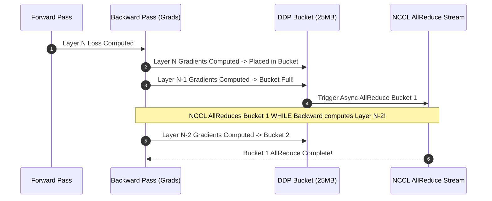

# Module 03: Distributed Data Parallel (DDP)

> **Architectural Scope**: PyTorch DDP Architecture, Gradient Bucketing (25 MB), Autograd Backward Hooks, Ring AllReduce Overlap, and Synchronization Invariants.

---


## PyTorch DDP Computation & Communication Overlap



---

## 🗺️ Recommended Step-by-Step Learning Path

Follow this exact sequence to achieve complete mastery of this module:

| Step | File to Open | What You Will Do |
| :---: | :--- | :--- |
| **1** | **[01_README.md](01_README.md)** | Read conceptual overview, architectural foundations, and mental models. |
| **2** | **[00_FOUNDATIONS_PLAYGROUND.md](00_FOUNDATIONS_PLAYGROUND.md)** | Practice beginner spoonfed micro-drills and line-by-line syntax breakdowns. |
| **3** | **[00_try_it_yourself.py](00_try_it_yourself.py)** | Run in terminal (`python 00_try_it_yourself.py`) for an interactive zero-dependency sandbox. |
| **4** | **[04_TROUBLESHOOTING_AND_EDGE_CASES.md](04_TROUBLESHOOTING_AND_EDGE_CASES.md)** | Study forensic runbooks, edge cases, and real-world failure post-mortems. |
| **5** | **[03_SELF_ASSESSMENT_AND_CHALLENGES.md](03_SELF_ASSESSMENT_AND_CHALLENGES.md)** | Test your knowledge with self-assessment quizzes, challenges, and diagnostic scenarios. |
| **6** | **[02_PROJECT_GUIDE.md](02_PROJECT_GUIDE.md)** | Follow guided project implementation for `starter/` and `project_solution/`. |
| **7** | **[problems/](problems/)** | Solve hands-on problem bank challenges and verify with `pytest problems/tests`. |
| **8** | **[debug_lab/](debug_lab/)** | Diagnose and fix silent production bugs in the Bug Hunter Drill. |

---

## 1. DDP System Architecture

```
+-----------------------------------------------------------------------------------------------+
| PYTORCH DDP OVERLAPPED BACKWARD PASS EXECUTION TIMELINE                                       |
+-----------------------------------------------------------------------------------------------+
| Time -->                                                                                      |
| Compute (Backward Pass): [ Layer 4 Backprop ] [ Layer 3 Backprop ] [ Layer 2 ] [ Layer 1 ]    |
| Communication (NCCL):                         [ Bucket 1 AllReduce ]   [ Bucket 0 AllReduce ] |
|                                               ^                                               |
|                                               Overlap hides 70-90% of network communication!  |
+-----------------------------------------------------------------------------------------------+
```

---

## 2. Autograd Hook Mechanics
In PyTorch DDP, each parameter tensor registers a `post_accumulate_grad_hook`:
1. When autograd writes `param.grad`, the hook fires.
2. The hook copies the gradient into its pre-allocated 25MB contiguous bucket buffer.
3. Once all parameters in the bucket have fired, DDP issues an asynchronous `dist.all_reduce(bucket)`.

---

## 3. Module Study Progression
1. **Beginner Playground**: Read [00_FOUNDATIONS_PLAYGROUND.md](00_FOUNDATIONS_PLAYGROUND.md).
2. **Architecture Theory**: Study this [01_README.md](01_README.md).
3. **Hands-on Project**: Follow [02_PROJECT_GUIDE.md](02_PROJECT_GUIDE.md).
4. **Staff Interview Challenges**: Check [03_SELF_ASSESSMENT_AND_CHALLENGES.md](03_SELF_ASSESSMENT_AND_CHALLENGES.md).
5. **Production Debugging**: Review [04_TROUBLESHOOTING_AND_EDGE_CASES.md](04_TROUBLESHOOTING_AND_EDGE_CASES.md).