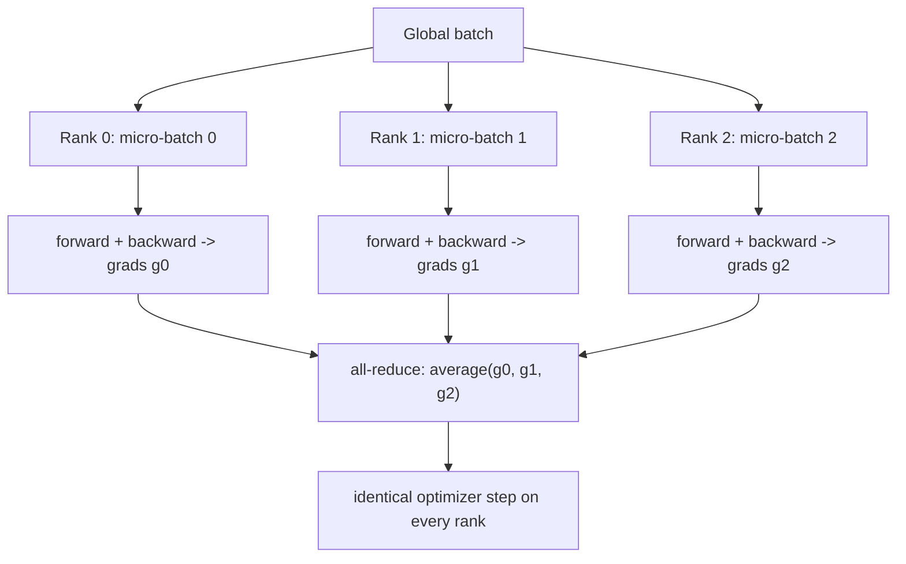

# Module 03: PyTorch Distributed Data Parallel (DDP)

> **Architectural Scope**: PyTorch DDP Architecture, Gradient Bucketing (25 MB), Autograd Backward Hooks, Ring AllReduce Overlap, and Synchronization Invariants.

---

## Why this module matters

Data parallelism is the simplest and most widely used way to use more than one GPU: every GPU holds a full copy of the model, processes a different slice of the batch, and the copies stay identical by averaging gradients. It is the baseline against which every other strategy in this course is measured, and the foundation underneath FSDP and ZeRO. DDP is also where most people first meet the real-world failure modes of distributed training: hangs, silent divergence between ranks, and "why is eight GPUs only five times faster?".

## Mental model: identical twins with different homework

Each GPU (rank) is a student with an identical textbook (the model weights). Each gets different homework problems (a shard of the batch). After doing their own work, the students **average their corrections** (gradients) and all apply the same averaged update, so the textbooks stay identical. The only communication is one gradient average per step.


```mermaid
flowchart TD
    D["Global batch"] --> S0["Rank 0: micro-batch 0"]
    D --> S1["Rank 1: micro-batch 1"]
    D --> S2["Rank 2: micro-batch 2"]
    S0 --> F0["forward + backward -> grads g0"]
    S1 --> F1["forward + backward -> grads g1"]
    S2 --> F2["forward + backward -> grads g2"]
    F0 --> AR["all-reduce: average(g0, g1, g2)"]
    F1 --> AR
    F2 --> AR
    AR --> U["identical optimizer step on every rank"]
```

## 1. The minimal training loop

```python
# launch: torchrun --nproc_per_node=8 train.py
import os, torch, torch.distributed as dist
from torch.nn.parallel import DistributedDataParallel as DDP
from torch.utils.data import DataLoader, DistributedSampler

dist.init_process_group("nccl")                       # reads RANK, WORLD_SIZE, MASTER_ADDR from torchrun
local_rank = int(os.environ["LOCAL_RANK"])
torch.cuda.set_device(local_rank)

model = MyModel().cuda(local_rank)
model = DDP(model, device_ids=[local_rank])           # broadcasts rank 0's weights, installs hooks

sampler = DistributedSampler(dataset, shuffle=True)   # each rank sees a distinct shard
loader = DataLoader(dataset, batch_size=32, sampler=sampler, pin_memory=True, num_workers=4)
opt = torch.optim.AdamW(model.parameters(), lr=3e-4)

for epoch in range(num_epochs):
    sampler.set_epoch(epoch)                          # different shuffle each epoch (easy to forget)
    for x, y in loader:
        loss = loss_fn(model(x.cuda(local_rank)), y.cuda(local_rank))
        loss.backward()                               # gradients all-reduced during this call
        opt.step(); opt.zero_grad(set_to_none=True)
```

Facts to internalise: **one process per GPU** (not threads); the **effective batch size** is `per_GPU_batch x world_size` (scale the learning rate and warm up accordingly); only rank 0 should log or save checkpoints.

## 2. What DDP does under the hood

1. **At construction:** parameters (and buffers) are broadcast from rank 0 so all replicas start identical, and parameters are partitioned into **buckets**.
2. **During backward:** the `Reducer` registers an autograd hook on every parameter's gradient accumulator. When a parameter's gradient is ready, the hook marks it; when **all gradients in a bucket** are ready, an asynchronous NCCL **all-reduce** (sum, then divide by world size) is launched for that bucket **while backward keeps computing earlier layers**.
3. **At the end of backward:** DDP waits for the outstanding all-reduces, so `.grad` holds averaged gradients when `backward()` returns.
4. The optimizer step runs locally and identically on each rank (same weights, same gradients, same optimizer state), keeping replicas in sync with no further communication.

### Bucketing

- Buckets are filled in **reverse parameter order** because gradients become ready from the last layer to the first. Default `bucket_cap_mb=25`; the first bucket is smaller (about 1 MB) so communication can start earlier.
- **Why buckets?** One all-reduce per parameter tensor is latency-bound (Module 02's `alpha`); one all-reduce at the very end cannot overlap with compute. Medium buckets give bandwidth-efficient messages **and** overlap.
- Tune `bucket_cap_mb` for your model and network (larger for high-latency inter-node links, smaller for faster overlap start), and consider `gradient_as_bucket_view=True` to avoid a copy and `static_graph=True` when the graph never changes.

## 3. Overlap: hiding communication behind the backward pass

Per-step time is roughly `max(compute, communication)` when overlap is good and `compute + communication` when it is not. Backward is about twice the forward cost, so there is a large window for communication to hide inside, **provided** the network can move the gradients in that time. If the all-reduce of the full gradient takes longer than backward, you are communication-bound and extra GPUs add little.

## 4. Synchronisation invariants (what keeps ranks identical)

- Every rank must call `forward` and `backward` the **same number of times** with the same parameter set; otherwise some ranks wait forever in an all-reduce (hang).
- **Unused parameters:** if a parameter gets no gradient on some iteration (conditional branches), the bucket never completes. Fix the model, or set `find_unused_parameters=True` (costs an extra graph traversal each step).
- **Gradient accumulation:** wrap non-final micro-steps in `with model.no_sync():` so gradients are only reduced once per optimizer step.
- **Randomness:** seed the model initialisation identically (or rely on the rank-0 broadcast) but give each rank a different data order; dropout RNG may differ per rank safely.
- **BatchNorm** statistics are per-rank unless you convert with `SyncBatchNorm` (needs extra collectives).
- **Checkpointing:** save from rank 0 (`model.module.state_dict()`), and barrier before other ranks read it.

## 5. The memory limit that motivates FSDP/ZeRO

DDP **replicates everything** on every GPU. For mixed-precision training with Adam, per parameter you hold about 2 bytes (BF16 weights) + 2 (gradients) + 4 (FP32 master weights) + 4 + 4 (Adam moments) = **16 bytes**, before activations. A 7B-parameter model needs about 112 GB for states alone: it does not fit on an 80 GB GPU no matter how many replicas you add. That is the exact problem Module 04 solves by sharding those states.

## Worked example: scaling arithmetic

Model: 1.3B parameters, BF16 gradients = 2.6 GB. Eight GPUs in one node, ring all-reduce over NVLink at about 450 GB/s per direction: each GPU sends about `2 x 7/8 x 2.6 GB = 4.5 GB`, which takes about 10 ms. Suppose backward compute takes about 150 ms (an assumed figure; measure yours), so communication hides completely: near-linear scaling (about 7.5x or better on 8 GPUs). Run the same job on 8 nodes with one 50 GB/s NIC per GPU: about 91 ms for the all-reduce: still hidden behind a 150 ms backward, but with little headroom, so a slower fabric or smaller per-GPU batch would expose it. At 13B parameters the inter-node all-reduce is about 10x larger and no longer hides, which is when you switch to sharding and hybrid strategies.

## Common pitfalls

1. **Forgetting `sampler.set_epoch(epoch)`**: every epoch repeats the same order.
2. **Using `DataParallel`** (single-process, threads, slow) instead of DDP.
3. **Calling `model.module` vs `model` inconsistently**, saving a state dict with a `module.` prefix.
4. **Different code paths per rank** (an `if rank == 0:` that runs a collective) causing hangs.
5. **Logging or `.item()` every step** forces synchronisation and defeats overlap.
6. **Not scaling the learning rate or warming up** after increasing the effective batch.
7. **Data loading bottleneck**: if `num_workers` is too low, GPUs idle regardless of the network.

## How this connects

- **Module 02** supplies the all-reduce cost model; **Module 01** supplies the bandwidth.
- **Module 04** removes DDP's redundancy by sharding; **Module 08** composes DP with TP and PP.
- **Module 09** covers checkpointing and recovery for exactly these loops.
- **Course 06, Module 11** (MLOps) wraps training jobs like this one in pipelines.

## Go further

- roadmap.sh: *MLOps* and *Machine Learning* nodes on distributed training; *Inference Engineering* node **model parallelism**.
- PyTorch DDP design notes and tutorial "Getting Started with DDP"; PyTorch `torchrun` documentation.
- Li et al., *PyTorch Distributed: Experiences on Accelerating Data Parallel Training* (VLDB 2020).

---

## Module Study Progression
1. **Beginner Playground**: Read [00_FOUNDATIONS_PLAYGROUND.md](00_FOUNDATIONS_PLAYGROUND.md).
2. **Architecture Theory**: Study this [01_README.md](01_README.md).
3. **Hands-on Project**: Follow [02_PROJECT_GUIDE.md](02_PROJECT_GUIDE.md).
4. **Staff Interview Challenges**: Check [03_SELF_ASSESSMENT_AND_CHALLENGES.md](03_SELF_ASSESSMENT_AND_CHALLENGES.md).
5. **Production Debugging**: Review [04_TROUBLESHOOTING_AND_EDGE_CASES.md](04_TROUBLESHOOTING_AND_EDGE_CASES.md).
