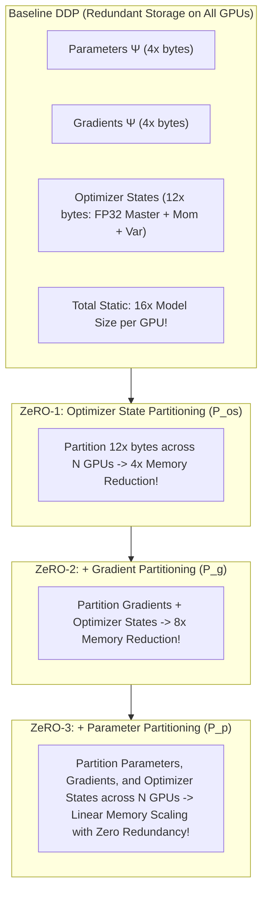

# Module 04: DeepSpeed ZeRO & PyTorch Fully Sharded Data Parallel (FSDP)


## ZeRO Memory Partitioning Hierarchy (Deepspeed)



---

## 🗺️ Recommended Step-by-Step Learning Path

Follow this exact sequence to achieve complete mastery of this module:

| Step | File to Open | What You Will Do |
| :---: | :--- | :--- |
| **1** | **[01_README.md](01_README.md)** | Read conceptual overview, architectural foundations, and mental models. |
| **2** | **[00_FOUNDATIONS_PLAYGROUND.md](00_FOUNDATIONS_PLAYGROUND.md)** | Practice beginner spoonfed micro-drills and line-by-line syntax breakdowns. |
| **3** | **[00_try_it_yourself.py](00_try_it_yourself.py)** | Run in terminal (`python 00_try_it_yourself.py`) for an interactive zero-dependency sandbox. |
| **4** | **[04_TROUBLESHOOTING_AND_EDGE_CASES.md](04_TROUBLESHOOTING_AND_EDGE_CASES.md)** | Study forensic runbooks, edge cases, and real-world failure post-mortems. |
| **5** | **[03_SELF_ASSESSMENT_AND_CHALLENGES.md](03_SELF_ASSESSMENT_AND_CHALLENGES.md)** | Test your knowledge with self-assessment quizzes, challenges, and diagnostic scenarios. |
| **6** | **[02_PROJECT_GUIDE.md](02_PROJECT_GUIDE.md)** | Follow guided project implementation for `starter/` and `project_solution/`. |
| **7** | **[problems/](problems/)** | Solve hands-on problem bank challenges and verify with `pytest problems/tests`. |
| **8** | **[debug_lab/](debug_lab/)** | Diagnose and fix silent production bugs in the Bug Hunter Drill. |

---

## 1. Architectural Motivation & Theoretical Foundations

In standard Distributed Data Parallel (DDP), distributed scaling is achieved by replicating model parameters and optimizer states across all $N_d$ ranks, broadcasting input batches across ranks, and synchronizing gradients using an `All-Reduce` collective.
While computationally efficient, DDP has a critical scaling bottleneck: **static memory consumption does not decrease as GPU count increases**.

### 1.1 Memory Breakdown in Mixed-Precision Training (AdamW)
Let $\Phi$ denote the number of parameters in the model. In standard FP16/BF16 mixed-precision training with AdamW:

$$\begin{aligned}
M_{\text{weights}} &= 2\Phi \quad (\text{FP16 parameters}) \\
M_{\text{gradients}} &= 2\Phi \quad (\text{FP16 gradients}) \\
M_{\text{master\_weights}} &= 4\Phi \quad (\text{FP32 master parameters for precision}) \\
M_{\text{momentum}} &= 4\Phi \quad (\text{FP32 first moment}) \\
M_{\text{variance}} &= 4\Phi \quad (\text{FP32 second moment}) \\
M_{\text{static}} &= 2\Phi + 2\Phi + 12\Phi = 16\Phi \text{ bytes}
\end{aligned}$$

For Llama-3-70B ($\Phi = 70 \times 10^9$):
$$M_{\text{static}} = 16 \times 70 \times 10^9 \text{ bytes} = 1,120 \text{ GB}$$

---

## 2. DeepSpeed ZeRO Stages: Mathematical Analysis

ZeRO eliminates memory redundancy across data-parallel ranks by partitioning model states across data-parallel processes:

### 2.1 ZeRO-Stage 1: Optimizer State Partitioning ($P_{os}$)
- Optimizer states ($12\Phi$ bytes) are partitioned across $N_d$ ranks.
- Rank $r$ stores $\frac{12\Phi}{N_d}$ bytes.
- Total static memory:
  $$M_{\text{ZeRO-1}} = 2\Phi + 2\Phi + \frac{12\Phi}{N_d}$$
- Communication cost: **Zero extra communication**. The gradient `All-Reduce` is split into `Reduce-Scatter` (each rank receives its gradient partition) $\to$ Optimizer update $\to$ `All-Gather` updated FP16 parameters. Total communication volume = $2\Phi$, identical to standard DDP!

### 2.2 ZeRO-Stage 2: Gradient Partitioning ($P_{os+g}$)
- As gradients are computed during the backward pass, they are immediately reduced and scattered to the rank responsible for the corresponding parameter slice.
- Memory retained for gradients: $\frac{2\Phi}{N_d}$.
- Total static memory:
  $$M_{\text{ZeRO-2}} = 2\Phi + \frac{2\Phi}{N_d} + \frac{12\Phi}{N_d} = 2\Phi + \frac{14\Phi}{N_d}$$
- Communication volume: Exactly $2\Phi$. Gradients are only reduced-scattered, avoiding full parameter gathering until the optimizer step.

### 2.3 ZeRO-Stage 3: Parameter Partitioning ($P_{os+g+p}$)
- Parameters themselves are sharded across $N_d$ ranks. Each rank holds only $\frac{2\Phi}{N_d}$ bytes.
- Total static memory:
  $$M_{\text{ZeRO-3}} = \frac{2\Phi + 2\Phi + 12\Phi}{N_d} = \frac{16\Phi}{N_d}$$
- Operational mechanics:
  1. **Forward Pass**: Before computing Layer $l$, execute `All-Gather` to reconstruct full parameters of Layer $l$. Compute activations. Immediately free the un-sharded weights.
  2. **Backward Pass**: Execute `All-Gather` for Layer $l$ weights. Compute activation and weight gradients. Immediately free weights. Execute `Reduce-Scatter` on weight gradients.
- Communication volume: $3\Phi$ total ($1\Phi$ in forward `All-Gather`, $1\Phi$ in backward `All-Gather`, $1\Phi$ in backward `Reduce-Scatter`). This is a $1.5\times$ communication overhead compared to DDP.

```
ZeRO-3 Layer Execution Flow:
[Sharded Params] --(All-Gather)--> [Full Layer Params]
                                           |
                                      (Forward GEMM)
                                           |
                                  [Discard Full Params]
```

---

## 3. PyTorch FSDP (Fully Sharded Data Parallel) Architecture

PyTorch FSDP is native ZeRO-3 integrated directly into `torch.distributed`.

### 3.1 FlatParameter vs Per-Parameter Sharding (FSDP1 vs FSDP2)
- **FSDP1**: Flattens all parameters of a submodule into a single contiguous 1D tensor (`FlatParameter`), slices it into chunks of size $\lceil S/N \rceil$, and handles collective communication on this contiguous buffer.
- **FSDP2 (DTensor-based)**: Uses PyTorch's `DTensor` primitive to shard parameters along designated mesh dimensions without flattening, preserving original tensor metadata and avoiding complex hook hacks.

### 3.2 Key Production Configurations:
```python
from torch.distributed.fsdp import (
    FullyShardedDataParallel as FSDP,
    ShardingStrategy,
    BackwardPrefetch,
    MixedPrecision,
    CPUOffload
)

fsdp_config = {
    "sharding_strategy": ShardingStrategy.FULL_SHARD, # ZeRO-3
    "backward_prefetch": BackwardPrefetch.BACKWARD_PRE, # Overlap comms with next layer grad
    "mixed_precision": MixedPrecision(
        param_dtype=torch.bfloat16,
        reduce_dtype=torch.float32, # Accumulate gradients in FP32 for stability
        buffer_dtype=torch.bfloat16,
    ),
    "limit_allgathers": True, # Throttles inflight All-Gathers to prevent activation OOM
}
```

### 3.3 Hybrid Sharding (HSDP)
When scaling to hundreds of nodes, inter-node `All-Gather` over InfiniBand can saturate network bisection bandwidth.
**HSDP** applies ZeRO-3 **within each 8-GPU node** (over fast 900 GB/s NVLink) and replicates parameters across nodes (over 400 Gbps InfiniBand).
$$\text{Static Memory} = \frac{16\Phi}{N_{\text{intra-node}}}$$
This provides the best trade-off between memory reduction and inter-node network saturation.