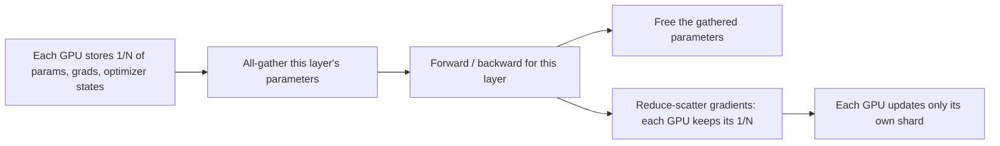

# Module 04: DeepSpeed ZeRO & PyTorch FSDP

> **Architectural Scope**: ZeRO stages 1 to 3, memory accounting for mixed-precision Adam, FSDP sharding and prefetching, hybrid sharding, offloading, and the communication cost of sharding.

---

## Why this module matters

DDP (Module 03) keeps a full copy of the weights, gradients and optimizer state on every GPU. For mixed-precision training with Adam that is about **16 bytes per parameter**, so a 7B model needs about 112 GB of model state per GPU, which no longer fits on an 80 GB card, and adding GPUs does not help because each one holds the *same* redundant copy. **ZeRO** (Zero Redundancy Optimizer, from DeepSpeed) and PyTorch's **FSDP** (Fully Sharded Data Parallel) remove the redundancy: the state is *partitioned* across the data-parallel GPUs, and each GPU temporarily gathers only what the current layer needs. Almost every open-source large-model training recipe uses one of these two.

## Mental model: a library where nobody owns the whole book

DDP gives every student a complete copy of every textbook. ZeRO gives each student only *their chapter* of every book. When the class reaches chapter 7, the owner of chapter 7 **broadcasts** it (all-gather), everyone uses it, and the borrowed copies are returned. The memory per student shrinks by the class size; the price is more talking.


```mermaid
flowchart LR
    S["Each GPU stores 1/N of params, grads, optimizer states"] --> AG["All-gather this layer's parameters"]
    AG --> FW["Forward / backward for this layer"]
    FW --> FREE["Free the gathered parameters"]
    FW --> RS["Reduce-scatter gradients: each GPU keeps its 1/N"]
    RS --> OPT["Each GPU updates only its own shard"]
```

## 1. Memory accounting

Let `Psi` be the number of parameters. Mixed-precision Adam holds per parameter: BF16/FP16 weights (2 bytes), gradients (2 bytes), and optimizer state of **K = 12 bytes** (FP32 master weights 4, momentum 4, variance 4). Total `(2 + 2 + K) Psi = 16 Psi`.

With `N` data-parallel GPUs, ZeRO shards progressively more:

| Stage | Shards | Memory per GPU | 7.5B params on 64 GPUs |
|---|---|---|---|
| Baseline (DDP) | nothing | `16 Psi` | 120 GB |
| **ZeRO-1** | optimizer states | `4 Psi + 12 Psi / N` | about 31.4 GB |
| **ZeRO-2** | + gradients | `2 Psi + 14 Psi / N` | about 16.6 GB |
| **ZeRO-3** | + parameters | `16 Psi / N` | about 1.9 GB |

(These are the figures from the ZeRO paper's worked example.) This counts **model state only**. **Activations, temporary buffers and fragmentation are not sharded** by ZeRO and often dominate for long sequences; combine with **activation checkpointing** (recompute activations in the backward pass) and with tensor/sequence parallelism.

## 2. Communication cost

Per step, in units of `Psi` elements moved per GPU:

- **DDP:** one all-reduce of gradients = reduce-scatter + all-gather = about `2 Psi`.
- **ZeRO-1 and ZeRO-2:** gradients are reduce-scattered (`Psi`), each GPU updates its shard, updated parameters are all-gathered (`Psi`): **same `2 Psi` as DDP**, with much less memory. Sharding optimizer state and gradients is nearly free in communication.
- **ZeRO-3 / FSDP full shard:** parameters are all-gathered before the forward pass of each layer (`Psi`), again before the backward pass (`Psi`, because they were freed), and gradients are reduce-scattered (`Psi`): **about `3 Psi`, i.e. 1.5x** the traffic of DDP. In return the model state shrinks by `N`. The extra traffic is hidden by **prefetching**: while layer `i` computes, the all-gather for layer `i+1` is already in flight.

## 3. PyTorch FSDP

FSDP's sharding strategies map onto ZeRO:

| `ShardingStrategy` | ZeRO equivalent | Notes |
|---|---|---|
| `FULL_SHARD` | ZeRO-3 | maximum memory saving |
| `SHARD_GRAD_OP` | ZeRO-2 | keeps parameters gathered between forward and backward |
| `HYBRID_SHARD` | ZeRO-3 inside a node, replicate across nodes | keeps the all-gathers on NVLink and only gradients cross the slow network (Module 01) |
| `NO_SHARD` | DDP | |

```python
from torch.distributed.fsdp import FullyShardedDataParallel as FSDP, MixedPrecision, ShardingStrategy
from torch.distributed.fsdp.wrap import transformer_auto_wrap_policy
import functools, torch

policy = functools.partial(transformer_auto_wrap_policy, transformer_layer_cls={TransformerBlock})
model = FSDP(
    model,
    auto_wrap_policy=policy,                      # one FSDP unit per transformer block
    sharding_strategy=ShardingStrategy.FULL_SHARD,
    mixed_precision=MixedPrecision(param_dtype=torch.bfloat16, reduce_dtype=torch.float32, buffer_dtype=torch.bfloat16),
    device_id=torch.cuda.current_device(),
    use_orig_params=True,
)
```

The newer composable API (`fully_shard`, "FSDP2") shards each parameter as a `DTensor`, which makes mixing with tensor parallelism and checkpointing cleaner. Practical knobs:

- **Wrapping granularity.** Each FSDP unit is gathered as a whole, so units that are too large raise peak memory and units that are too small cause many tiny collectives. Wrapping at **transformer-block** level is the standard choice.
- **Prefetching** (`forward_prefetch`, `backward_prefetch=BACKWARD_PRE`) overlaps the next unit's all-gather with the current unit's compute.
- **Mixed precision:** keep a sharded FP32 master copy; gather and compute in BF16; reduce gradients in FP32 for stability.
- **CPU offload** of parameters/optimizer states trades PCIe bandwidth for capacity; **ZeRO-Infinity** goes further to NVMe.
- **Checkpointing:** use sharded state dicts (each rank writes its shard, Module 09); full state dicts require gathering everything onto one rank.

## 4. DeepSpeed in practice

DeepSpeed exposes ZeRO through a JSON config:

```json
{
  "train_micro_batch_size_per_gpu": 4,
  "gradient_accumulation_steps": 8,
  "bf16": {"enabled": true},
  "zero_optimization": {
    "stage": 3,
    "overlap_comm": true,
    "contiguous_gradients": true,
    "stage3_prefetch_bucket_size": "auto",
    "offload_optimizer": {"device": "none"}
  }
}
```

Choose the **lowest stage that fits**: stage 1 or 2 if state fits (cheapest, same traffic as DDP), stage 3 only when parameters themselves do not fit. Hugging Face `Trainer`/`Accelerate` and many frameworks drive both DeepSpeed and FSDP from the same config.

## Worked example: will a 13B model fit?

13B parameters, mixed-precision Adam: `16 x 13e9 = 208 GB` of model state. On 8 x 80 GB GPUs with ZeRO-3: `208 / 8 = 26 GB` per GPU for state, leaving ~54 GB for activations and buffers; with activation checkpointing this trains comfortably. With ZeRO-2 it is `2 x 13 + 14 x 13 / 8 = 26 + 22.75 = 48.8 GB` per GPU: tight but possible with small micro-batches and checkpointing. With plain DDP it is 208 GB per GPU: impossible. Communication: stage 3 moves about `3 x 13e9 x 2 B = 78 GB` per GPU per optimizer step (BF16), which at 450 GB/s NVLink is about 0.17 s, hidden behind a long forward/backward of a large micro-batch.

## Common pitfalls

1. **Believing ZeRO shards activations.** It does not; run out of memory on long sequences and add checkpointing.
2. **Using stage 3 when stage 1 or 2 fits**, paying 1.5x communication for nothing.
3. **Wrapping the whole model as one FSDP unit**, which gathers all parameters at once (no memory saving at the peak).
4. **Ignoring the network in multi-node ZeRO-3**: all-gathers across nodes at 50 GB/s stall unless prefetch hides them; use `HYBRID_SHARD`.
5. **Saving full state dicts on every save** (slow, memory spike); use sharded checkpoints.
6. **Mixed-precision mistakes**: reducing gradients in low precision, or no FP32 master weights, diverges.
7. **Different random seeds across ranks for dropout in sharded regions** are fine, but different parameter init across ranks is not; rely on broadcast/meta-device init.

## How this connects

- **Module 03** is the baseline; **Module 02** supplies reduce-scatter/all-gather costs.
- **Module 05 and 06** shard the *model* itself (tensor and pipeline); **Module 08** combines all three.
- **Module 09**: sharded checkpoints. **Module 10**: scaling laws and cost decide how many GPUs to shard over.

## Go further

- roadmap.sh: *Machine Learning* / *MLOps* training nodes; *Inference Engineering* **model parallelism**.
- Rajbhandari et al., *ZeRO: Memory Optimizations Toward Training Trillion Parameter Models* (SC 2020); Zhao et al., *PyTorch FSDP* (VLDB 2023).
- DeepSpeed ZeRO tutorial; PyTorch FSDP tutorial; Hugging Face "Fully Sharded Data Parallel" guide.

---

## Module Study Progression
1. **Beginner Playground**: Read [00_FOUNDATIONS_PLAYGROUND.md](00_FOUNDATIONS_PLAYGROUND.md).
2. **Architecture Theory**: Study this [01_README.md](01_README.md).
3. **Hands-on Project**: Follow [02_PROJECT_GUIDE.md](02_PROJECT_GUIDE.md).
4. **Staff Interview Challenges**: Check [03_SELF_ASSESSMENT_AND_CHALLENGES.md](03_SELF_ASSESSMENT_AND_CHALLENGES.md).
5. **Production Debugging**: Review [04_TROUBLESHOOTING_AND_EDGE_CASES.md](04_TROUBLESHOOTING_AND_EDGE_CASES.md).
