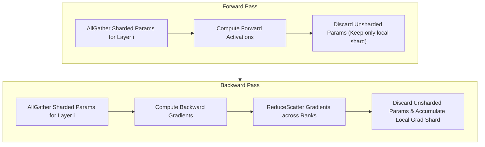

# Module 05: Tensor Parallelism (Megatron-LM) & Sequence Parallelism


## FSDP (Fully Sharded Data Parallel) Execution Cycle



## 1. Mathematical Formulation of Megatron-LM

Tensor Parallelism splits individual weight tensors across multiple processing units to compute large matrix multiplications cooperatively.

### 1.1 Column Parallel Linear Layer
Let $X \in \mathbb{R}^{b \times s \times h}$ denote the activation input, where $b$ is batch size, $s$ is sequence length, and $h$ is hidden dimension. Let $W \in \mathbb{R}^{h \times h_{\text{out}}}$ denote the weight matrix.

In a Column Parallel layer with tensor parallel degree $k$:
$$W = \begin{bmatrix} W_1 & W_2 & \dots & W_k \end{bmatrix}, \quad W_i \in \mathbb{R}^{h \times \frac{h_{\text{out}}}{k}}$$

Each rank $i$ computes:
$$Y_i = X W_i \in \mathbb{R}^{b \times s \times \frac{h_{\text{out}}}{k}}$$
- **Forward Pass**: $X$ is replicated across all ranks. Each rank computes its column slice independently. **Communication overhead: 0**.
- **Backward Pass**:
  $$\frac{\partial L}{\partial X} = \sum_{i=1}^k \frac{\partial L}{\partial Y_i} W_i^T$$
  Because each rank computes a partial gradient with respect to $X$, an **`All-Reduce`** collective is required in the backward pass to synchronize $\frac{\partial L}{\partial X}$.

### 1.2 Row Parallel Linear Layer
In a Row Parallel layer, the weight matrix is partitioned horizontally along its rows:
$$W = \begin{bmatrix} W_1 \\ W_2 \\ \vdots \\ W_k \end{bmatrix}, \quad W_i \in \mathbb{R}^{\frac{h_{\text{in}}}{k} \times h_{\text{out}}}$$

The input $X$ is partitioned along its column dimension across ranks: $X = [X_1, X_2, \dots, X_k]$.
Each rank computes:
$$Y_i = X_i W_i \in \mathbb{R}^{b \times s \times h_{\text{out}}}$$
The full output is the mathematical sum:
$$Y = X W = \sum_{i=1}^k X_i W_i = \text{All-Reduce-Sum}(Y_i)$$
- **Forward Pass**: Requires **`All-Reduce`** to aggregate partial matrix products.
- **Backward Pass**: Gradients with respect to input slices $\frac{\partial L}{\partial X_i} = \frac{\partial L}{\partial Y} W_i^T$ require **no communication** because $\frac{\partial L}{\partial Y}$ is already identical across ranks!

---

## 2. Self-Attention Tensor Parallelism

A multi-head attention block with $H$ heads and head dimension $d_k$ ($h = H \cdot d_k$) is partitioned as follows:

```
                  [Input X]
                      |
        +-------------+-------------+
        |                           |
[Q, K, V Projections]       [Q, K, V Projections]  (Column Parallel, H/k heads)
        |                           |
 [Local Attention]           [Local Attention]     (No comms needed!)
        |                           |
 [Output Proj W_o]           [Output Proj W_o]     (Row Parallel)
        +-------------+-------------+
                      |
                 [All-Reduce]
                      |
                  [Output]
```

### 2.1 Head Divisibility Requirement
The total number of attention heads $H$ **must be evenly divisible** by the Tensor Parallel size $k$:
$$H \pmod k = 0$$
For Grouped Query Attention (GQA) with $H_{\text{kv}}$ key-value heads:
$$H_{\text{kv}} \pmod k = 0$$
If $H_{\text{kv}} < k$, KV heads must either be duplicated across ranks or padded.

---

## 3. Megatron Sequence Parallelism (SP)

In standard Megatron TP, LayerNorm and Dropout operations are replicated across all $k$ ranks.
While LayerNorm computation is cheap, storing activations across all ranks consumes substantial VRAM:
$$M_{\text{act, LN}} = 2 \cdot b \cdot s \cdot h \text{ bytes}$$

### 3.1 Eliminating Redundant Activations
Megatron Sequence Parallelism observes that the `All-Reduce` in Row Parallel forward can be decomposed into:
$$\text{All-Reduce} = \text{Reduce-Scatter} + \text{All-Gather}$$

By placing the **`Reduce-Scatter` immediately after the Row Parallel layer**, the output activation is sharded along the **sequence dimension** ($s/k$ tokens per rank)!
1. LayerNorm and Dropout execute on local sequence slices of size $\frac{s}{k}$.
2. Before the next Column Parallel layer, an **`All-Gather`** re-assembles the full sequence.
- **Communication Cost**: Exact same communication volume as standard TP ($2 \times \frac{k-1}{k} V$), but activation memory in LayerNorm/Dropout is reduced by an exact factor of $k$!