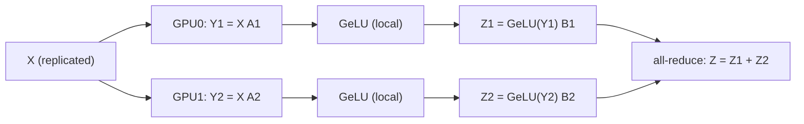

# Module 05: Tensor Parallelism (Megatron-LM)

> **Architectural Scope**: Column- and row-parallel linear layers, sharding attention by heads, the conjugate `f`/`g` communication operators, sequence parallelism, vocabulary parallelism, and the NVLink constraint.

---

## Why this module matters

ZeRO/FSDP (Module 04) shards *state*, but every GPU still computes each layer on the full weight matrix once it has gathered it, and a single layer's activations and matmuls can themselves be too large or too slow for one GPU. **Tensor parallelism (TP)** splits the matrix multiplications *inside* a layer across GPUs, so each GPU holds and computes only a slice of every weight matrix. Megatron-LM (NVIDIA) showed a way to do this with only **two communication points per transformer layer** in the forward pass, and that recipe is used in virtually every large-model training and serving stack.

## Mental model: split the matrix so the nonlinearity stays local

A matrix product `Y = X A` can be split two ways:

- **Column-parallel:** split `A` by columns, `A = [A1 | A2]`. Each GPU computes `Y_i = X A_i` on the **full** input `X` and produces a **slice of the output columns**. No communication needed in the forward pass.
- **Row-parallel:** split `A` by rows, `A = [A1 ; A2]`, and the input by columns, `X = [X1 | X2]`. Each GPU computes a **partial sum** `X_i A_i`, and the true output is the sum, so an **all-reduce** is needed.

The trick: put a column-parallel layer first and a row-parallel layer second. The column-parallel output slice is *exactly* the input slice the row-parallel layer wants, so the element-wise nonlinearity in between works on local data with **no communication**. One all-reduce at the end recombines.

```mermaid
flowchart LR
    X["X (replicated)"] --> C1["GPU0: Y1 = X A1"]
    X --> C2["GPU1: Y2 = X A2"]
    C1 --> G1["GeLU (local)"]
    C2 --> G2["GeLU (local)"]
    G1 --> R1["Z1 = GeLU(Y1) B1"]
    G2 --> R2["Z2 = GeLU(Y2) B2"]
    R1 --> AR["all-reduce: Z = Z1 + Z2"]
    R2 --> AR
```

## 1. Transformer layer under TP

**MLP.** `Y = GeLU(X A)`, `Z = Y B`. Split the first projection `A` (hidden to 4 x hidden) by columns, and the second `B` by rows. Forward: **1 all-reduce** (after `B`).

**Self-attention.** Attention heads are independent, so assign `n_heads / t` heads to each of `t` GPUs. The Q, K, V projections are column-parallel (each GPU gets the columns for its heads), attention is computed locally per head, and the output projection is row-parallel followed by **1 all-reduce**.

So a layer costs **2 all-reduces in the forward pass and 2 in the backward pass**.

**The conjugate operators.** Megatron names the two communication points `f` and `g`:

- `f`: forward = identity, backward = all-reduce (on the gradient w.r.t. the replicated input `X`).
- `g`: forward = all-reduce, backward = identity.

You wrap the parallel region as `f -> column-parallel -> nonlinearity -> row-parallel -> g`. Autograd then produces the correct communication in both directions.

**Other pieces.**
- **Vocabulary-parallel embedding and output layer:** split the vocabulary dimension; the cross-entropy loss is computed with a distributed softmax (all-reduce of max and sum) so the full `batch x seq x vocab` logits are never gathered on one GPU.
- **LayerNorm, dropout and residual adds are replicated** in plain TP, which wastes memory and compute; sequence parallelism (below) fixes that.

## 2. Sequence parallelism (the TP refinement)

In plain TP, LayerNorm/dropout activations are replicated on all `t` GPUs. **Sequence parallelism** (Korthikanti et al., 2022) shards those regions along the **sequence dimension** and replaces each all-reduce by a **reduce-scatter** (leaving each GPU with its sequence shard) followed later by an **all-gather** (before the next column-parallel layer). The total traffic is the same (all-reduce = reduce-scatter + all-gather, Module 02) but activation memory in the non-TP regions drops by `t`. Combined with selective activation recomputation it removes most of the activation-memory overhead of large models. (Do not confuse this with *context parallelism / ring attention* in Module 07, which shards the sequence *inside* attention.)

## 3. The communication bill and the NVLink rule

Per layer forward, each TP all-reduce moves a tensor of `b x s x h` elements (batch x sequence x hidden). With `t` GPUs in a ring, each GPU sends about `2 (t - 1)/t x b s h x bytes` per all-reduce.

**Worked example.** `h = 8192`, `b x s = 8,192` tokens per micro-batch, BF16, `t = 8` on one NVLink node:

- Activation tensor: `8192 x 8192 x 2 B = 128 MiB`; ring traffic per GPU `1.75 x 128 MiB = 224 MiB`; at 450 GB/s per direction about **0.5 ms per all-reduce**, so about 1 ms for the two forward all-reduces.
- Layer compute: about `24 b s h^2 = 1.3e13` FLOPs forward, divided by 8 GPUs = `1.65e12` per GPU, at roughly 400 TFLOP/s effective: about **4 ms**.
- So communication is about 25% of compute even on NVLink, and *cannot* be fully hidden because each all-reduce sits on the critical path between dependent matmuls. Over 50 GB/s InfiniBand it would be 9x worse (about 9 ms of communication for 4 ms of compute).

Hence the rule: **keep the TP degree within the NVLink domain (typically `t <= 8`)**, and use data/pipeline parallelism across nodes. Choosing `t` larger than needed shrinks each matmul (lower GPU efficiency) and increases communication share. Constraints: `t` must divide the number of attention heads (and for grouped-query attention, K/V heads either divide or are replicated across ranks) and the hidden/FFN sizes.

## 4. Using it

- **Megatron-LM / Megatron-Core** provide `ColumnParallelLinear`, `RowParallelLinear`, `VocabParallelEmbedding` and the full GPT stack.
- **PyTorch** offers `torch.distributed.tensor.parallel` (`parallelize_module` with `ColwiseParallel`, `RowwiseParallel`, `SequenceParallel`) built on `DTensor`.
- **Inference engines** (vLLM, SGLang, TensorRT-LLM) use the same sharding with `--tensor-parallel-size`; for decode, the all-reduce latency (not bandwidth) dominates, so NVLink and fused/custom all-reduce kernels matter (Course 09).

## Common pitfalls

1. **TP across nodes**: a several-fold slowdown versus within NVLink.
2. **Heads not divisible by `t`**, or GQA KV heads fewer than `t` without replication.
3. **Forgetting that RNG state** (dropout) must be synchronised in replicated regions and distinct in sharded ones; Megatron manages this with a "model-parallel RNG tracker".
4. **Too high `t` for small models**: matmuls shrink, utilisation drops, communication share grows.
5. **Mismatched checkpoints**: weights saved for one TP degree must be resharded to load at another.
6. **Assuming overlap**: unlike DDP gradient all-reduces, TP all-reduces are on the critical path (some frameworks overlap them with chunked/pipelined matmuls, but gains are partial).

## How this connects

- **Module 02** for all-reduce, reduce-scatter and all-gather costs; **Module 01** for why NVLink is mandatory.
- **Module 04** (ZeRO/FSDP) and **Module 06** (pipeline) compose with TP in **Module 08** (3D parallelism).
- **Course 07**: each TP shard still runs the GEMMs and fused kernels of Modules 05 to 08 there.

## Go further

- roadmap.sh: *Inference Engineering* nodes **tensor parallelism**, **model parallelism**, **multi node inference**.
- Shoeybi et al., *Megatron-LM: Training Multi-Billion Parameter Language Models Using Model Parallelism* (2019); Korthikanti et al., *Reducing Activation Recomputation in Large Transformer Models* (2022).
- PyTorch tensor-parallel tutorial; Hugging Face "Parallelism methods" guide; Megatron-Core documentation.

---

## Module Study Progression
1. **Beginner Playground**: Read [00_FOUNDATIONS_PLAYGROUND.md](00_FOUNDATIONS_PLAYGROUND.md).
2. **Architecture Theory**: Study this [01_README.md](01_README.md).
3. **Hands-on Project**: Follow [02_PROJECT_GUIDE.md](02_PROJECT_GUIDE.md).
4. **Staff Interview Challenges**: Check [03_SELF_ASSESSMENT_AND_CHALLENGES.md](03_SELF_ASSESSMENT_AND_CHALLENGES.md).
5. **Production Debugging**: Review [04_TROUBLESHOOTING_AND_EDGE_CASES.md](04_TROUBLESHOOTING_AND_EDGE_CASES.md).
