# Module 07: Sequence & Context Parallelism (Ring Attention & DeepSpeed Ulysses)


## Pipeline Parallelism 1F1B Scheduling Schedule

```mermaid
gantt
    title Pipeline 1F1B Execution Timeline (4 Stages)
    dateFormat X
    axisFormat %s

    section Stage 0
    F0 :active, 0, 1
    F1 :active, 1, 2
    F2 :active, 2, 3
    F3 :active, 3, 4
    B0 :crit, 4, 5
    F4 :active, 5, 6
    B1 :crit, 6, 7

    section Stage 1
    Idle :crit, 0, 1
    F0 :active, 1, 2
    F1 :active, 2, 3
    F2 :active, 3, 4
    F3 :active, 4, 5
    B0 :crit, 5, 6
    F4 :active, 6, 7

    section Stage 2
    Idle :crit, 0, 2
    F0 :active, 2, 3
    F1 :active, 3, 4
    F2 :active, 4, 5
    B0 :crit, 6, 7

    section Stage 3
    Idle :crit, 0, 3
    F0 :active, 3, 4
    F1 :active, 4, 5
    B0 :crit, 5, 6
    B1 :crit, 6, 7
```



---

## 1. Algorithmic Foundation: Ring Attention

Ring Attention (Liu et al., 2023) shards long sequences along the sequence dimension across $N_{\text{cp}}$ context-parallel devices, executing attention computation concurrently while circulating Key ($K$) and Value ($V$) blocks in a logical ring topology.

### 1.1 Mathematical Formulation of Online Softmax Tracking
Let sequence length $S$ be partitioned into chunks of length $c = \frac{S}{N_{\text{cp}}}$.
Rank $r \in \{0, \dots, N_{\text{cp}}-1\}$ holds query chunk $Q_r \in \mathbb{R}^{c \times d}$, key chunk $K_r \in \mathbb{R}^{c \times d}$, and value chunk $V_r \in \mathbb{R}^{c \times d}$.

To compute exact attention without materializing full $S \times S$ logits, each rank maintains running online softmax statistics:
- $m_r \in \mathbb{R}^{c}$: running maximum logit for numerical stability
- $l_r \in \mathbb{R}^{c}$: running sum of exponentials
- $O_r \in \mathbb{R}^{c \times d}$: running unnormalized attention output accumulator

At ring step $k \in \{0, \dots, N_{\text{cp}}-1\}$, rank $r$ interacts with key-value block $j = (r - k) \pmod{N_{\text{cp}}}$:

$$\begin{aligned}
S_{r,j} &= \frac{Q_r K_j^T}{\sqrt{d}} \\
\tilde{m} &= \max(m_r, \text{rowmax}(S_{r,j})) \\
P_{r,j} &= \exp(S_{r,j} - \tilde{m}) \\
l_{\text{new}} &= e^{m_r - \tilde{m}} l_r + \text{rowsum}(P_{r,j}) \\
O_{\text{new}} &= \text{diag}\left(e^{m_r - \tilde{m}}\right) O_r + P_{r,j} V_j \\
m_r &\leftarrow \tilde{m}, \quad l_r \leftarrow l_{\text{new}}, \quad O_r \leftarrow O_{\text{new}}
\end{aligned}$$

After $N_{\text{cp}}$ steps, each rank normalizes its output:
$$O_r^* = \text{diag}\left(l_r^{-1}\right) O_r$$
The result $O^* = [O_0^*, O_1^*, \dots, O_{N_{\text{cp}}-1}^*]^T$ is mathematically identical to monolithic full-sequence FlashAttention!

---

## 2. Causal Masking in Ring Attention

In autoregressive decoder models, query token at index $t$ can only attend to key tokens at indices $\tau \le t$.
When sequence is partitioned into chunks across the ring:
1. **Full Block Execution ($j < r$)**: Query chunk $r$ is strictly later in sequence than key chunk $j$. Compute unmasked full cross-attention.
2. **Triangular Diagonal Execution ($j = r$)**: Compute standard causal attention with upper triangular masking ($-\infty$).
3. **Skipped Block ($j > r$)**: Query chunk $r$ is strictly earlier than key chunk $j$. In causal attention, all attention logits are masked to $-\infty$. **Skip computation entirely**!

```
Causal Ring Attention Matrix (4 Ranks):
Chunk 0 (Rank 0): [Causal ] [Skipped] [Skipped] [Skipped]
Chunk 1 (Rank 1): [Full   ] [Causal ] [Skipped] [Skipped]
Chunk 2 (Rank 2): [Full   ] [Full   ] [Causal ] [Skipped]
Chunk 3 (Rank 3): [Full   ] [Full   ] [Full   ] [Causal ]
```

### 2.1 Zigzag Ring Attention (Load Balancing)
Notice that Rank 0 performs computation only on Step 0 and sits completely idle for the remaining 3 steps!
**Zigzag Ring Attention** assigns two interleaved half-chunks to each rank (e.g. Rank 0 holds tokens $0 \dots c/2$ and $S - c/2 \dots S$), perfectly equalizing computation across all devices and eliminating the causal idle bubble!