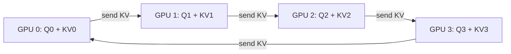

# Module 07: Sequence & Context Parallelism (Ring Attention, Ulysses)

> **Architectural Scope**: Why long contexts break single-GPU training, sharding along the sequence dimension, Ring Attention with blockwise online softmax, DeepSpeed-Ulysses all-to-all, causal load balancing, and the compute/communication overlap condition.

---

## Why this module matters

Modern models train and serve with contexts of 128K, 1M, or more tokens. Even with FlashAttention (course 07, Module 08) removing the `N x N` score matrix, the *activations and KV tensors* are `O(N x h)` per layer and the attention FLOPs are `O(N^2)`. A single GPU runs out of memory or time long before 1M tokens. Data, tensor and pipeline parallelism all shard along other dimensions (batch, hidden, layers); none splits the **sequence**. **Context parallelism (CP)** does, and **Ring Attention** is the algorithm that makes the one hard part, attention, work when each GPU holds only a slice of the tokens.

## Mental model: everyone holds a chapter, but attention needs the whole book

Split a 1M-token sequence across 64 GPUs: 16K tokens each. Layers that act **per token** (MLPs, norms, projections, embeddings) need no communication, since each GPU just processes its own tokens. Attention is different: every query must see every earlier key and value. Ring Attention solves this by passing the K/V chunks around a ring: each GPU keeps its queries fixed and, step by step, receives the next GPU's K/V chunk, folds it into its running attention result, and forwards the chunk onward.

```mermaid
flowchart LR
    G0["GPU 0: Q0 + KV0"] -->|"send KV"| G1["GPU 1: Q1 + KV1"]
    G1 -->|"send KV"| G2["GPU 2: Q2 + KV2"]
    G2 -->|"send KV"| G3["GPU 3: Q3 + KV3"]
    G3 -->|"send KV"| G0
```

After `n - 1` rotations every GPU's queries have attended to every K/V chunk, and no GPU ever held the whole sequence.

## 1. Ring Attention step by step

Let `n` GPUs each hold a chunk of `c = N / n` tokens (`Q_i, K_i, V_i`). On GPU `i`:

1. Initialise the running output `O_i`, running max `m_i` and denominator `l_i` (the online-softmax state of course 07, Module 07/08).
2. For step `t = 0 ... n - 1`: compute blockwise attention of `Q_i` against the K/V chunk currently held (initially its own, then those received), update `(O_i, m_i, l_i)` exactly as the FlashAttention inner loop does, **while at the same time sending that chunk to the next rank and receiving the next one** (asynchronous P2P).
3. After `n` steps, normalise `O_i / l_i`.

Because the online-softmax update is exact, the result is **identical** to full attention. The backward pass rotates the same way, circulating K/V together with partial `dK, dV`.

### The overlap condition

Per step each GPU computes attention between `c` queries and `c` keys: about `4 c^2 h` FLOPs (two matmuls), and transfers a K/V chunk of `2 c h x bytes`. The intensity per transferred byte is `2c / bytes_per_element` FLOP/B. Communication is hidden behind compute when

`2c / B >= (compute throughput) / (link bandwidth)`.

**Worked example.** BF16 (`B = 2`) at about 400 TFLOP/s effective: over 50 GB/s inter-node links the ratio is 8,000 FLOP/B, so `c >= 8,000` tokens per GPU; over 450 GB/s NVLink the ratio is about 900, so `c >= 900`. A 1M-token sequence on 64 GPUs has `c = 16,384`, comfortably above both thresholds: the ring is fully overlapped even across nodes. Shorter chunks or many more GPUs make it communication-bound. This is why ring attention shines for *very long* contexts and is wasteful for short ones.

## 2. Causal masking and load balance

With a causal mask, GPU 0 (earliest tokens) attends only to itself, while the last GPU attends to everything, so naive contiguous chunking leaves early ranks idle and does nearly 2x unnecessary work waiting. Fixes:

- **Striped attention** and **zigzag ring attention** assign each GPU tokens from both ends of the sequence (for example chunks `i` and `2n - 1 - i`), so every rank gets about the same causal workload.
- Skip fully masked K/V blocks entirely.

## 3. DeepSpeed-Ulysses: switch the sharding with all-to-all

Ulysses shards the sequence for the per-token layers, then performs an **all-to-all** before attention to convert "sharded by sequence, all heads" into "all tokens, sharded by heads". Each GPU computes full attention (with FlashAttention) for its subset of heads, then another all-to-all converts back.

| | Ring Attention | Ulysses |
|---|---|---|
| Communication pattern | `n - 1` P2P rotations of K/V | two all-to-alls per attention layer |
| Volume per GPU | grows with `N`, independent of `n` (overlapped with compute) | `O(N h / n)`: shrinks as you add GPUs |
| Limit | needs `c` large enough to overlap | parallel degree **<= number of (KV) heads** |
| Attention kernel | custom blockwise ring loop | standard FlashAttention per GPU |
| Strength | very long sequences, any head count | simple, efficient inside a node at moderate degrees |

Modern systems combine them (**hybrid / USP, "unified sequence parallelism"**): Ulysses inside a node over NVLink (all-to-all is bandwidth-hungry) and ring across nodes.

## 4. How CP relates to the other parallelisms

- **Sequence parallelism in Megatron (Module 05)** shards activations of LayerNorm/dropout across the *tensor-parallel group* to save memory; it does not reduce attention's per-GPU token count. **Context parallelism** shards *all* layers' tokens, including attention, along a separate CP group.
- It composes with the others as an extra dimension: world size = `DP x PP x TP x CP` (and expert parallel for MoE, Module 08).
- **Memory check.** At `N = 1M`, `h = 8192`, BF16, one activation tensor per layer is `1M x 8192 x 2 B = 16 GB`. Impossible on one GPU; sharded 64-way it is 256 MB each.
- For **inference** (Course 09) the same idea appears as sharding the KV cache across GPUs for long-context decode.

## Common pitfalls

1. **Using CP at short sequence lengths**, paying communication for no memory benefit.
2. **Ignoring causal imbalance**: early ranks idle; use zigzag/striped layouts.
3. **Ulysses degree larger than the number of heads** (or GQA KV heads): not allowed without replication.
4. **Position encodings and masks must use global positions**: each GPU must offset RoPE indices and masks by its chunk start.
5. **Wrong normalisation across steps**: forgetting the `exp(m_old - m_new)` rescale breaks exactness.
6. **Deadlocks** from mismatched P2P send/recv ordering around the ring.
7. **Packing and document masks**: sequence packing with attention masks across chunk boundaries needs careful bookkeeping.

## How this connects

- **Course 07, Modules 07 and 08**: online softmax and FlashAttention are the per-block engine inside each ring step.
- **Module 02**: all-to-all and P2P costs; **Module 01**: why Ulysses prefers NVLink and ring tolerates the network.
- **Module 08** composes CP with DP, TP, PP, EP.
- **Course 10, Module 09** (context optimisation) is about *using* long contexts well, once you can train them.

## Go further

- roadmap.sh: *Inference Engineering* nodes **long context handling**, **attention optimization**, **model parallelism**.
- Liu, Zaharia, Abbeel, *Ring Attention with Blockwise Transformers for Near-Infinite Context* (2023); Jacobs et al., *DeepSpeed-Ulysses* (2023); Brandon et al., *Striped Attention* (2023).
- Megatron-Core context parallelism documentation; Hugging Face "Context parallelism" guide.

---

## Module Study Progression
1. **Beginner Playground**: Read [00_FOUNDATIONS_PLAYGROUND.md](00_FOUNDATIONS_PLAYGROUND.md).
2. **Architecture Theory**: Study this [01_README.md](01_README.md).
3. **Hands-on Project**: Follow [02_PROJECT_GUIDE.md](02_PROJECT_GUIDE.md).
4. **Staff Interview Challenges**: Check [03_SELF_ASSESSMENT_AND_CHALLENGES.md](03_SELF_ASSESSMENT_AND_CHALLENGES.md).
5. **Production Debugging**: Review [04_TROUBLESHOOTING_AND_EDGE_CASES.md](04_TROUBLESHOOTING_AND_EDGE_CASES.md).
