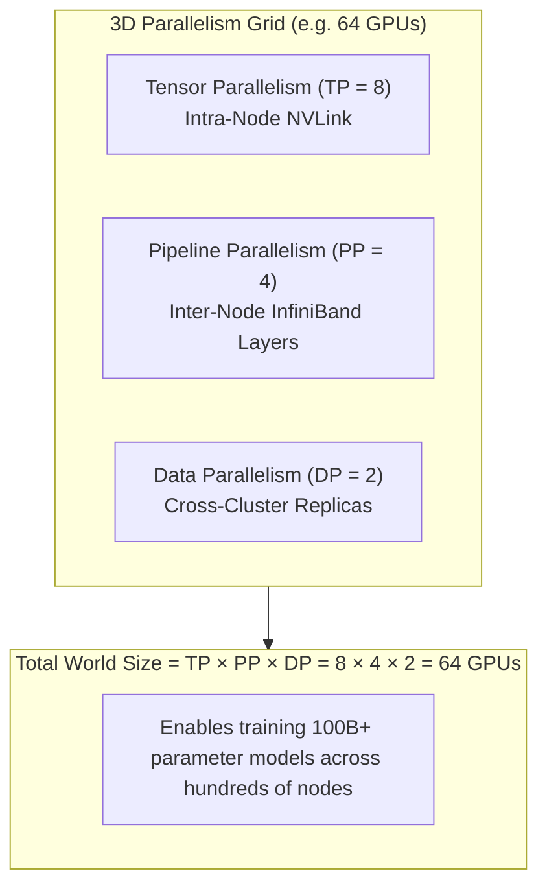

# Module 08: 3D Parallelism Integration & Orchestration


## 3D Parallelism Architectural Orthogonality



## 1. Mathematical Architecture of 3D Parallel Grids

In large-scale distributed training (e.g., Megatron-Turing NLG 530B, Llama-3 405B), individual models exceed the memory and compute capacity of single devices and single nodes.
The training infrastructure establishes a 3D Cartesian process grid of size $N = TP \times PP \times DP$.

### 1.1 Rank Mapping & Orthogonal Communicator Formation
Let a global rank be denoted by $R \in \{0, \dots, N-1\}$.
The mapping into 3D Cartesian coordinates $(r_{\text{tp}}, r_{\text{pp}}, r_{\text{dp}})$ follows row-major order:

$$\begin{aligned}
r_{\text{tp}} &= R \pmod{TP} \\
r_{\text{pp}} &= \left\lfloor \frac{R}{TP} \right\rfloor \pmod{PP} \\
r_{\text{dp}} &= \left\lfloor \frac{R}{TP \times PP} \right\rfloor
\end{aligned}$$

Conversely, the global rank is reconstructed bijectively:
$$R = r_{\text{tp}} + r_{\text{pp}} \cdot TP + r_{\text{dp}} \cdot (TP \cdot PP)$$

### 1.2 Orthogonal Process Group Partitioning
To prevent deadlocks and communication interference, PyTorch initializes three sets of orthogonal NCCL communicators:
- **TP Groups**: $PP \times DP$ distinct groups of size $TP$. (All ranks share identical $r_{\text{pp}}$ and $r_{\text{dp}}$).
- **PP Groups**: $TP \times DP$ distinct groups of size $PP$. (All ranks share identical $r_{\text{tp}}$ and $r_{\text{dp}}$).
- **DP Groups**: $TP \times PP$ distinct groups of size $DP$. (All ranks share identical $r_{\text{tp}}$ and $r_{\text{pp}}$).

```
3D Cartesian Process Cube:
          +-----------------------+
         /                       /|
        /       DP Group        / |
       /                       /  |
      +-----------------------+   |
      |                       |   |
      |                       |   +
      |  TP Group    PP Group |  /
      |                       | /
      +-----------------------+
```

---

## 2. Multi-Dimensional Communication Schedules

At each global step:
1. **Forward Pass**:
   - Micro-batches enter Stage 0 of PP.
   - At each layer, TP groups perform internal Column/Row `All-Reduce` collectives over NVLink.
   - Activations are transmitted across PP boundaries using non-blocking P2P `isend`/`irecv`.
2. **Backward Pass**:
   - Activation gradients flow in reverse through PP stages.
   - TP groups synchronize internal layer gradients.
3. **Data Parallel Reduction**:
   - DP groups perform `All-Reduce` or `Reduce-Scatter` (ZeRO-1/2) across data-parallel replicas, overlapped with backward pipeline execution.