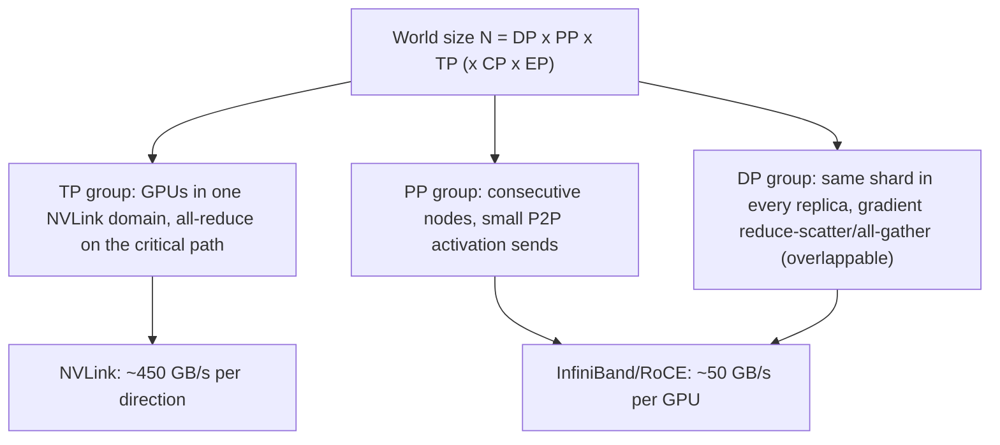

# Module 08: 3D Parallelism Integration & Orchestration

> **Architectural Scope**: Composing data, tensor and pipeline parallelism (plus context and expert parallelism), mapping parallel groups onto the cluster topology, memory and communication budgeting, launch orchestration, and a validation workflow.

---

## Why this module matters

Modules 03 to 07 each introduced one way to split a training job. A frontier-scale run uses **several at once**, because each handles a different bottleneck and each prefers a different network tier. The engineering problem is no longer "what is tensor parallelism?" but "given this model, this cluster and this budget, **what combination** will fit in memory, keep GPUs busy, and survive for weeks?". This module is the decision procedure.

## Mental model: three axes, three kinds of wire

Imagine the GPUs arranged in a 3D grid. Along one axis they split the **matrices** (TP), along another they split the **layers** (PP), along the third they hold **replicas of the same shard** (DP). Each axis carries different traffic, so each is mapped to the wire that suits it.

```mermaid
flowchart TD
    W["World size N = DP x PP x TP (x CP x EP)"] --> TP["TP group: GPUs in one NVLink domain, all-reduce on the critical path"]
    W --> PP["PP group: consecutive nodes, small P2P activation sends"]
    W --> DP["DP group: same shard in every replica, gradient reduce-scatter/all-gather (overlappable)"]
    TP --> N1["NVLink: ~450 GB/s per direction"]
    PP --> N2["InfiniBand/RoCE: ~50 GB/s per GPU"]
    DP --> N2
```

| Axis | Splits | Traffic | Sensitivity | Best placement |
|---|---|---|---|---|
| **TP** (t) | each layer's matrices | all-reduce of activations, 4 per layer, critical path | latency and bandwidth | **inside the NVLink domain** |
| **PP** (p) | the layer stack | P2P activations at stage boundaries | modest, hides behind compute | **across nodes** |
| **DP** (d) | the batch | gradient reduction once per step (ZeRO-1/2: reduce-scatter + all-gather) | overlappable with backward | **outermost**, any tier |
| **CP** (c) | the sequence | K/V rotation or all-to-all | needs large chunks | between TP and PP or inside nodes |
| **EP** (e) | MoE experts | all-to-all of tokens | bandwidth-hungry | within NVLink if possible |

Always: **world size `N = d x p x t` (x `c` x `e` where used)**.

## 1. The standard planning recipe

1. **Make it fit.** Compute model-state memory per GPU (Module 04): `16 Psi` bytes with Adam mixed-precision, divided by how much you shard it. Weights are split by `t x p` (TP and PP always partition parameters); the data-parallel dimension can shard the rest via ZeRO-1/2 (a *distributed optimizer*).
2. **Set `t` to the NVLink domain size** or less (typically 8, or the number of GPUs in an NVL rack); use a smaller `t` if the model is small.
3. **Add `p` until the model fits** with room for activations, keeping the bubble small: you need `m >= 4p` micro-batches (Module 06) and balanced stages. Use interleaving if `m` is limited.
4. **Use the remaining GPUs for `d`**: `d = N / (t x p)`. This is what gives throughput.
5. **Add CP** for long sequences (Module 07) and **EP** for MoE models.
6. **Choose micro-batch size and gradient accumulation** to reach the target global batch (in tokens), checking activation memory (use selective recomputation).
7. **Measure MFU** (Model FLOPs Utilisation = achieved model FLOP/s over peak). Well-tuned dense LLM runs reach about 40 to 55% on H100-class hardware; much lower means a bottleneck (Module 10).

## 2. Worked example: 70B model on 256 H100s (32 nodes x 8)

Choose `t = 8` (one node), `p = 4`, so `d = 256 / 32 = 8`.

- **Parameters per GPU:** `70B / (8 x 4) = 2.19B`.
- **Model state:** BF16 weights 2 B + gradients 2 B = `4 x 2.19B = 8.75 GB`; optimizer state `12 x 2.19B = 26.3 GB`, sharded across `d = 8` by a distributed optimizer = `3.3 GB`. Total about **12 GB**, leaving ~65 GB for activations and buffers.
- **Pipeline:** `p = 4` stages; with a global batch of 1,024 sequences and `d = 8`, each pipeline processes 128 sequences; micro-batch size 1 gives `m = 128`; 1F1B bubble extra `= 3/128 = 2.3%`.
- **Communication per step:** TP all-reduces stay on NVLink; PP sends activations across nodes (small, overlapped); DP does a reduce-scatter and all-gather of the 8.75 GB gradient/parameter shards over InfiniBand, overlapped with backward.

If the same 70B had to run on only 64 GPUs, `t = 8, p = 4, d = 2` shrinks the DP dimension, reducing sharding of optimizer state (`26.3/2 = 13 GB`) and throughput, but still fits.

## 3. Interactions and gotchas

- **ZeRO-3/FSDP with pipeline parallelism** is awkward (parameters would be re-gathered for every micro-batch), so Megatron-style stacks combine **ZeRO-1 (distributed optimizer) + TP + PP**, while PyTorch-native stacks (torchtitan) often combine **FSDP2 + TP + (optionally) PP/CP** and rely on `HYBRID_SHARD`. Choose a coherent stack rather than mixing arbitrary pieces.
- **TP + sequence parallelism** is essentially free (Module 05) and should be on by default.
- **Group construction matters.** Ranks are laid out so TP groups are contiguous (same node), PP groups stride across nodes, and DP groups collect the same `(tp, pp)` coordinate. NCCL creates one communicator per group; a wrong mapping silently puts TP over InfiniBand.
- **Tied embeddings** between the first and last pipeline stage need a gradient all-reduce between those two ranks.
- **Global batch size vs convergence:** increasing `d` increases the global batch; learning-rate scaling and warm-up matter, and there is a *critical batch size* beyond which more data parallelism buys little (Module 10).

## 4. Orchestration

- **Launching:** `torchrun` with a rendezvous endpoint, or Slurm (`srun` per node/GPU with `MASTER_ADDR`/`RANK` derived from `SLURM_PROCID`); on Kubernetes, the Kubeflow Training Operator, JobSet or Volcano gang-schedule all pods together (an all-or-nothing requirement).
- **Topology awareness:** bind each process to its GPU and the NIC on the same PCIe switch; set `NCCL_SOCKET_IFNAME`/`NCCL_IB_HCA` explicitly; verify with `nccl-tests` at full scale before the real run.
- **Reliability:** at thousands of GPUs, failures are routine (Module 09), so jobs need frequent sharded checkpoints, automatic restart (torchrun elastic or the scheduler), and node health checks that cordon bad hosts.
- **Observability:** per-step loss, grad norm, MFU, per-rank step time (to spot stragglers), NCCL timing, GPU temperature/ECC errors.

## 5. Validating a parallel configuration

Never trust a new `(d, p, t)` config blindly:

1. **Loss-curve parity:** train a small model for a few hundred steps on one GPU and under the parallel config with the same seed and global batch; the losses should match to numerical tolerance.
2. **Gradient-norm parity** on the first step across configurations.
3. **Scale one axis at a time** (for example `t=1 -> 2 -> 8`) and watch throughput and memory.
4. **Check communication share** in an Nsight Systems trace (course 07, Module 11).
5. **Checkpoint round-trip:** save, restart, confirm loss continues identically (and test resharding to a different `(d, p, t)`).

## Common pitfalls

1. **TP across nodes** (or a rank mapping that does it by accident).
2. **Forgetting the bubble**: too few micro-batches for the chosen `p`.
3. **Imbalanced stages** (embedding/LM head).
4. **Assuming parallelism choices are independent**: changing `t` changes the micro-batch memory, the bubble and the DP degree all at once.
5. **No full-scale network test** before burning a week of compute.
6. **Ignoring stragglers**: one slow GPU stalls the synchronous job.
7. **Checkpoint formats tied to one parallel layout**.

## How this connects

- **Modules 03 to 07** are the ingredients; **Module 09** is the failure-handling layer; **Module 10** decides how big a run is worth doing.
- **Course 07** supplies per-GPU kernel efficiency, which multiplies into MFU.
- **Course 09**: inference uses TP (and sometimes PP/EP) with the same placement logic.

## Go further

- roadmap.sh: *Inference Engineering* nodes **model parallelism**, **expert parallelism**, **multi node inference**; *MLOps* for pipelines and orchestration.
- Narayanan et al., *Efficient Large-Scale Language Model Training on GPU Clusters Using Megatron-LM* (SC 2021); Hugging Face "Ultra-Scale Playbook"; torchtitan and Megatron-Core documentation.
- Meta's *The Llama 3 Herd of Models* (training infrastructure section) for a real 4D-parallel configuration and failure statistics.

---

## Module Study Progression
1. **Beginner Playground**: Read [00_FOUNDATIONS_PLAYGROUND.md](00_FOUNDATIONS_PLAYGROUND.md).
2. **Architecture Theory**: Study this [01_README.md](01_README.md).
3. **Hands-on Project**: Follow [02_PROJECT_GUIDE.md](02_PROJECT_GUIDE.md).
4. **Staff Interview Challenges**: Check [03_SELF_ASSESSMENT_AND_CHALLENGES.md](03_SELF_ASSESSMENT_AND_CHALLENGES.md).
5. **Production Debugging**: Review [04_TROUBLESHOOTING_AND_EDGE_CASES.md](04_TROUBLESHOOTING_AND_EDGE_CASES.md).
