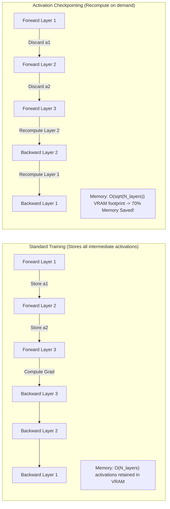

# Module 09: Distributed Checkpointing (DCP) & Elastic Failure Recovery


## Activation Checkpointing Memory Savings



---

## 🗺️ Recommended Step-by-Step Learning Path

Follow this exact sequence to achieve complete mastery of this module:

| Step | File to Open | What You Will Do |
| :---: | :--- | :--- |
| **1** | **[01_README.md](01_README.md)** | Read conceptual overview, architectural foundations, and mental models. |
| **2** | **[00_FOUNDATIONS_PLAYGROUND.md](00_FOUNDATIONS_PLAYGROUND.md)** | Practice beginner spoonfed micro-drills and line-by-line syntax breakdowns. |
| **3** | **[00_try_it_yourself.py](00_try_it_yourself.py)** | Run in terminal (`python 00_try_it_yourself.py`) for an interactive zero-dependency sandbox. |
| **4** | **[04_TROUBLESHOOTING_AND_EDGE_CASES.md](04_TROUBLESHOOTING_AND_EDGE_CASES.md)** | Study forensic runbooks, edge cases, and real-world failure post-mortems. |
| **5** | **[03_SELF_ASSESSMENT_AND_CHALLENGES.md](03_SELF_ASSESSMENT_AND_CHALLENGES.md)** | Test your knowledge with self-assessment quizzes, challenges, and diagnostic scenarios. |
| **6** | **[02_PROJECT_GUIDE.md](02_PROJECT_GUIDE.md)** | Follow guided project implementation for `starter/` and `project_solution/`. |
| **7** | **[problems/](problems/)** | Solve hands-on problem bank challenges and verify with `pytest problems/tests`. |
| **8** | **[debug_lab/](debug_lab/)** | Diagnose and fix silent production bugs in the Bug Hunter Drill. |

---

## 1. Systems Architecture of PyTorch DCP

PyTorch Distributed Checkpoint (`torch.distributed.checkpoint` / DCP) decouples the logical global state dict from the physical distributed storage layout.

### 1.1 Logical Global Metadata & Chunk Storage
1. **Storage Planner**: Traverses state dict tensors, extracts global shapes and dtype, and assigns `ChunkStorageMetadata` specifying the tensor's offset and dimensions within the global coordinate space.
2. **Parallel Storage Writer**: Ranks asynchronously write their assigned chunk buffers directly into shard files (e.g. `__0_0.distcp`, `__1_0.distcp`).
3. **Metadata Manifest (`.metadata`)**: Rank 0 writes a unified binary manifest storing:
   - Global tensor registry
   - Spatial chunk index map
   - Quantization / compression encoding parameters

---

## 2. Dynamic Resharding on Checkpoint Load

A critical advantage of DCP is the ability to save under topology $(TP_1, PP_1, DP_1)$ and load under completely different topology $(TP_2, PP_2, DP_2)$.

### 2.1 Spatial Bounding-Box Intersection
When loading:
1. The target rank requests tensor slice $S_{\text{target}} = [\text{start}, \text{end}]$.
2. The DCP load planner inspects the metadata manifest to find all saved chunks $C_{\text{saved}}$ that intersect $S_{\text{target}}$:
   $$\text{Intersection} = S_{\text{target}} \cap C_{\text{saved}}$$
3. Parallel I/O workers issue targeted strided byte-range reads to retrieve only the overlapping bytes directly into the target GPU memory buffer.

```
DCP Resharding (Save on 2 ranks -> Load on 4 ranks):
Saved Chunks:  [----- Rank 0 -----] [----- Rank 1 -----]
Target Chunks: [ R0 ] [ R1 ] [ R2 ] [ R3 ]
Intersection:  R0 reads from saved 0
               R1 reads from saved 0
               R2 reads from saved 1
               R3 reads from saved 1
```

---

## 3. Asynchronous Non-Blocking Checkpointing

To eliminate GPU idle time during checkpoint I/O:
1. GPUs copy sharded state tensors into pinned host CPU RAM via PCIe ($64 \text{ GB/s}$) in $< 500 \text{ ms}$.
2. GPU training loop immediately resumes next forward/backward step.
3. Dedicated background CPU worker threads stream pinned memory buffers to persistent parallel storage asynchronously.