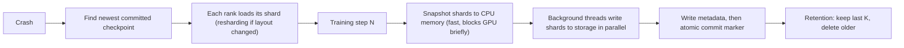

# Module 09: Distributed Checkpointing (DCP) & Failure Recovery

> **Architectural Scope**: What a checkpoint must contain, sharded parallel saves and resharding on load, asynchronous and atomic writes, checkpoint-interval maths (Young-Daly), failure modes at scale, detection, and automatic recovery.

---

## Why this module matters

At small scale, a crashed run is an annoyance. At cluster scale it is the normal state of affairs: with thousands of GPUs, something fails every few hours. Meta reported roughly 466 job interruptions during a 54-day training run of Llama 3 405B on 16K GPUs, most of them from hardware faults. A training system is therefore only as good as its ability to **save its state cheaply, restore it correctly, and restart without a human**. A checkpoint is also your only protection against loss spikes and bad data: you roll back to it.

## Mental model: save games for a very large game

Think of a video game with a very large world. A good save system is **fast** (does not freeze play for minutes), **complete** (nothing missing, including the random-number state), **safe** (a crash in the middle of saving never corrupts your last good save), and **portable** (you can load it on different hardware). Each of those four properties has a concrete technique below.


```mermaid
flowchart LR
    T["Training step N"] --> SNAP["Snapshot shards to CPU memory (fast, blocks GPU briefly)"]
    SNAP --> BG["Background threads write shards to storage in parallel"]
    BG --> COMMIT["Write metadata, then atomic commit marker"]
    COMMIT --> RET["Retention: keep last K, delete older"]
    CRASH["Crash"] --> FIND["Find newest committed checkpoint"]
    FIND --> LOAD["Each rank loads its shard (resharding if layout changed)"]
    LOAD --> T
```

## 1. What must be in a checkpoint

1. **Model weights** (and buffers).
2. **Optimizer state**: Adam's FP32 master weights plus two moments, about 12 bytes per parameter, i.e. **six times the BF16 weights**. Without it, resuming restarts the optimizer from cold and the loss jumps.
3. **Learning-rate scheduler** state and the **global step**.
4. **Data position**: sampler/shuffle seed, epoch and offset, or a per-rank dataloader state. Otherwise you either repeat or skip data.
5. **RNG states** (Python, NumPy, CUDA per rank) for reproducible resumption, plus gradient-scaler state if used.
6. **Configuration and parallel layout** metadata (and code/commit hash) so you can tell what produced it.

**Size.** At 16 bytes per parameter, a 70B model's full training state is about **1.1 TB**; a 405B model is about 6.5 TB. Every rank holds only a shard (Module 04), so saving must also be sharded.

## 2. Sharded, parallel checkpoints (PyTorch DCP)

Gathering everything onto rank 0 and writing one file (`state_dict()` of a full model) is slow, needs terabytes of CPU memory on one host, and does not scale. `torch.distributed.checkpoint` (DCP) instead has **every rank write its own shard in parallel**, plus a small **metadata** file describing which tensor slices live where.

```python
import torch.distributed.checkpoint as dcp
from torch.distributed.checkpoint.state_dict import get_state_dict, set_state_dict

model_sd, opt_sd = get_state_dict(model, optimizer)           # sharded view, no gather
state = {"model": model_sd, "optim": opt_sd, "step": step}
dcp.save(state, checkpoint_id=f"/ckpt/step_{step}")           # all ranks write concurrently

# resume (works even if world size or parallel layout changed):
dcp.load(state, checkpoint_id=f"/ckpt/step_{step}")
set_state_dict(model, optimizer, model_state_dict=state["model"], optim_state_dict=state["optim"])
```

The key property is **load-time resharding**: because metadata records global tensor shapes and slice offsets, a checkpoint saved with `d x p x t = 8 x 4 x 8` can be loaded under a different layout (for example for evaluation on fewer GPUs, or after losing nodes). Other stacks offer the same idea (DeepSpeed universal checkpoints, Megatron distributed checkpoints, Orbax in JAX).

**Bandwidth arithmetic.** Writing 1.1 TB at an aggregate 100 GB/s from a parallel file system takes about 11 s; at an aggregate 10 GB/s, 110 s. Aggregate throughput scales with the number of writers *and* the storage backend; a single NFS server is a bottleneck.

## 3. Making saves cheap: asynchronous and tiered

- **Asynchronous checkpointing** (`dcp.async_save`): stage the shards from GPU to pinned CPU memory (seconds, the only time training pauses), then **write to storage in a background thread** while training continues. Cost drops from the full write time to the GPU-to-CPU copy time.
- **Tiered storage:** write first to local NVMe or node memory (fast, frequent), then copy asynchronously to the shared file system or object store (S3, GCS) at a lower frequency. In-memory checkpointing across peer nodes (as in research systems like Gemini) allows near-instant recovery from single-node failures.
- **Atomicity:** write into a temporary directory and only after **all ranks finish and metadata is written** create a commit marker (or rename). On restart, ignore any checkpoint without the marker; never delete the previous good one until the new one is committed.
- **Integrity:** checksums on shards, and a periodic test restore. A checkpoint you have never loaded is a hope, not a backup.
- **Retention:** keep the last `K` plus periodic milestone checkpoints for rollbacks and evaluations.

## 4. How often to checkpoint (Young-Daly)

Checkpointing costs time `C` each; failures lose work since the last checkpoint. For a job whose **mean time between failures** is `M`, the interval that minimises expected waste is approximately

`T_opt = sqrt(2 x C x M)`

Crucially `M` for the **whole job** is the per-node MTBF divided by the number of nodes, so it shrinks as you scale.

**Worked example.** Job MTBF `M = 3 h = 10,800 s`, checkpoint cost `C = 60 s` (blocking): `T_opt = sqrt(2 x 60 x 10,800) = sqrt(1.3e6) = 1,138 s`, about **19 minutes**. Checkpoint overhead is `60 / 1138 = 5%` and expected rework is about half an interval (about 10 minutes per failure). Cut `C` to 5 s with async checkpointing and `T_opt` becomes `sqrt(2 x 5 x 10,800) = 329 s` (about 5.5 minutes), with only `5 / 329 = 1.5%` overhead and about 2.7 minutes lost per failure. That is why asynchronous saves pay for themselves at scale.

## 5. Failure modes at scale

| Failure | Typical symptom | Notes |
|---|---|---|
| GPU fault (ECC error, Xid, thermal throttle, falling off the bus) | job crash or a single slow rank | HBM and GPU faults are a leading cause |
| Network (link flap, switch, NIC) | NCCL timeout or sudden bandwidth drop | often intermittent |
| Host (CPU, RAM, disk, power) | node disappears | |
| Software (OOM, NCCL hang, driver, dataloader deadlock) | hang with no error | the hardest to diagnose |
| Preemption (spot instances) | SIGTERM | gives a short window to save |
| **Silent data corruption** | wrong numbers, no error | detect with loss/grad-norm anomaly checks and redundant computation on suspect nodes |
| **Stragglers** | whole job slows to the slowest rank | one thermally throttled GPU costs everyone |

## 6. Detection and recovery

1. **Detect:** NCCL watchdog and timeouts (`TORCH_NCCL_ASYNC_ERROR_HANDLING`, collective timeouts), heartbeats, the PyTorch **NCCL flight recorder** (dumps recent collective history per rank to find the one that did not arrive), per-rank step-time monitoring.
2. **Isolate:** identify and **cordon** the faulty node (scheduler health checks, DCGM diagnostics, `nccl-tests` on suspect pairs).
3. **Restart automatically:** `torchrun` elastic agents, Slurm requeue, or Kubernetes operators restart all workers from the **latest committed checkpoint**; keep **hot spare nodes** so a replacement is available immediately rather than waiting for the queue.
4. **Verify:** after restart, confirm the loss continues smoothly and the step and data position match.
5. **Roll back for bad training, too:** loss spikes or NaNs are handled by restoring an earlier checkpoint, optionally skipping the offending data batches and lowering the learning rate.

## Common pitfalls

1. **Saving only weights**: resuming without optimizer state and data position gives a loss jump and repeated data.
2. **Gathering the full state to rank 0** (out-of-memory and hours-long saves).
3. **Non-atomic writes**: a crash during save leaves a corrupt "latest" checkpoint.
4. **No resharding path**: a checkpoint stuck to one world size.
5. **Never test-loading**, then discovering corruption during an emergency.
6. **Checkpoint interval chosen by habit** (every 1,000 steps) instead of from `C` and `M`.
7. **Ignoring RNG and sampler state**, making debugging non-reproducible.
8. **One slow storage target** shared by all ranks.

## How this connects

- **Module 04**: sharded state is what makes sharded checkpoints natural.
- **Module 08**: orchestration decides the restart policy; **Module 10**: failure rate and restart cost enter the cost model.
- **Course 06, Module 11** (MLOps): model registries and versioned artifacts follow from the final checkpoints.

## Go further

- roadmap.sh: *MLOps* nodes on reproducibility, orchestration and monitoring; *Inference Engineering* node **safetensors** for the serving-side weight format.
- PyTorch `torch.distributed.checkpoint` tutorial and recipe; `torchrun` elastic documentation.
- Meta, *The Llama 3 Herd of Models* (reliability section); Wang et al., *Gemini: Fast Failure Recovery in Distributed Training with In-Memory Checkpoints* (SOSP 2023); Young (1974) and Daly (2006) on optimal checkpoint intervals.

---

## Module Study Progression
1. **Beginner Playground**: Read [00_FOUNDATIONS_PLAYGROUND.md](00_FOUNDATIONS_PLAYGROUND.md).
2. **Architecture Theory**: Study this [01_README.md](01_README.md).
3. **Hands-on Project**: Follow [02_PROJECT_GUIDE.md](02_PROJECT_GUIDE.md).
4. **Staff Interview Challenges**: Check [03_SELF_ASSESSMENT_AND_CHALLENGES.md](03_SELF_ASSESSMENT_AND_CHALLENGES.md).
5. **Production Debugging**: Review [04_TROUBLESHOOTING_AND_EDGE_CASES.md](04_TROUBLESHOOTING_AND_EDGE_CASES.md).
