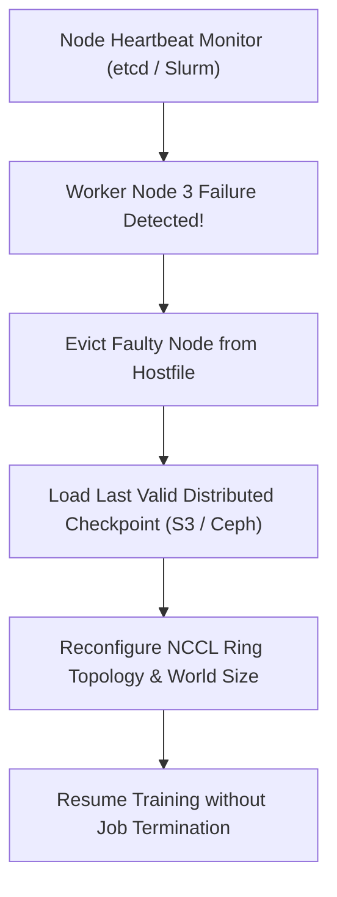

# Module 10: Scaling Laws, Profiling & FinOps

## Resilient Distributed Fault Tolerance Architecture

## 1. Mathematical Derivation of Transformer Training FLOPs

Let $\Phi$ denote total non-embedding parameters, $b$ denote global batch size, $s$ denote sequence length, $L$ denote layer count, and $h$ denote hidden dimension.

### 1.1 Forward Pass Compute Breakdown (Standard Decoder Layer)
For each token ($b \cdot s = 1$):
1. **Self-Attention Q, K, V Projections**:
   $$3 \times (2 \cdot h \cdot h) = 6h^2 \text{ FLOPs}$$
2. **Attention Logits & Weighted Sum**:
   $$2 \cdot s \cdot h \text{ FLOPs} \quad (Q K^T) + 2 \cdot s \cdot h \text{ FLOPs} \quad (P V) = 4sh \text{ FLOPs}$$
3. **Attention Output Projection ($W_O$)**:
   $$2 \cdot h \cdot h = 2h^2 \text{ FLOPs}$$
4. **Feed-Forward Network (MLP)**:
   - For standard Transformer ($4h$ expansion):
     $$2 \times (2 \cdot h \cdot 4h) = 16h^2 \text{ FLOPs}$$
   - For SwiGLU architecture (expansion $\frac{8}{3}h$, 3 matrices):
     $$3 \times \left(2 \cdot h \cdot \frac{8}{3}h\right) = 16h^2 \text{ FLOPs}$$
5. **Total Forward Compute per Layer**:
   $$C_{\text{forward, layer}} = 24h^2 + 4sh \text{ FLOPs}$$
When $s \ll h$, the quadratic attention term is negligible, yielding:
$$C_{\text{forward}} \approx 2\Phi \text{ FLOPs per token}$$

### 1.2 Backward Pass Compute Breakdown
Backpropagation requires:
- Gradients with respect to inputs: $2\Phi$ FLOPs
- Gradients with respect to weights: $2\Phi$ FLOPs
$$\text{Total Backward Compute} \approx 4\Phi \text{ FLOPs per token}$$

$$\text{Total FLOPs per Token} = C_{\text{step}} = 6\Phi$$
With full activation recomputation (gradient checkpointing), the forward pass is re-evaluated once during backward, yielding:
$$C_{\text{step, recompute}} = 8\Phi \text{ FLOPs per token}$$

---

## 2. MFU vs. HFU (Hardware FLOPs Utilization)

$$\text{MFU} = \frac{6 \cdot \Phi \cdot \text{Tokens/second}}{N_{\text{GPUs}} \cdot \text{Peak FLOPs}}$$
$$\text{HFU} = \frac{\text{Actual Operator FLOPs executed on Tensor Cores}}{N_{\text{GPUs}} \cdot \text{Peak FLOPs}}$$
- **HFU** measures raw hardware utilization, including rematerialized activation recomputations and padding.
- **MFU** measures pure algorithmic productivity. If you enable full activation checkpointing, HFU increases while MFU remains constant or drops slightly.

---

## 3. Chinchilla Scaling Law Formulation

$$\min_{N, D} L(N, D) = E + \frac{A}{N^\alpha} + \frac{B}{D^\beta} \quad \text{s.t.} \quad C = 6 N D$$
Using Lagrange multipliers:
$$N^* = G \left(\frac{C}{6}\right)^a, \quad D^* = G^{-1} \left(\frac{C}{6}\right)^b$$
where $a = \frac{\beta}{\alpha + \beta} \approx 0.45$, $b = \frac{\alpha}{\alpha + \beta} \approx 0.55$.