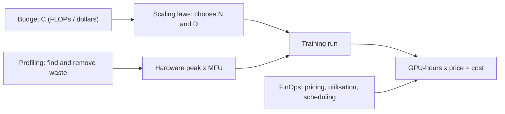

# Module 10: Scaling Laws, Cluster Profiling & FinOps

> **Architectural Scope**: The `6ND` compute rule, empirical scaling laws and compute-optimal training (Chinchilla), MFU and step-time breakdown, critical batch size, and the financial maths of GPU clusters.

---

## Why this module matters

Training a large model is one of the most expensive engineering decisions a team makes: millions of GPU-hours and a bill measured in millions of dollars. Three questions decide whether that money is well spent. **How big a model and how much data should we use for a given budget?** (scaling laws) **How much of the hardware's potential are we actually using?** (profiling, MFU) **What does it cost, and where is the waste?** (FinOps). This module gives you the back-of-the-envelope tools to answer each before you commit a cluster.

## Mental model: a budget with three dials

You have a compute budget `C` (in FLOPs, equivalently dollars). You choose model size `N` (parameters) and data size `D` (tokens). Efficiency determines how many of the FLOPs you paid for are *useful*. Scaling laws tell you how to split `C` between `N` and `D`; profiling tells you how much of `C` you actually get; FinOps tells you what each unit costs.

```mermaid
flowchart LR
    B["Budget C (FLOPs / dollars)"] --> SL["Scaling laws: choose N and D"]
    SL --> RUN["Training run"]
    HW["Hardware peak x MFU"] --> RUN
    RUN --> COST["GPU-hours x price = cost"]
    PROF["Profiling: find and remove waste"] --> HW
    FIN["FinOps: pricing, utilisation, scheduling"] --> COST
```

## 1. The compute rule: `C ~ 6 N D`

For a dense Transformer, one training step costs about 2 FLOPs per parameter per token in the forward pass and about 4 in the backward pass (twice the forward): **6 FLOPs per parameter per token**. Attention score computation adds a term that is small relative to this unless sequences are very long. So

`C ~ 6 x N x D`   (FLOPs).

Worked example: a 70B model on 15T tokens needs `6 x 70e9 x 15e12 = 6.3e24` FLOPs. (For mixture-of-experts models, `N` is the number of *active* parameters per token.)

## 2. Scaling laws and compute-optimal training

**Kaplan et al. (2020)** found that loss falls as a smooth power law in model size, data and compute over many orders of magnitude, with no sign of saturation: `L(N) ~ N^(-alpha)` and similarly for `D` and `C`. **Hoffmann et al. (2022, "Chinchilla")** re-measured how to split a fixed compute budget and found that earlier models were **under-trained**: for compute-optimal training, `N_opt` and `D_opt` should both scale roughly as `C^0.5`, which works out to about **20 training tokens per parameter**. Their 70B Chinchilla model trained on 1.4T tokens outperformed the 280B Gopher trained on 300B tokens with the same compute.

Two caveats matter in practice:

- **Inference changes the optimum.** Chinchilla minimises *training* compute for a given loss. If a model will serve billions of requests, a **smaller model trained on far more tokens** gives the same quality at lower serving cost. Llama 3 8B was trained on about 15T tokens (nearly 2,000 tokens per parameter) for this reason.
- **Laws are empirical fits** for a given architecture, data mix and quality. Data repetition, data quality and architecture (MoE) shift the constants. Use them to plan and to sanity-check, not as guarantees; run small-scale sweeps (often with muP-style parameterisation so hyperparameters transfer) and extrapolate.

**Critical batch size.** Increasing the global batch beyond a *critical batch size* gives diminishing returns in steps saved (McCandlish et al., 2018); it grows as training progresses. This caps useful data parallelism, which is why very large runs add other forms of parallelism instead.

## 3. MFU: how much of the hardware you actually use

**Model FLOPs Utilisation (MFU)** = useful model FLOPs per second / theoretical peak FLOP/s of the hardware. Using `6 N` FLOPs per token:

`MFU = (6 N x tokens_per_second) / (num_GPUs x peak_FLOPs_per_GPU)`.

(**HFU**, Hardware FLOPs Utilisation, also counts recomputed FLOPs from activation checkpointing, so HFU >= MFU; MFU is the honest metric.) Well-tuned dense LLM training reaches roughly 40 to 55% MFU on H100-class hardware; below 30% means a bottleneck worth hunting.

**Time to train.** `T = 6 N D / (G x P_peak x MFU)` for `G` GPUs.

Worked example, continued: 70B, 15T tokens, H100 BF16 dense peak about 989 TFLOP/s, MFU 40% so 396 TFLOP/s effective. GPU-seconds `= 6.3e24 / 3.96e14 = 1.6e10`, i.e. **about 4.4 million GPU-hours**. On 16,384 GPUs that is `1.6e10 / 16,384 = 9.7e5 s ~ 270 h ~ 11 days`. At an illustrative `$2.50` per GPU-hour the compute alone is roughly `$11M`. Raising MFU from 40% to 50% saves 20% of that, about `$2.2M`, which is why profiling is financially serious work.

## 4. Where the missing MFU goes (profiling a cluster)

Break each step's wall time into buckets and measure them:

| Bucket | What it is | Typical remedy |
|---|---|---|
| Compute | GEMMs, attention, fused kernels | better kernels (course 07), larger micro-batch, Tensor Core-friendly shapes |
| **Exposed communication** | collectives not hidden behind compute | overlap, bucket tuning, hybrid sharding, topology-aware placement (Modules 01 to 08) |
| Pipeline bubble | idle stages (Module 06) | more micro-batches, interleaving |
| Load imbalance / stragglers | one slow rank stalls all | health checks, rebalance, replace bad nodes |
| Data loading | GPUs waiting for input | more workers, prefetch, faster storage, pre-tokenised data |
| Optimizer / host overhead | small kernels, Python, `.item()` syncs | fused optimizers, CUDA graphs |
| Checkpointing and restarts | blocking saves, failure rework | async checkpoints, Young-Daly interval (Module 09) |

Tools: **PyTorch profiler** (Chrome/Perfetto traces, per-op time), **Nsight Systems** timelines across ranks (course 07, Module 11), NCCL logs and `nccl-tests` for link health, per-rank step-time dashboards for stragglers, and DCGM metrics (GPU utilisation, SM activity, temperature, ECC). Always profile at **representative scale**: a communication bottleneck at 512 GPUs may not exist at 8.

## 5. FinOps: the money side

**Unit economics.** Cost per useful token, for training or serving:

`cost per 1M tokens = (GPU $/hour) / (tokens per second per GPU x 3600) x 1e6`.

Worked example (serving): a GPU priced at `$3/hour` serving 2,500 tokens/s per GPU: `3 / (2500 x 3600) x 1e6 = $0.33` per million tokens. Doubling throughput through batching, quantisation or better kernels halves the cost, with no change to the price list.

Levers:

- **Utilisation first.** An idle GPU costs the same as a busy one. Track allocation vs actual utilisation; gang-scheduling gaps, queue fragmentation and failed jobs are common waste.
- **Pricing models:** on-demand (flexible, most expensive), reserved/committed use (large discounts for steady load), spot/preemptible (cheapest, needs fast checkpoint and resume, Module 09).
- **Right-size the experiment pipeline:** most spend often goes to hyperparameter sweeps and failed runs; use small proxies, early stopping and scaling-law extrapolation before the big run.
- **Avoid waste in the big run:** pass `nccl-tests` and a short burn-in before launching, cordon unhealthy nodes automatically, checkpoint cheaply.
- **Data and storage costs:** tokenised datasets, checkpoints (terabytes each) and egress add up; apply retention policies.
- **Attribution (showback/chargeback):** tag jobs by team and project so cost is visible; set budgets and alerts.
- **Training vs inference lifetime cost:** for a deployed model, inference spend usually exceeds training spend within months; model efficiency (distillation, quantisation, speculative decoding in course 09) is a FinOps lever, too.

## Common pitfalls

1. **Using Chinchilla ratios blindly** for a model that will be served heavily.
2. **Quoting HFU as MFU**, flattering the numbers.
3. **Computing `6ND` with total instead of active parameters** for MoE models.
4. **Optimising kernels before checking exposed communication and stragglers.**
5. **Profiling at toy scale**, missing scale-dependent bottlenecks.
6. **Counting only compute cost**: ignoring failed runs, restarts, storage, and engineering time.
7. **Ignoring the critical batch size**: adding data parallelism that does not improve convergence per sample.

## How this connects

- **Modules 01 to 09** supply every term in the efficiency equation; this module is where they are added up.
- **Course 07** raises MFU at the kernel level; **course 09** is the same economics for serving (cost per token, TTFT/TPOT).
- **Course 12** evaluation tells you whether the extra compute actually bought quality.

## Go further

- roadmap.sh: *Inference Engineering* nodes **cost estimation**, **capacity management**, **sizing / procurement**, **gpu procurement**; *MLOps* cost and monitoring topics.
- Kaplan et al., *Scaling Laws for Neural Language Models* (2020); Hoffmann et al., *Training Compute-Optimal Large Language Models* (2022); McCandlish et al., *An Empirical Model of Large-Batch Training* (2018); Chowdhery et al., *PaLM* (MFU definition).
- FinOps Foundation, "What is FinOps?"; PyTorch profiler recipe; Hugging Face "Ultra-Scale Playbook".

---

## Module Study Progression
1. **Beginner Playground**: Read [00_FOUNDATIONS_PLAYGROUND.md](00_FOUNDATIONS_PLAYGROUND.md).
2. **Architecture Theory**: Study this [01_README.md](01_README.md).
3. **Hands-on Project**: Follow [02_PROJECT_GUIDE.md](02_PROJECT_GUIDE.md).
4. **Staff Interview Challenges**: Check [03_SELF_ASSESSMENT_AND_CHALLENGES.md](03_SELF_ASSESSMENT_AND_CHALLENGES.md).
5. **Production Debugging**: Review [04_TROUBLESHOOTING_AND_EDGE_CASES.md](04_TROUBLESHOOTING_AND_EDGE_CASES.md).
