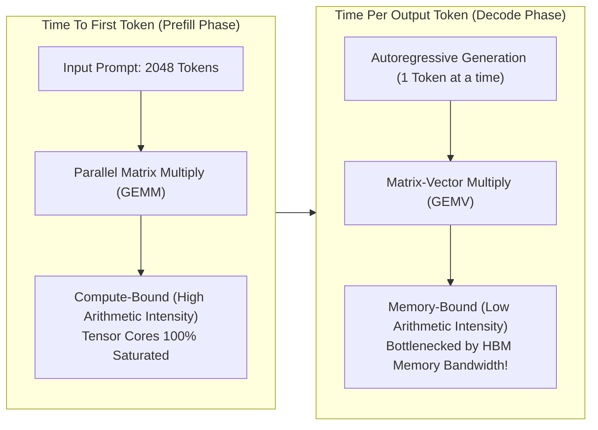

# Module 01: Inference Latency, Throughput & TTFT/TPOT Trade-offs


## LLM Inference Latency Breakdown (Prefill vs Decode)



---

## 🗺️ Recommended Step-by-Step Learning Path

Follow this exact sequence to achieve complete mastery of this module:

| Step | File to Open | What You Will Do |
| :---: | :--- | :--- |
| **1** | **[01_README.md](01_README.md)** | Read conceptual overview, architectural foundations, and mental models. |
| **2** | **[00_FOUNDATIONS_PLAYGROUND.md](00_FOUNDATIONS_PLAYGROUND.md)** | Practice beginner spoonfed micro-drills and line-by-line syntax breakdowns. |
| **3** | **[00_try_it_yourself.py](00_try_it_yourself.py)** | Run in terminal (`python 00_try_it_yourself.py`) for an interactive zero-dependency sandbox. |
| **4** | **[04_TROUBLESHOOTING_AND_EDGE_CASES.md](04_TROUBLESHOOTING_AND_EDGE_CASES.md)** | Study forensic runbooks, edge cases, and real-world failure post-mortems. |
| **5** | **[03_SELF_ASSESSMENT_AND_CHALLENGES.md](03_SELF_ASSESSMENT_AND_CHALLENGES.md)** | Test your knowledge with self-assessment quizzes, challenges, and diagnostic scenarios. |
| **6** | **[02_PROJECT_GUIDE.md](02_PROJECT_GUIDE.md)** | Follow guided project implementation for `starter/` and `project_solution/`. |
| **7** | **[problems/](problems/)** | Solve hands-on problem bank challenges and verify with `pytest problems/tests`. |
| **8** | **[debug_lab/](debug_lab/)** | Diagnose and fix silent production bugs in the Bug Hunter Drill. |

---

## 1. Architectural Foundations of LLM Inference

Unlike classical deep learning inference where input tensors undergo a single static forward pass, autoregressive decoder Transformer inference is a sequential, state-dependent process.

### 1.1 Metrics Taxonomy & User Experience
Let an inference request $R$ submit a prompt of length $S_{\text{prompt}}$ and generate $S_{\text{gen}}$ completion tokens.
1. **Time to First Token (TTFT)**:
   $$\text{TTFT} = t_{\text{first\_token}} - t_{\text{arrival}}$$
   Measures system responsiveness; dominated by prompt prefill computation and queue wait time.
2. **Time Per Output Token (TPOT)**:
   $$\text{TPOT} = \frac{t_{\text{finish}} - t_{\text{first\_token}}}{S_{\text{gen}} - 1}$$
   Measures conversational streaming smoothness.
3. **Inter-Token Latency (ITL)**:
   $$\text{ITL}_i = t_{i} - t_{i-1} \quad \forall i \in \{2, \dots, S_{\text{gen}}\}$$
   Per-token latency distribution; spikes in ITL create perceptible jitter.
4. **Normalized Latency (E2E / Output Tokens)**:
   $$\text{Latency}_{\text{norm}} = \frac{t_{\text{finish}} - t_{\text{arrival}}}{S_{\text{gen}}}$$

---

## 2. Computational Regimes: Prefill vs. Decode

### 2.1 The Roofline Model Analysis
The operational performance of GPU execution is governed by the Williams et al. Roofline Model:
$$\text{Attainable Performance} = \min(\text{Peak Compute [FLOP/s]}, \text{Operational Intensity [FLOP/byte]} \times \text{Memory Bandwidth [byte/s]})$$

```
Performance
  ^
  |                  Peak Compute Limit (Compute-Bound: Prefill)
  |                 /-------------------------------------------
  |                /
  |               /
  |              /   Memory Bandwidth Limit (Memory-Bound: Decode)
  |             /
  |            /
  +-----------+-------------------------------------------------->
  0       Ridge Point                               Intensity (FLOP/byte)
```

### 2.2 Operational Intensity Calculations
Let $\Phi$ denote parameter count, $b$ denote batch size, $s$ denote sequence length, and $h$ denote hidden dimension.
- **Prefill Phase (GEMM)**:
  $$\text{FLOPs} = 2 b s \Phi, \quad \text{Bytes} = 2\Phi + 2 b s h$$
  When $b s \gg 1$:
  $$I_{\text{prefill}} = \frac{2 b s \Phi}{2\Phi + 2 b s h} \approx b s \text{ FLOP/byte}$$
  Easily exceeds the H100 ridge point ($\approx 295 \text{ FLOP/byte}$), fully saturating Tensor Cores.
- **Decode Phase (GEMV)**:
  At each decode step, each request generates 1 token ($s=1$):
  $$I_{\text{decode}} = \frac{2 b \Phi}{2\Phi + 2 b h} \approx b \text{ FLOP/byte}$$
  For small batch sizes ($b=1$ to $b=8$), $I_{\text{decode}} \ll 295$, locking execution into the bandwidth-bound regime.

---

## 3. The Pareto Frontier: Throughput vs. Latency

As concurrency increases:
- **Throughput (tokens/sec)** scales linearly until memory bandwidth is saturated or KV cache capacity is exhausted.
- **TPOT & TTFT** degrade as batching increases queuing delays and memory contention.
High-performance serving architectures (e.g. vLLM, TensorRT-LLM, SGLang) optimize operations along this Pareto frontier.