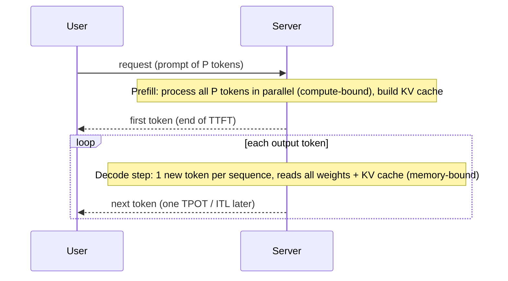

# Module 01: Inference Latency, TTFT & TPOT Trade-offs

> **Architectural Scope**: The two phases of LLM inference (prefill and decode), the metrics that matter (TTFT, TPOT/ITL, end-to-end latency, throughput, goodput), why decode is memory-bound, and how batching trades latency for throughput.

---

## Why this module matters

Training is about throughput over weeks. Serving is about **latency under load for real users**, at a cost per token you can afford. An LLM request is not one computation but two very different ones, and the metrics, bottlenecks and optimisations differ for each. If you cannot say whether a slow chat reply is a *time-to-first-token* problem or a *time-per-token* problem, you cannot fix it. Every technique in the rest of this course (KV-cache management, PagedAttention, continuous batching, chunked prefill, speculative decoding, quantisation) is aimed at one of the quantities defined here.

## Mental model: reading the question, then writing the answer one word at a time

When you ask a question, the model first **reads the whole prompt at once** (fast per token, because all tokens are processed in parallel, but it must finish before anything appears) and then **writes the answer one token at a time**, each token requiring a full pass through the model that re-reads every weight. The first phase decides how long you wait before the first word; the second decides how fast the words stream.

```mermaid
sequenceDiagram
    participant U as User
    participant S as Server
    U->>S: request (prompt of P tokens)
    Note over S: Prefill: process all P tokens in parallel (compute-bound), build KV cache
    S-->>U: first token (end of TTFT)
    loop each output token
        Note over S: Decode step: 1 new token per sequence, reads all weights + KV cache (memory-bound)
        S-->>U: next token (one TPOT / ITL later)
    end
```

## 1. The metrics

| Metric | Meaning | What drives it |
|---|---|---|
| **TTFT** (time to first token) | request arrival until the first output token | queueing + prompt length (prefill compute) |
| **TPOT** / **ITL** (time per output token / inter-token latency) | average gap between successive output tokens | decode step time, which depends on batch size and memory traffic |
| **E2E latency** | arrival until the last token | `TTFT + (n_out - 1) x TPOT` |
| **Throughput** | total tokens (or requests) per second the system produces | batch size, GPU efficiency |
| **Goodput** | requests per second that **meet their SLOs** (for example TTFT < 500 ms and TPOT < 50 ms) | the number that matters commercially |

Always report **percentiles** (p50, p95, p99) rather than averages: tail latency is what users remember, and queueing makes tails grow quickly as load approaches capacity. Typical human-facing targets: TTFT well under a second, TPOT under about 50 ms (faster than reading speed, roughly 20 tokens/s or more); batch or offline jobs care only about throughput.

## 2. Prefill: compute-bound

All `P` prompt tokens go through the model in parallel as large matrix multiplications, so the GPU's Tensor Cores are busy. Cost is about `2 x N_params x P` FLOPs.

**Worked example.** An 8B model, a 2,000-token prompt: `2 x 8e9 x 2000 = 3.2e13` FLOPs. At an effective 400 TFLOP/s that is about **80 ms** of pure compute. A 32,000-token prompt is 16x more (about 1.3 s) plus the quadratic attention term, which is why long prompts dominate TTFT.

## 3. Decode: memory-bound

Each decode step produces **one token per sequence** but must read **all model weights** (and each sequence's KV cache, Module 02) from HBM. The arithmetic per byte is tiny, so speed is set by bandwidth:

`step time ~ (weight bytes + KV bytes read) / memory bandwidth`.

**Worked example.** 8B model in FP16 is 16 GB; on an H100 (3.35 TB/s): `16 / 3350 = 4.8 ms` per step, i.e. an upper bound of about 200 tokens/s for a *single* sequence, regardless of how much compute the GPU has. A 70B FP16 model (140 GB) needs at least two GPUs; split with tensor parallelism it is about 21 ms per step on two H100s by this bound (real systems lose some to communication and overheads).

Decode **arithmetic intensity** at batch size `B` with FP16 weights is about `2B FLOPs / 2 bytes per parameter = B FLOP/B`, far below an H100's ridge point of roughly 300 FLOP/B (course 07, Module 01). So at small batches the GPU is mostly idle waiting for memory.

## 4. Batching: the central trade-off

Serving `B` sequences in the same decode step reads the weights **once** and applies them to `B` tokens. Throughput therefore rises almost linearly with `B` while the step time barely changes, until you reach the compute ridge (`B` of a few hundred for dense models; the KV cache read also grows with `B`, eventually dominating).

| Batch size B | Step time (illustrative, 8B FP16, H100) | Tokens/s (all users) | Per-user TPOT |
|---|---|---|---|
| 1 | ~5 ms | ~200 | ~5 ms |
| 32 | ~6 ms | ~5,300 | ~6 ms |
| 256 | ~12 ms (KV reads and compute start to bite) | ~21,000 | ~12 ms |

So **larger batches buy throughput (lower cost per token) at the price of somewhat higher TPOT and, because requests wait to be batched, higher TTFT.** The operating point is a business decision expressed through SLOs: choose the largest batch that keeps p95 TTFT and TPOT within target. Memory limits the maximum batch: the **KV cache** of every running sequence must fit (Module 02), which is why KV management is the real bottleneck of high-throughput serving.

## 5. Where the knobs are

- **Reduce TTFT:** prefix caching (Module 04), chunked prefill (Module 06), prompt compression, scheduling short prompts first, more GPUs/TP for prefill, disaggregated prefill (Module 06).
- **Reduce TPOT:** quantised weights (fewer bytes per step, Module 08), speculative decoding (several tokens per weight read, Module 07), faster attention kernels, tensor parallelism (more bandwidth), smaller batches or priority scheduling for latency-sensitive traffic.
- **Increase throughput/cost efficiency:** continuous batching (Module 05), PagedAttention for larger batches (Module 03), quantisation of weights and KV cache, FP8 compute.
- **Protect tails:** admission control, queue limits, autoscaling (Module 09).

## Common pitfalls

1. **Reporting only average latency** or only throughput; always give percentiles and the load at which they were measured.
2. **Mixing TTFT and TPOT** when diagnosing: long prompts hurt TTFT, heavy batching hurts TPOT.
3. **Benchmarking at batch 1 and extrapolating to production**, or the reverse.
4. **Assuming compute is the bottleneck in decode**; it is bandwidth and KV capacity.
5. **Ignoring output length**: E2E latency is dominated by `n_out x TPOT` for long answers.
6. **Comparing systems on different prompt/output length distributions**, which makes throughput numbers meaningless.
7. **Optimising throughput past the SLO knee** and wrecking p99.

## How this connects

- **Course 07, Module 01** (roofline) explains why decode is memory-bound and prefill compute-bound.
- **Module 02** onward address the KV cache, the batching and the scheduling that determine these metrics.
- **Module 09** turns the metrics into benchmarks, SLAs and autoscaling rules.
- **Course 08, Module 10** applies the same unit-economics thinking to training.

## Go further

- roadmap.sh: *Inference Engineering* nodes **time to first token**, **inter token latency**, **tokens per second**, **latency vs throughput**, **latency percentiles**, **prefill / decode phases**, **bottleneck analysis**.
- NVIDIA NIM "LLM benchmarking metrics" documentation; Anyscale, *Reproducible performance metrics for LLM inference*; Hugging Face TGI benchmarking guide.
- Pope et al., *Efficiently Scaling Transformer Inference* (2022); Kipply, *Transformer Inference Arithmetic*.

---

## Module Study Progression
1. **Beginner Playground**: Read [00_FOUNDATIONS_PLAYGROUND.md](00_FOUNDATIONS_PLAYGROUND.md).
2. **Architecture Theory**: Study this [01_README.md](01_README.md).
3. **Hands-on Project**: Follow [02_PROJECT_GUIDE.md](02_PROJECT_GUIDE.md).
4. **Staff Interview Challenges**: Check [03_SELF_ASSESSMENT_AND_CHALLENGES.md](03_SELF_ASSESSMENT_AND_CHALLENGES.md).
5. **Production Debugging**: Review [04_TROUBLESHOOTING_AND_EDGE_CASES.md](04_TROUBLESHOOTING_AND_EDGE_CASES.md).
