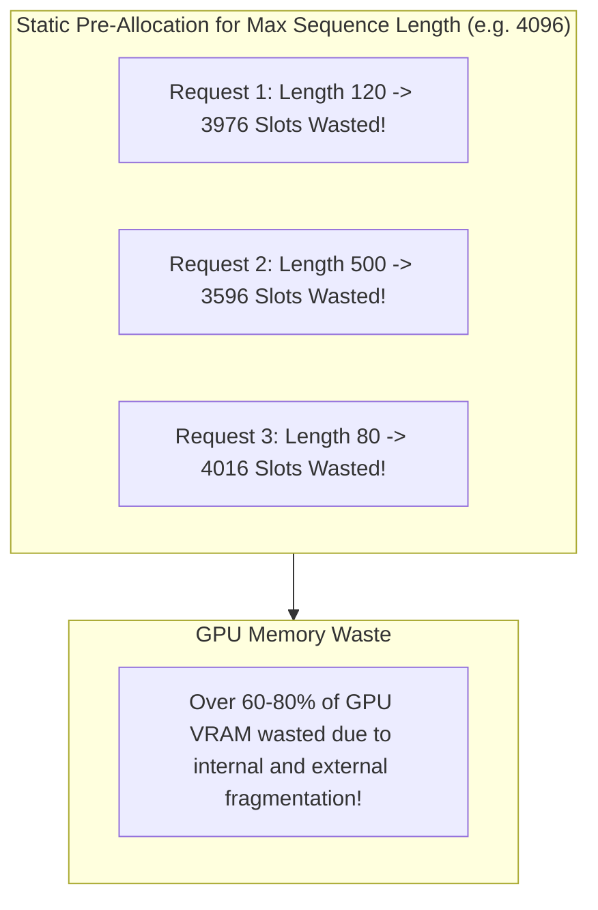

# Module 02: KV-Cache Memory Management

## Traditional Contiguous KV Cache Memory Fragmentation

---

## 🗺️ Recommended Step-by-Step Learning Path

Follow this exact sequence to achieve complete mastery of this module:

| Step | File to Open | What You Will Do |
| :---: | :--- | :--- |
| **1** | **[01_README.md](01_README.md)** | Read conceptual overview, architectural foundations, and mental models. |
| **2** | **[00_FOUNDATIONS_PLAYGROUND.md](00_FOUNDATIONS_PLAYGROUND.md)** | Practice beginner spoonfed micro-drills and line-by-line syntax breakdowns. |
| **3** | **[00_try_it_yourself.py](00_try_it_yourself.py)** | Run in terminal (`python 00_try_it_yourself.py`) for an interactive zero-dependency sandbox. |
| **4** | **[04_TROUBLESHOOTING_AND_EDGE_CASES.md](04_TROUBLESHOOTING_AND_EDGE_CASES.md)** | Study forensic runbooks, edge cases, and real-world failure post-mortems. |
| **5** | **[03_SELF_ASSESSMENT_AND_CHALLENGES.md](03_SELF_ASSESSMENT_AND_CHALLENGES.md)** | Test your knowledge with self-assessment quizzes, challenges, and diagnostic scenarios. |
| **6** | **[02_PROJECT_GUIDE.md](02_PROJECT_GUIDE.md)** | Follow guided project implementation for `starter/` and `project_solution/`. |
| **7** | **[problems/](problems/)** | Solve hands-on problem bank challenges and verify with `pytest problems/tests`. |
| **8** | **[debug_lab/](debug_lab/)** | Diagnose and fix silent production bugs in the Bug Hunter Drill. |

---

## 1. Mathematical Anatomy of Attention Caching

In autoregressive generation, self-attention requires key and value tensors for all prior tokens.
Let $L$ denote layer count, $H_{\text{kv}}$ denote key/value attention heads, $d_{\text{head}}$ denote head dimension, $S$ denote sequence length, and $b$ denote concurrent batch size.

### 1.1 Multi-Head Attention (MHA) vs. Grouped-Query Attention (GQA)
In standard Multi-Head Attention (MHA), $H_{\text{kv}} = H_{\text{q}}$.
In Grouped-Query Attention (GQA), multiple query heads share a single key/value head:
$$H_{\text{kv}} = \frac{H_{\text{q}}}{G}, \quad G \in \{4, 8\}$$
In Multi-Query Attention (MQA), $H_{\text{kv}} = 1$.

$$\text{Total KV Bytes} = 2 \times P \times L \times H_{\text{kv}} \times d_{\text{head}} \times S \times b$$
where $P$ is precision bytes ($2$ for FP16/BF16, $1$ for FP8).

| Model | Layers ($L$) | $H_{\text{q}}$ | $H_{\text{kv}}$ | Architecture | KV Bytes / Token | 4K Context / User |
| :--- | :---: | :---: | :---: | :---: | :---: | :---: |
| **Llama-2-7B** | 32 | 32 | 32 | MHA | 512 KB | 2.05 GB |
| **Llama-3-8B** | 32 | 32 | 8 | GQA | 128 KB | 0.51 GB |
| **Llama-3-70B** | 80 | 64 | 8 | GQA | 320 KB | 1.28 GB |
| **Llama-3-405B** | 126 | 128 | 16 | GQA | 1,008 KB | 4.03 GB |

---

## 2. Memory Fragmentation: Internal vs. External

### 2.1 The Traditional Static Allocation Crisis
Prior to modern serving systems (like vLLM), engines pre-allocated a contiguous tensor buffer sized for the maximum possible sequence length ($S_{\text{max}} = 4096$ or $8192$):
1. **Internal Fragmentation**: If a user request finishes in 200 tokens, the remaining 3,896 reserved token slots sit empty and cannot be shared.
2. **External Fragmentation**: As requests finish at varying times, free memory forms non-contiguous memory holes. Allocators fail to satisfy a new contiguous allocation even when total free memory is sufficient.
Over **$60\% - 80\%$** of GPU memory was routinely wasted!