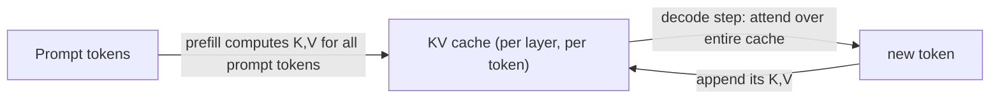

# Module 02: KV-Cache Memory Management

> **Architectural Scope**: Why the KV cache exists, how to compute its size, how it limits batch size and context length, and the main techniques for shrinking or managing it (GQA/MQA/MLA, quantisation, eviction, offloading).

---

## Why this module matters

Generating token `t` requires attention over the keys and values of *all* previous tokens. Recomputing them every step would make generation quadratic in length, so every serving engine **caches** the keys and values of the tokens already processed: the **KV cache**. It is the single largest consumer of GPU memory after the weights, it grows with both sequence length and number of concurrent requests, and it decides how many users one GPU can serve. Most of the serving innovations of the last few years (PagedAttention, prefix caching, GQA, KV quantisation) are KV-cache innovations.

## Mental model: a notebook that every conversation keeps adding to

Each active conversation keeps a notebook with one page per token, holding that token's key and value vectors for every layer. The model re-reads the whole notebook to produce each new word, then adds one page. A long conversation has a thick notebook; many conversations mean many notebooks; and the GPU has a fixed number of pages' worth of shelf space.

```mermaid
flowchart LR
    P["Prompt tokens"] -->|"prefill computes K,V for all prompt tokens"| C["KV cache (per layer, per token)"]
    C -->|"decode step: attend over entire cache"| T["new token"]
    T -->|"append its K,V"| C
```

## 1. How big is the KV cache?

Per token, the cache stores a key and a value (factor 2) for every layer and every **KV head**:

`bytes per token = 2 x n_layers x n_kv_heads x head_dim x bytes_per_element`

| Model | Layers | KV heads | Head dim | Per token (FP16) | 4,096-token sequence |
|---|---|---|---|---|---|
| Llama-2 7B (MHA) | 32 | 32 | 128 | 512 KiB | 2 GiB |
| Llama-3 8B (GQA) | 32 | 8 | 128 | **128 KiB** | 512 MiB |
| Llama-3 70B (GQA) | 80 | 8 | 128 | 320 KiB | 1.25 GiB |

Scale it up: Llama-3 8B at a 128K-token context needs `131,072 x 128 KiB = 16 GiB` **for a single sequence**, as much as the model weights. The cache is linear in sequence length and linear in the number of concurrent sequences.

**Capacity planning example.** An 80 GB H100 serving Llama-3 8B in FP16: weights 16 GB, reserve about 10% for activations and overhead, leaving roughly 55 GB for KV. That is `55 GiB / 128 KiB = ~450,000` cached tokens, about **110 concurrent 4K-token sequences**, or only about 3 sequences at 128K. Everything else (batch size, throughput, cost per token) follows from this number.

## 2. The cost during decode

Each decode step reads the entire cache for every running sequence (Module 01). With long contexts and large batches the **KV reads can exceed the weight reads**: 100 sequences of 4K tokens on the 8B model means `100 x 512 MiB = 50 GiB` read per step versus 16 GB of weights. So KV size affects not only *capacity* but also *step time* (TPOT).

## 3. Why naive allocation wastes memory

A simple server preallocates a contiguous buffer per request sized for the **maximum possible length** (say 4,096 tokens), even if the request ends after 200. This causes:

- **Internal fragmentation:** the reserved but unused tail.
- **External fragmentation:** gaps between buffers of different sizes.
- **No sharing:** identical prompt prefixes are stored again for every request.

The vLLM paper measured that existing systems used only roughly **20 to 40% of KV memory** for actual token states. That is a 2 to 4x loss of batch size, and therefore throughput, from allocation policy alone: the motivation for PagedAttention (Module 03).

## 4. Making the cache smaller (architecture)

| Technique | Idea | Effect |
|---|---|---|
| **MQA** (multi-query attention) | all query heads share one K/V head | KV shrinks by `n_heads`x; some quality loss |
| **GQA** (grouped-query attention) | groups of query heads share a K/V head (for example 32 query heads, 8 KV heads) | 4x smaller than MHA with little quality loss; now the default in Llama 3, Mistral, Qwen |
| **MLA** (multi-head latent attention, DeepSeek) | store a low-rank latent vector per token and expand it when needed | KV shrinks by an order of magnitude versus MHA |
| **Sliding-window attention** | each token attends only to the last `W` tokens, so the cache is capped at `W` | bounded memory; loses distant context unless interleaved with global layers |
| **Fewer/shared layers** | cross-layer KV sharing | smaller cache, architecture-specific |

These are decisions made when the model is *designed and trained*; the serving engineer inherits them, which is why `n_kv_heads` is one of the first numbers to look up for any model.

## 5. Making the cache smaller (serving time)

- **KV-cache quantisation:** store K/V in FP8 or INT8 (even INT4) instead of FP16, halving or quartering the cache with small accuracy cost; per-head or per-token scales; check long-context quality. Supported in vLLM, TensorRT-LLM and others.
- **Eviction / compression:** keep only "important" tokens (heavy hitters such as H2O) or the first few **attention sink** tokens plus a recent window (StreamingLLM); lossy, so evaluate on your task.
- **Offloading:** spill cold or preempted sequences' KV to CPU memory or NVMe and bring them back when needed (PCIe bandwidth is the limit, about 64 GB/s versus HBM's TB/s), which is useful for long idle chat sessions.
- **Prefix sharing:** requests sharing a prompt prefix (system prompt, few-shot examples, a document) can share the same cached blocks (Module 04).
- **Paging:** allocate in small fixed-size blocks on demand (Module 03).
- **Admission and preemption:** when memory runs out the scheduler must queue, **preempt** a request (drop its KV and recompute later, or swap it out), or reject. Good policies keep a safety margin and prioritise by SLO.
- **Tensor/pipeline parallelism** pools memory across GPUs: with TP, KV heads are sharded, so cache capacity scales with GPU count (up to the number of KV heads, after which heads are replicated).

## Worked example: how many users?

Serve Llama-3 8B on one H100, average context 2,000 tokens (prompt + output so far). Per sequence KV: `2,000 x 128 KiB = 250 MiB`. With 55 GiB available: `55 x 1024 / 250 = 225` concurrent sequences. Switching KV to FP8 doubles it to about 450 sequences. If a single user uploads a 100K-token document, that one sequence consumes `100,000 x 128 KiB = 12.2 GiB`: the same space as about 50 average users, which is why admission control and per-request length limits exist.

## Common pitfalls

1. **Planning capacity from weights alone**; KV often decides concurrency.
2. **Ignoring GQA when estimating** (using `n_heads` instead of `n_kv_heads` overestimates by 4x for Llama 3).
3. **Setting `max_model_len` far above real needs**, reserving memory you never use (in engines that reserve by max length).
4. **Letting one long request starve the rest** without per-request limits or preemption policy.
5. **Quantising the KV cache without testing long-context accuracy.**
6. **Forgetting activations and CUDA-graph memory** when setting the GPU memory utilisation fraction (out-of-memory at peak).
7. **Counting only decode**: prefill of long prompts also needs temporary memory for activations.

## How this connects

- **Module 01**: KV reads are part of the decode step time.
- **Module 03 (PagedAttention)** fixes fragmentation; **Module 04** shares prefixes; **Module 05** relies on a well-managed cache to batch continuously; **Module 08** quantises weights (and optionally KV) to free memory.
- **Course 07, Module 08**: FlashAttention is the compute side of the same attention; **Course 08, Module 07**: long-context training shards the sequence, and serving shards the KV.

## Go further

- roadmap.sh: *Inference Engineering* nodes **kv cache**, **kv cache storage**, **memory**, **long context handling**, **attention variants**, **caching**.
- Kwon et al., *Efficient Memory Management for Large Language Model Serving with PagedAttention* (SOSP 2023); Shazeer, *Fast Transformer Decoding: One Write-Head is All You Need* (MQA); Ainslie et al., *GQA* (2023); DeepSeek-V2 (MLA); Xiao et al., *StreamingLLM* (2023).
- Hugging Face "KV cache strategies" guide; NVIDIA "Mastering LLM Techniques: Inference Optimization".

---

## Module Study Progression
1. **Beginner Playground**: Read [00_FOUNDATIONS_PLAYGROUND.md](00_FOUNDATIONS_PLAYGROUND.md).
2. **Architecture Theory**: Study this [01_README.md](01_README.md).
3. **Hands-on Project**: Follow [02_PROJECT_GUIDE.md](02_PROJECT_GUIDE.md).
4. **Staff Interview Challenges**: Check [03_SELF_ASSESSMENT_AND_CHALLENGES.md](03_SELF_ASSESSMENT_AND_CHALLENGES.md).
5. **Production Debugging**: Review [04_TROUBLESHOOTING_AND_EDGE_CASES.md](04_TROUBLESHOOTING_AND_EDGE_CASES.md).
