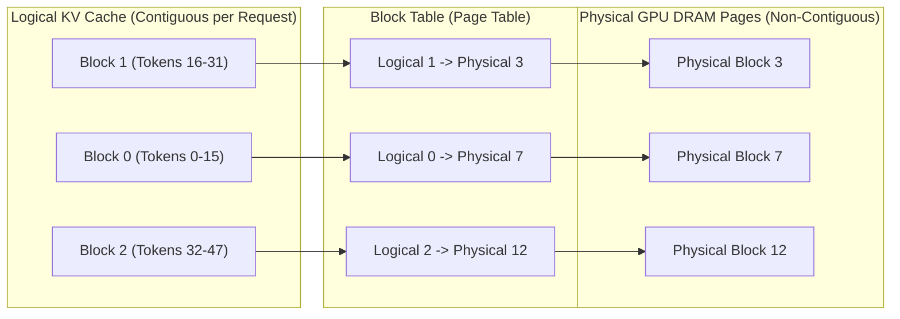

# Module 03: PagedAttention Architecture (vLLM)


## PagedAttention Virtual Memory Block Table (vLLM)



---

## 🗺️ Recommended Step-by-Step Learning Path

Follow this exact sequence to achieve complete mastery of this module:

| Step | File to Open | What You Will Do |
| :---: | :--- | :--- |
| **1** | **[01_README.md](01_README.md)** | Read conceptual overview, architectural foundations, and mental models. |
| **2** | **[00_FOUNDATIONS_PLAYGROUND.md](00_FOUNDATIONS_PLAYGROUND.md)** | Practice beginner spoonfed micro-drills and line-by-line syntax breakdowns. |
| **3** | **[00_try_it_yourself.py](00_try_it_yourself.py)** | Run in terminal (`python 00_try_it_yourself.py`) for an interactive zero-dependency sandbox. |
| **4** | **[04_TROUBLESHOOTING_AND_EDGE_CASES.md](04_TROUBLESHOOTING_AND_EDGE_CASES.md)** | Study forensic runbooks, edge cases, and real-world failure post-mortems. |
| **5** | **[03_SELF_ASSESSMENT_AND_CHALLENGES.md](03_SELF_ASSESSMENT_AND_CHALLENGES.md)** | Test your knowledge with self-assessment quizzes, challenges, and diagnostic scenarios. |
| **6** | **[02_PROJECT_GUIDE.md](02_PROJECT_GUIDE.md)** | Follow guided project implementation for `starter/` and `project_solution/`. |
| **7** | **[problems/](problems/)** | Solve hands-on problem bank challenges and verify with `pytest problems/tests`. |
| **8** | **[debug_lab/](debug_lab/)** | Diagnose and fix silent production bugs in the Bug Hunter Drill. |

---

## 1. Systems Architecture of PagedAttention

PagedAttention (Kwon et al., SOSP 2023) partitions the KV cache into fixed-size physical blocks that are mapped dynamically to logical token sequences via per-sequence block tables.

### 1.1 Core Data Structures
1. **Physical Block**: A contiguous memory buffer capable of storing key and value vectors for $B$ tokens (typically $B=16$ or $B=32$):
   $$\text{Block Size (bytes)} = 2 \times P \times L \times H_{\text{kv}} \times d_{\text{head}} \times B$$
2. **Block Table**: An integer array for each active sequence mapping logical block index $\lfloor i / B \rfloor$ to physical block ID:
   $$\text{PhysicalBlockID} = \text{BlockTable}\left[\left\lfloor \frac{i}{B} \right\rfloor\right]$$
   $$\text{SlotOffset} = i \pmod B$$
3. **Free Block Manager**: A free-list tracking unallocated physical block indices on the GPU.

---

## 2. Copy-on-Write (CoW) Mechanics

For decoding strategies that branch (e.g. beam search, parallel sampling, tree-of-thought):
- Multiple sequence forks point to the same physical blocks for shared prefixes.
- Each physical block maintains a **reference count** (`ref_count`).
- When Sequence $A$ appends a new token to a shared block:
  - If `ref_count > 1`, a new physical block is allocated, the content is copied (**Copy-on-Write**), `ref_count` of the original block is decremented, and Sequence $A$'s block table is updated.
  - If `ref_count == 1`, write occurs in-place.

```
Initial Shared State:
Sequence A: -> [Physical Block 4 (ref=2)]
Sequence B: -> [Physical Block 4 (ref=2)]

After Sequence A Appends Divergent Token (Copy-on-Write):
Sequence A: -> [Physical Block 9 (ref=1)] (New private block)
Sequence B: -> [Physical Block 4 (ref=1)] (Original block retained)
```