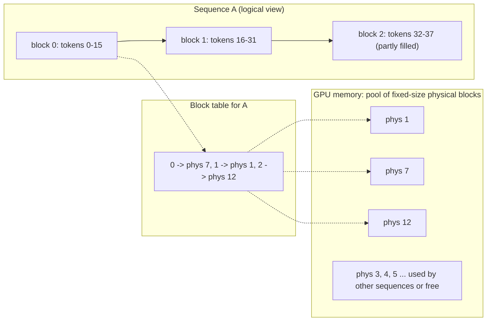

# Module 03: PagedAttention Architecture (vLLM)

> **Architectural Scope**: Virtual-memory-style KV-cache paging, block tables, on-demand allocation, copy-on-write sharing, preemption, and how the attention kernel reads non-contiguous memory.

---

## Why this module matters

Module 02 showed that naive KV-cache allocation wastes 60 to 80% of the memory that could hold tokens, which directly caps batch size and throughput. **PagedAttention** (Kwon et al., SOSP 2023, the core of **vLLM**) solves this by borrowing a 50-year-old idea from operating systems: **virtual memory with paging**. It is the reason a modern serving engine can run several times more concurrent requests on the same GPU, and its block-table abstraction is the foundation for prefix caching (Module 04), copy-on-write sampling and preemption.

## Mental model: a book that stores its pages anywhere

A contiguous KV buffer is like requiring every novel to be stored in one unbroken stretch of shelf, reserved for its maximum possible length. Paging lets a sequence's "pages" (small blocks of KV for 16 tokens) sit **anywhere** in memory, with a small **page table** recording the order. New pages are handed out only when the sequence actually grows, and freed pages go straight back to a shared pool.


```mermaid
flowchart LR
    subgraph Logical["Sequence A (logical view)"]
        L0["block 0: tokens 0-15"] --> L1["block 1: tokens 16-31"] --> L2["block 2: tokens 32-37 (partly filled)"]
    end
    subgraph Table["Block table for A"]
        T["0 -> phys 7, 1 -> phys 1, 2 -> phys 12"]
    end
    subgraph Physical["GPU memory: pool of fixed-size physical blocks"]
        P1["phys 1"]
        P7["phys 7"]
        P12["phys 12"]
        PX["phys 3, 4, 5 ... used by other sequences or free"]
    end
    L0 -.-> T
    T -.-> P7
    T -.-> P1
    T -.-> P12
```

## 1. The mechanism

1. **Fixed-size blocks.** At start-up the engine measures free GPU memory, reserves it for the KV cache and carves it into **blocks** of `B` tokens (default 16). A block holds the K and V for `B` tokens across all layers (or per layer, depending on implementation).
2. **Block table per sequence.** Each sequence has a table mapping *logical block index* to *physical block id*.
3. **On-demand allocation.** A new sequence gets just enough blocks for its prompt. During decode, when the last block fills, one more block is taken from the free pool.
4. **Freed immediately.** When a sequence finishes, its blocks return to the pool at once; no compaction is needed because blocks are uniform.
5. **The kernel does the translation.** The paged attention kernel, given a query and a block table, **gathers** K and V from the listed physical blocks, much like an MMU translating virtual to physical addresses. The attention maths (and FlashAttention-style tiling) is unchanged; only the memory addressing differs.

```python
# toy block manager (conceptual)
class BlockManager:
    def __init__(self, num_blocks, block_size=16):
        self.free = list(range(num_blocks)); self.B = block_size
        self.tables = {}                              # seq_id -> [physical block ids]
        self.ref = [0] * num_blocks                   # reference counts for sharing

    def append_token(self, seq_id, n_tokens_so_far):
        table = self.tables.setdefault(seq_id, [])
        if n_tokens_so_far % self.B == 0:             # last block is full (or sequence is new)
            if not self.free: raise MemoryError("preempt something")
            blk = self.free.pop(); self.ref[blk] = 1; table.append(blk)

    def free_seq(self, seq_id):
        for blk in self.tables.pop(seq_id, []):
            self.ref[blk] -= 1
            if self.ref[blk] == 0: self.free.append(blk)
```

## 2. Why it wastes so little

Internal fragmentation is limited to the **unfilled tail of each sequence's last block**: on average about `(B - 1) / 2` tokens per sequence. External fragmentation is zero because all blocks are the same size. The paper reports KV-memory waste dropping to under about 4%, enabling roughly **2 to 4x higher throughput** than prior systems at the same latency.

**Worked example.** Llama-3 8B: one 16-token block is `16 x 128 KiB = 2 MiB`. A request with a 70-token prompt needs `ceil(70 / 16) = 5` blocks (10 MiB), wasting 10 token slots (12.5% of its own allocation). A max-length reservation of 4,096 tokens would reserve 512 MiB for the same request: 98% waste at that moment. On 55 GiB of KV memory, paging holds about 5,600 such short requests (`55 GiB / 10 MiB`) versus 110 max-length reservations (`55 GiB / 512 MiB`). In practice the gain depends on the length distribution, but it is the difference between memory-bound and compute-bound serving.

## 3. Sharing and copy-on-write

Because blocks are reference-counted, sequences can **share** physical blocks:

- **Parallel sampling / `n > 1`:** all samples share the prompt's blocks; each only allocates new blocks for its own generated tokens.
- **Beam search:** beams share common prefixes; when a beam diverges inside a shared block, the engine uses **copy-on-write**: allocate a new block, copy the partial content, and update just that sequence's table.
- **Prefix caching (Module 04):** blocks are keyed by a hash of their token contents plus their prefix, so a later request with the same system prompt reuses the already computed blocks.

## 4. Memory pressure: preemption

If the pool runs out while sequences are still growing, the scheduler must **preempt** at sequence granularity (all-or-nothing, since a sequence needs its whole KV to proceed):

- **Recompute:** drop the victim's blocks; later, re-run prefill over its prompt plus tokens generated so far (cheap for short sequences, since prefill is parallel).
- **Swap:** copy blocks to CPU memory and bring them back later (limited by PCIe bandwidth).

Policies decide *whom* to preempt (typically the most recently admitted, first-come-first-served for fairness). Frequent preemption signals that the engine is over-admitting; lower `max_num_seqs`, raise GPU memory utilisation, or add capacity.

## 5. Trade-offs and design choices

- **Block size.** Smaller blocks reduce internal waste but increase block-table size and make gather accesses less efficient; larger blocks (32, 64, 128) improve kernel efficiency and shrink metadata but waste more per sequence. 16 is a common compromise; some kernels (FlashInfer, FlashAttention with paged KV) prefer larger blocks.
- **Kernel cost.** Gathering through a block table adds indirection, but because each block holds contiguous tokens the loads remain wide; well-optimised paged kernels run close to contiguous-kernel speed, and the memory saved far outweighs the small overhead.
- **Memory profiling at start-up.** vLLM runs a dummy forward pass to measure peak activation memory, then gives the rest (up to `gpu_memory_utilization`, default about 0.9) to the cache.
- **Beyond one GPU.** Under tensor parallelism each GPU holds its shard of the KV heads and the block table is shared logically across them.

## Common pitfalls

1. **Believing paging speeds up the math**; it increases *capacity* (batch size), which in turn raises throughput.
2. **Setting `gpu_memory_utilization` too high**, leading to out-of-memory during activation peaks or CUDA-graph capture; or too low, wasting capacity.
3. **Mistaking preemption storms for compute limits**: look at the preemption counter.
4. **Choosing a block size without checking kernel support.**
5. **Forgetting shared-block safety**: writing into a block with `ref > 1` without copy-on-write corrupts other sequences.
6. **Judging by short prompts only**: paging's benefit depends on length variance; measure with your own workload.

## How this connects

- **Module 02** defines the problem; **Module 04** extends block sharing to a prefix tree (RadixAttention); **Module 05** schedules requests continuously on top of this allocator.
- **Course 04, Module 22** places vLLM within a distributed serving architecture.
- **Course 07, Module 08** (FlashAttention) supplies the tiled attention math that paged kernels reuse.

## Go further

- roadmap.sh: *Inference Engineering* nodes **pagedattention**, **kv cache**, **vllm**, **inference engines**, **caching**.
- Kwon et al., *Efficient Memory Management for Large Language Model Serving with PagedAttention* (2023); the vLLM blog post "vLLM: Easy, Fast, and Cheap LLM Serving with PagedAttention"; vLLM documentation (design docs).
- Denning, *Virtual Memory* (1970) for the OS ancestry of the idea.

---

## Module Study Progression
1. **Beginner Playground**: Read [00_FOUNDATIONS_PLAYGROUND.md](00_FOUNDATIONS_PLAYGROUND.md).
2. **Architecture Theory**: Study this [01_README.md](01_README.md).
3. **Hands-on Project**: Follow [02_PROJECT_GUIDE.md](02_PROJECT_GUIDE.md).
4. **Staff Interview Challenges**: Check [03_SELF_ASSESSMENT_AND_CHALLENGES.md](03_SELF_ASSESSMENT_AND_CHALLENGES.md).
5. **Production Debugging**: Review [04_TROUBLESHOOTING_AND_EDGE_CASES.md](04_TROUBLESHOOTING_AND_EDGE_CASES.md).
