# Module 04: RadixAttention & Hierarchical Prefix Caching (SGLang)


## Continuous (Iteration-Level) Batching vs Static Batching

```mermaid
gantt
    title Serving Batch Scheduling: Continuous vs Static
    dateFormat X
    axisFormat %s

    section Static Batching (Bubbles)
    Req A (Tokens 1-4) :crit, 0, 4
    Req B (Tokens 1-2) :active, 0, 2
    Req B Wasted Idle :done, 2, 4
    Req C (Blocked Waiting) :crit, 4, 8

    section Continuous Batching (Orca)
    Req A (Tokens 1-4) :active, 0, 4
    Req B (Tokens 1-2) :active, 0, 2
    Req C (Inserts at Step 2) :crit, 2, 6
    Req D (Inserts at Step 4) :crit, 4, 7
```



---

## 1. Systems Architecture of RadixAttention

RadixAttention (Zheng et al., SGLang 2024) models the lifetime KV-cache state of an LLM serving engine as a Radix Tree (compact Trie) over token IDs.

### 1.1 Mathematical Formulation of Prefix Matching
Let a prompt sequence be an ordered tuple of token IDs $T = (t_1, t_2, \dots, t_n)$.
The Radix Tree maintains a hierarchy of nodes $\mathcal{N}$, where each node $u \in \mathcal{N}$ contains:
- `tokens`: A contiguous token subsequence $(t_a, \dots, t_b)$
- `block_ids`: Physical GPU memory blocks containing the cached KV tensors
- `children`: Dict mapping leading token ID to child node
- `last_access_time`: Timestamp for LRU eviction priority
- `ref_count`: Number of active in-flight requests referencing this node

The prefix matching algorithm traverses from root:
$$\text{LongestPrefix}(T) = \arg\max_{P \subseteq T, P \in \text{Paths}(\mathcal{T})} |P|$$

If a match is partial (i.e. incoming tokens match a prefix of an existing node's tokens), the engine performs a **node split**:
```
Before Split:
[Node A: tokens=(10, 20, 30, 40), blocks=(B1, B2)]

Incoming: (10, 20, 99)
After Split:
[Node A1: tokens=(10, 20), blocks=(B1)]
    +---> [Node A2: tokens=(30, 40), blocks=(B2)]
    +---> [Node New: tokens=(99), blocks=(B3)]
```

---

## 2. LRU Eviction Policy & Memory Safety

When the physical block manager encounters an allocation stall:
1. Identify all leaf nodes with `ref_count == 0`.
2. Sort candidates by `last_access_time` ascending.
3. Evict oldest leaves, release their physical blocks, and prune empty parent nodes recursively until sufficient memory is reclaimed.