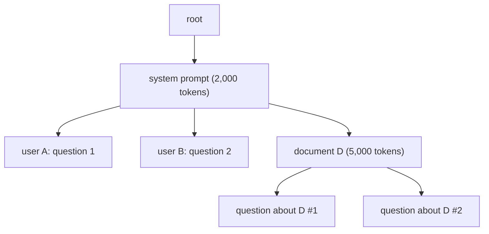

# Module 04: RadixAttention & Prefix Caching (SGLang)

> **Architectural Scope**: Why identical prompt prefixes can reuse KV cache, the radix-tree data structure behind SGLang's RadixAttention, hash-based automatic prefix caching in vLLM, eviction, cache-aware scheduling and routing, and the limits and security implications of sharing.

---

## Why this module matters

Real LLM traffic is full of repetition: the same system prompt on every chat request, the same few-shot examples, the same retrieved document asked about by many users, the growing conversation history re-sent on every turn, an agent's long tool descriptions. Recomputing the KV cache for that shared prefix on every request wastes prefill compute and inflates TTFT. **Prefix caching** keeps the KV blocks of previously processed prefixes and reuses them when a new request starts with the same tokens. Done well it cuts TTFT and cost dramatically for chat, RAG and agent workloads, and API providers expose it as discounted "cached input tokens".

## Mental model: do not re-read the part of the book you already read

If 1,000 students all start their answer by reading the same 2,000-word instruction sheet, reading it once and reusing the notes saves 999 readings. The catch: your notes for a page depend on **everything before it**, so you can only reuse notes for a *prefix*, a start that is identical word for word.

```mermaid
flowchart TD
    ROOT["root"] --> SYS["system prompt (2,000 tokens)"]
    SYS --> U1["user A: question 1"]
    SYS --> U2["user B: question 2"]
    SYS --> DOC["document D (5,000 tokens)"]
    DOC --> Q1["question about D #1"]
    DOC --> Q2["question about D #2"]
```

Each node stores the KV blocks for its token segment; a new request walks the tree as far as its tokens match, reuses those blocks, and only prefills the remainder.

## 1. Why only prefixes can be shared

In a causal transformer, the key/value vectors for token `i` depend on all tokens `0 ... i` (through earlier layers' attention), and with rotary position embeddings they also depend on the token's absolute position. Two requests therefore have identical KV for their first `k` tokens **if and only if their first `k` tokens (and positions) are identical**. A shared suffix or a shared document in the middle of different prompts is *not* reusable by exact methods. (Research such as CacheBlend explores approximate reuse of non-prefix chunks, with accuracy trade-offs; production engines use exact prefix reuse.)

**Design rule:** put **static content first, dynamic content last**: system prompt, tool definitions, few-shot examples, retrieved documents (when shared), and only then the user's message. Also avoid inserting timestamps, request IDs or random ordering early in the prompt; one changed token near the start invalidates everything after it.

## 2. RadixAttention (SGLang)

SGLang (Zheng et al., 2023) stores all cached KV in a **radix tree** (a compressed trie) keyed by **token sequences**: each edge is labelled with a run of tokens and its node holds the corresponding KV blocks (paged, as in Module 03).

- **Lookup:** for a new request, walk the tree matching tokens; the longest match is the reusable prefix. If a match ends mid-edge, the edge is split.
- **Insert:** after prefill/decode, the request's newly computed segment is added as a new node, so future requests, including the *same conversation's next turn*, hit it.
- **Reference counting:** nodes in use by running requests are pinned.
- **Eviction:** when memory is short, evict unpinned **leaf** nodes in **LRU** order (a parent is only freed after its children, preserving prefix structure).
- **Cache-aware scheduling:** the scheduler sorts or prioritises waiting requests by **longest matched prefix**, which approximates a depth-first traversal of the tree and keeps hot prefixes resident instead of thrashing them.

The paper reports up to several-times higher throughput on workloads with heavy sharing (few-shot learning, multi-turn chat, tree-of-thought, self-consistency sampling, agent loops).

## 3. Automatic prefix caching in vLLM

vLLM implements the same idea at **block granularity** on top of PagedAttention: each *full* block is identified by a hash of `(hash of preceding blocks, tokens in this block)`. A new request hashes its prompt block by block and maps each hash to an existing physical block when present (incrementing its reference count), skipping prefill for those tokens. Details that matter:

- **Only full blocks** are cached (a partial last block is recomputed), so effective reuse is `floor(shared_tokens / block_size) x block_size`.
- Freed blocks stay in the cache (in an LRU "evictable" pool) until the memory is needed for something else.
- It is enabled by a flag (for example `--enable-prefix-caching`) and is the default in recent versions.

## 4. What it saves

**Worked example.** A chatbot with a 2,000-token system prompt serves 1,000 requests, each with a 100-token user message. Without caching, prefill processes `1,000 x 2,100 = 2.1M` tokens. With caching, the system prompt is computed once and only about `1,000 x 100 = 100K` new tokens are prefilled (plus 2,000 once): a **95% reduction** in prefill compute. For an 8B model, the shared 2,000 tokens cost about 80 ms of prefill each time (Module 01), so TTFT drops by roughly that amount on every hit.

Multi-turn chat is the same effect with a growing prefix: turn `n` re-sends turns `1 ... n-1`, which are all cache hits if the engine has kept them. Without caching, prefill cost grows quadratically across a long conversation.

Track the **prefix cache hit rate** (fraction of prompt tokens served from cache). A low rate on a workload that *should* share means something is breaking the prefix (a varying header, differing chat templates or whitespace, per-request IDs).

## 5. Distributed serving: cache-aware routing

With many replicas, a request only benefits if it lands on the replica that already holds its prefix. Round-robin load balancing scatters conversations across replicas and destroys hit rates. Solutions:

- **Session or prefix affinity:** route by conversation ID or by a hash of the prompt prefix (consistent hashing).
- **Cache-aware routers** (for example the SGLang router, llm-d, Dynamo's KV-aware router) track which prefixes each replica holds and route to the best match while balancing load.
- **Tiered KV stores:** spill cold prefixes from HBM to CPU memory, local SSD or a shared cache so replicas can reuse each other's work (LMCache and similar systems).

## 6. Limits and risks

- **Exactness only:** any token difference ends the match; tokenisation quirks (leading spaces, special tokens) matter.
- **Memory competition:** cached prefixes occupy KV memory that could serve more concurrent requests; LRU balances this, but a huge cold cache can reduce batch size.
- **Security (multi-tenant):** a cache hit is *faster*, so an attacker who can time TTFT may infer whether another tenant's prompt prefix is cached. Mitigate by **isolating caches per tenant** or adding a per-tenant **cache salt** to the hash, and by not sharing caches across trust boundaries.
- **Correctness with LoRA/adapters or different sampling-independent settings:** cache keys must include anything that changes the KV (model version, adapter ID, multimodal inputs).
- **Determinism:** reusing cached KV is numerically equivalent in principle, but different batch shapes can produce tiny floating-point differences.

## Common pitfalls

1. **Putting variable content (date, user name, request ID) at the start of the prompt**, giving a 0% hit rate.
2. **Assuming a shared document in the middle of different prompts will be reused.**
3. **Round-robin routing** across replicas.
4. **Ignoring the block-size rounding**: very short shared prefixes (less than one block) never hit.
5. **Cross-tenant cache sharing** without considering timing side channels.
6. **Forgetting to key on adapter/model/multimodal inputs.**
7. **Not measuring hit rate**; you cannot optimise what you do not observe.

## How this connects

- **Module 02** (KV memory) and **Module 03** (blocks and reference counts) are the substrate.
- **Module 05**: scheduling interacts with cache hits (cache-aware ordering).
- **Module 06**: disaggregated prefill/decode needs KV transfer, which benefits from the same block identity.
- **Course 10, Module 02** (contextual retrieval) and **Course 11** agents are workloads that live on shared prefixes.

## Go further

- roadmap.sh: *Inference Engineering* nodes **caching**, **caching approaches**, **cache aware routing**, **sglang**, **kv cache storage**.
- Zheng et al., *SGLang: Efficient Execution of Structured Language Model Programs* (2023); LMSYS blog "Fast and Expressive LLM Inference with RadixAttention and SGLang"; vLLM documentation on automatic prefix caching.
- Provider docs on prompt caching (Anthropic, OpenAI) for how cached tokens are billed.

---

## Module Study Progression
1. **Beginner Playground**: Read [00_FOUNDATIONS_PLAYGROUND.md](00_FOUNDATIONS_PLAYGROUND.md).
2. **Architecture Theory**: Study this [01_README.md](01_README.md).
3. **Hands-on Project**: Follow [02_PROJECT_GUIDE.md](02_PROJECT_GUIDE.md).
4. **Staff Interview Challenges**: Check [03_SELF_ASSESSMENT_AND_CHALLENGES.md](03_SELF_ASSESSMENT_AND_CHALLENGES.md).
5. **Production Debugging**: Review [04_TROUBLESHOOTING_AND_EDGE_CASES.md](04_TROUBLESHOOTING_AND_EDGE_CASES.md).
